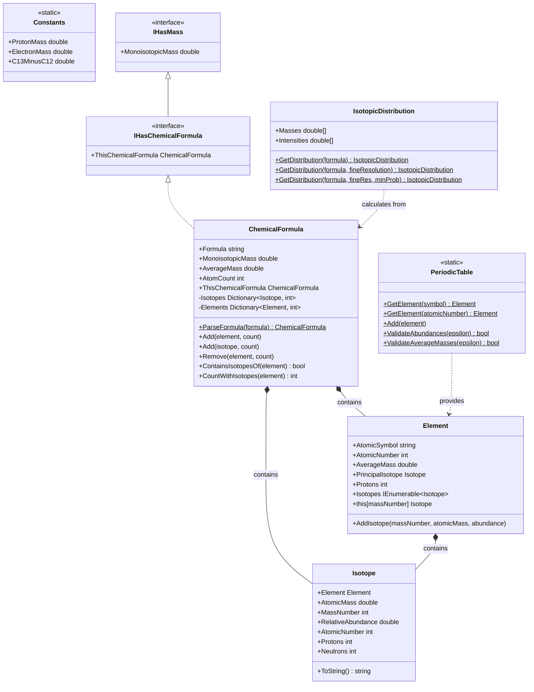

# Chemistry Library

## Overview

The Chemistry Library provides fundamental chemical data structures and calculations for mass spectrometry and proteomics applications. This library implements the core concepts of chemical elements, isotopes, chemical formulas, and isotopic distributions with high-precision atomic masses based on NIST data.

### Key Features

- **Complete Periodic Table**: Full implementation with 118 elements and their isotopes
- **Chemical Formula Parsing**: Parse and manipulate chemical formulas with isotope support
- **Isotopic Distribution Calculations**: Calculate theoretical isotopic patterns using advanced algorithms
- **Mass Calculations**: Both monoisotopic and average mass calculations
- **Hill Notation**: Standardized chemical formula representation
- **Type-Safe Operations**: Strong typing with interfaces and operator overloading

### Quick Start

```csharp
// Parse a chemical formula
var formula = ChemicalFormula.ParseFormula("C6H12O6");

// Access mass properties
Console.WriteLine($"Monoisotopic Mass: {formula.MonoisotopicMass:F4}");
Console.WriteLine($"Average Mass: {formula.AverageMass:F4}");
Console.WriteLine($"Formula: {formula.Formula}");

// Add/remove elements
formula.Add(PeriodicTable.GetElement("N"), 2);
formula.Remove(PeriodicTable.GetElement("O"), 1);

// Work with specific isotopes
formula.Add(PeriodicTable.GetElement("C")[13], 2);  // Add 2 C13

// Calculate isotopic distribution
var distribution = IsotopicDistribution.GetDistribution(formula);
```

## System Design

### Architecture Overview

The Chemistry library uses a hierarchical structure representing chemical concepts:



### Core Components

#### ChemicalFormula
Central class representing a chemical formula. Supports both elemental composition (unspecified isotopes) and specific isotopes.

```csharp
public sealed class ChemicalFormula : IEquatable<ChemicalFormula>, 
    IEquatable<IHasChemicalFormula>, IHasChemicalFormula
{
    // Main properties
    public string Formula { get; }
    public double MonoisotopicMass { get; }
    public double AverageMass { get; }
    public int AtomCount { get; }
    
    // Manipulation
    public void Add(Element element, int count);
    public void Add(Isotope isotope, int count);
    public void Remove(Element element, int count);
    public void Replace(Isotope isotopeToRemove, Isotope isotopeToAdd);
    
    // Queries
    public bool ContainsIsotopesOf(Element element);
    public int CountWithIsotopes(Element element);
    public bool IsSupersetOf(ChemicalFormula formula);
}
```

#### PeriodicTable (Static)
Singleton providing access to all chemical elements and their isotopes.

```csharp
public static class PeriodicTable
{
    // Access elements
    public static Element GetElement(string atomicSymbol);
    public static Element GetElement(int atomicNumber);
    
    // Validation
    public static bool ValidateAbundances(double epsilon);
    public static bool ValidateAverageMasses(double epsilon);
}
```

#### Element
Represents a chemical element with all its naturally occurring isotopes.

```csharp
public class Element
{
    public int AtomicNumber { get; }
    public string AtomicSymbol { get; }
    public double AverageMass { get; }
    public Isotope PrincipalIsotope { get; }
    public IEnumerable<Isotope> Isotopes { get; }
    
    // Indexer for isotope access
    public Isotope this[int massNumber] { get; }
}
```

#### Isotope
Represents a specific isotope of an element.

```csharp
public sealed class Isotope
{
    public Element Element { get; }
    public double AtomicMass { get; }
    public int MassNumber { get; }
    public double RelativeAbundance { get; }
    public int Protons { get; }
    public int Neutrons { get; }
}
```

## Chemical Formula Operations

### Parsing Formulas

The library supports parsing chemical formulas in standard notation with optional isotope specification:

```csharp
// Standard formula
var glucose = ChemicalFormula.ParseFormula("C6H12O6");

// With isotopes (use curly braces)
var labeled = ChemicalFormula.ParseFormula("C{13}6H12O6");  // All carbons are C13

// Mixed isotopes
var mixed = ChemicalFormula.ParseFormula("C5C{13}1H12O6");  // 5 regular C + 1 C13

// Complex formula
var peptide = ChemicalFormula.ParseFormula("C2H5NO2");

// Negative counts (for removing elements)
var water = ChemicalFormula.ParseFormula("H2O-1");  // Means subtract 1 oxygen
```

**Supported Syntax**:
- **Element symbol**: Required, e.g., `C`, `H`, `Na`
- **Isotope mass number**: Optional, in curly braces, e.g., `C{13}`, `N{15}`
- **Count**: Optional number following element/isotope, e.g., `C6`, `H{2}2`
- **Sign**: Optional `-` before count for subtraction, e.g., `H-2`
- **Whitespace**: Optional spaces between components

### Building Formulas Programmatically

```csharp
// Start with empty formula
var formula = new ChemicalFormula();

// Add elements
formula.Add(PeriodicTable.GetElement("C"), 6);
formula.Add(PeriodicTable.GetElement("H"), 12);
formula.Add(PeriodicTable.GetElement("O"), 6);

// Add specific isotopes
var carbon13 = PeriodicTable.GetElement("C")[13];
formula.Add(carbon13, 2);

// Remove elements
formula.Remove(PeriodicTable.GetElement("O"), 1);

// Copy constructor
var copy = new ChemicalFormula(formula);

// From another object with chemical formula
var fromInterface = new ChemicalFormula(objectWithFormula);
```

### Formula Arithmetic

Chemical formulas support operator overloading:

```csharp
var water = ChemicalFormula.ParseFormula("H2O");
var ammonia = ChemicalFormula.ParseFormula("NH3");

// Addition
var combined = water + ammonia;  // H5NO

// Subtraction
var diff = combined - water;  // NH3

// Multiplication
var twoWater = water * 2;  // H4O2
var threeAmmonia = 3 * ammonia;  // N3H9

// Check relationships
bool isSubset = water.IsSubsetOf(combined);  // true
bool isSuperset = combined.IsSupersetOf(water);  // true
```

### Querying Formula Content

```csharp
var formula = ChemicalFormula.ParseFormula("C6H12N2O2");

// Check for elements
bool hasCarbon = formula.ContainsIsotopesOf(PeriodicTable.GetElement("C"));

// Count atoms
int carbonCount = formula.CountWithIsotopes(PeriodicTable.GetElement("C"));  // 6
int totalAtoms = formula.AtomCount;  // 22

// Check for specific isotope
bool hasC13 = formula.ContainsSpecificIsotope(PeriodicTable.GetElement("C")[13]);
int c13Count = formula.CountSpecificIsotopes(PeriodicTable.GetElement("C")[13]);

// Get unique elements
int uniqueElements = formula.NumberOfUniqueElementsByAtomicNumber;
```

## Mass Calculations

### Monoisotopic vs Average Mass

```csharp
var formula = ChemicalFormula.ParseFormula("C6H12O6");

// Monoisotopic mass (uses principal isotope for each element)
double monoMass = formula.MonoisotopicMass;  // 180.0634 Da

// Average mass (weighted by natural abundance)
double avgMass = formula.AverageMass;  // 180.156 Da

// Difference
double diff = avgMass - monoMass;  // ~0.093 Da
```

**When to Use Each**:
- **Monoisotopic Mass**: Mass spectrometry (high resolution), proteomics
- **Average Mass**: Chemical calculations, low-resolution MS

### Proton and Neutron Counting

```csharp
var formula = ChemicalFormula.ParseFormula("C{13}6H12O6");

// Total protons
int protons = formula.ProtonCount;

// Neutron count (only if all isotopes specified!)
try
{
    int neutrons = formula.NeutronCount();  // Throws if elements present
}
catch (MzLibException ex)
{
    // Exception: "Cannot know for sure what the number of neutrons is!"
}
```

### Hydrogen/Carbon Ratio

```csharp
var peptide = ChemicalFormula.ParseFormula("C10H15N3O2S");
double hcRatio = peptide.HydrogenCarbonRatio;  // 1.5
```

## Hill Notation

The library automatically generates Hill notation (standardized formula representation):

```csharp
var formula = ChemicalFormula.ParseFormula("O6H12C6");

// Hill notation: Carbon first, then Hydrogen, then others alphabetically
string hillNotation = formula.Formula;  // "C6H12O6"

// With isotopes
var labeled = ChemicalFormula.ParseFormula("C5C{13}1H12O6");
string notation = labeled.Formula;  // "C5C{13}1H12O6"
```

**Hill Notation Rules**:
1. Carbon first (if present)
2. Carbon isotopes after regular carbon
3. Hydrogen second (if present)
4. Hydrogen isotopes after regular hydrogen
5. All other elements alphabetically
6. Isotopes grouped with their elements

## Isotopic Distribution Calculations

### Basic Distribution

Calculate theoretical isotopic patterns for any chemical formula:

```csharp
var formula = ChemicalFormula.ParseFormula("C100H152N26O32S1");

// Calculate distribution (default parameters)
var distribution = IsotopicDistribution.GetDistribution(formula);

// Access results
double[] masses = distribution.Masses;
double[] intensities = distribution.Intensities;

// Find most abundant peak
int maxIndex = 0;
double maxIntensity = 0;
for (int i = 0; i < intensities.Length; i++)
{
    if (intensities[i] > maxIntensity)
    {
        maxIntensity = intensities[i];
        maxIndex = i;
    }
}

Console.WriteLine($"Most abundant isotope: {masses[maxIndex]:F4} Da");
Console.WriteLine($"Monoisotopic mass: {masses[0]:F4} Da");
Console.WriteLine($"Isotope count: {masses.Length}");
```

### Advanced Distribution Parameters

Fine-tune distribution calculations for specific needs:

```csharp
var formula = ChemicalFormula.ParseFormula("C50H75N15O10");

// Default: 0.01 Da resolution, 1e-200 min probability
var dist1 = IsotopicDistribution.GetDistribution(formula);

// Custom resolution (finer = more peaks)
var dist2 = IsotopicDistribution.GetDistribution(formula, fineResolution: 0.001);

// Custom resolution and minimum probability threshold
var dist3 = IsotopicDistribution.GetDistribution(
    formula, 
    fineResolution: 0.01,
    minProbability: 1e-100  // Higher threshold = fewer peaks
);

// Full control
var dist4 = IsotopicDistribution.GetDistribution(
    formula,
    fineResolution: 0.005,
    minProbability: 1e-150,
    molecularWeightResolution: 1e-10
);
```

**Parameters**:

| Parameter | Default | Description | Effect |
|-----------|---------|-------------|--------|
| `fineResolution` | 0.01 | Mass resolution in Da | Smaller = more detailed |
| `minProbability` | 1e-200 | Minimum probability to include | Higher = fewer peaks |
| `molecularWeightResolution` | 1e-12 | Internal precision | Affects calculation accuracy |

### Algorithm Details

The library implements the **MIDAs (Molecular Isotopic Distribution Analysis)** algorithm:

**Reference**: 
- Alves, G., Ogurtsov, A. Y., & Yu, Y. K. (2014). *Molecular Isotopic Distribution Analysis (MIDAs) with Adjustable Mass Accuracy*. Journal of the American Society for Mass Spectrometry, 25(1), 57-70. DOI: 10.1007/s13361-013-0733-7

**Key Features**:
- High accuracy for large molecules
- Efficient computation using polynomial multiplication
- Fine-grained resolution
- Automatic peak merging

## Periodic Table Access

### Getting Elements

```csharp
// By atomic symbol
Element carbon = PeriodicTable.GetElement("C");
Element hydrogen = PeriodicTable.GetElement("H");
Element sodium = PeriodicTable.GetElement("Na");

// By atomic number
Element carbon2 = PeriodicTable.GetElement(6);
Element oxygen = PeriodicTable.GetElement(8);

// Implicit conversion from int
Element nitrogen = (Element)7;

// Implicit conversion from string
Element sulfur = (Element)"S";
```

### Accessing Element Properties

```csharp
var carbon = PeriodicTable.GetElement("C");

// Basic properties
string symbol = carbon.AtomicSymbol;  // "C"
int atomicNumber = carbon.AtomicNumber;  // 6
double avgMass = carbon.AverageMass;  // 12.0107
int protons = carbon.Protons;  // 6

// Principal isotope (most abundant)
Isotope principalC = carbon.PrincipalIsotope;  // C12
double principalMass = principalC.AtomicMass;  // 12.0000000

// All isotopes
foreach (var isotope in carbon.Isotopes)
{
    Console.WriteLine($"{isotope}: {isotope.AtomicMass:F6} Da, " +
                      $"{isotope.RelativeAbundance:P4}");
}
// Output:
// C{12}: 12.000000 Da, 98.9300%
// C{13}: 13.003355 Da, 1.0700%
```

### Working with Isotopes

```csharp
var carbon = PeriodicTable.GetElement("C");

// Access specific isotope by mass number
Isotope c12 = carbon[12];
Isotope c13 = carbon[13];
Isotope c14 = carbon[14];  // Radioactive

// Isotope properties
Console.WriteLine($"Mass Number: {c13.MassNumber}");  // 13
Console.WriteLine($"Atomic Mass: {c13.AtomicMass:F6}");  // 13.003355
Console.WriteLine($"Abundance: {c13.RelativeAbundance:P4}");  // 1.0700%
Console.WriteLine($"Protons: {c13.Protons}");  // 6
Console.WriteLine($"Neutrons: {c13.Neutrons}");  // 7

// String representation
string isotopeName = c13.ToString();  // "C{13}"
```

## Interfaces

### IHasMass

Basic interface for objects with mass:

```csharp
public interface IHasMass
{
    double MonoisotopicMass { get; }
}
```

**Implemented By**: `ChemicalFormula`, and indirectly by all `IHasChemicalFormula` objects

### IHasChemicalFormula

Interface for objects that have a chemical formula:

```csharp
public interface IHasChemicalFormula : IHasMass
{
    ChemicalFormula ThisChemicalFormula { get; }
}
```

**Implemented By**: `ChemicalFormula`, and throughout mzLib by peptides, proteins, modifications, etc.

**Usage**:
```csharp
public void ProcessMolecule(IHasChemicalFormula molecule)
{
    ChemicalFormula formula = molecule.ThisChemicalFormula;
    double mass = molecule.MonoisotopicMass;
    
    // Work with formula
    formula.Add(PeriodicTable.GetElement("P"), 1);
}
```

## Common Use Cases

### Peptide Mass Calculation

```csharp
// Amino acid residue masses (without water)
var ala = ChemicalFormula.ParseFormula("C3H5NO");  // Alanine
var gly = ChemicalFormula.ParseFormula("C2H3NO");  // Glycine
var ser = ChemicalFormula.ParseFormula("C3H5NO2");  // Serine

// Peptide: Ala-Gly-Ser
var peptide = ala + gly + ser;

// Add water (for intact peptide)
var water = ChemicalFormula.ParseFormula("H2O");
peptide.Add(water);

// Add N-terminus H
peptide.Add(PeriodicTable.GetElement("H"), 1);

Console.WriteLine($"Peptide mass: {peptide.MonoisotopicMass:F4} Da");
Console.WriteLine($"Formula: {peptide.Formula}");
```

### Isotope Labeling

```csharp
// Original peptide
var peptide = ChemicalFormula.ParseFormula("C47H75N13O16");

// Replace all carbons with C13
var c12 = PeriodicTable.GetElement("C")[12];
var c13 = PeriodicTable.GetElement("C")[13];
int carbonCount = peptide.CountSpecificIsotopes(c12);
peptide.Remove(c12, carbonCount);
peptide.Add(c13, carbonCount);

// Calculate mass shift
double massShift = carbonCount * Constants.C13MinusC12;
Console.WriteLine($"Mass shift: {massShift:F4} Da");

// Or use Replace method
var peptide2 = ChemicalFormula.ParseFormula("C47H75N13O16");
peptide2.Replace(c12, c13);  // Replaces all C12 with C13
```

### Modified Peptide Analysis

```csharp
// Base peptide
var peptide = ChemicalFormula.ParseFormula("C47H75N13O16");

// Add phosphorylation (HPO3)
var phospho = ChemicalFormula.ParseFormula("HPO3");
peptide.Add(phospho);

// Add oxidation (O)
peptide.Add(PeriodicTable.GetElement("O"), 1);

// Calculate modified mass
double modifiedMass = peptide.MonoisotopicMass;

// Get isotopic pattern for modified peptide
var distribution = IsotopicDistribution.GetDistribution(peptide);
```

### Fragment Ion Calculation

```csharp
// Full peptide
var peptide = ChemicalFormula.ParseFormula("C47H75N13O16");

// Calculate b-ion (remove C-terminus)
var bIon = new ChemicalFormula(peptide);
bIon.Remove(PeriodicTable.GetElement("O"), 1);
bIon.Remove(PeriodicTable.GetElement("H"), 1);

// Calculate y-ion (remove N-terminus)
var yIon = new ChemicalFormula(peptide);
yIon.Remove(PeriodicTable.GetElement("H"), 1);
yIon.Add(PeriodicTable.GetElement("H"), 2);  // Add NH3, remove H = net +H
```

### Small Molecule Analysis

```csharp
// Drug molecule
var aspirin = ChemicalFormula.ParseFormula("C9H8O4");
Console.WriteLine($"Aspirin: {aspirin.MonoisotopicMass:F4} Da");

// Calculate [M+H]+
var protonated = new ChemicalFormula(aspirin);
protonated.Add(PeriodicTable.GetElement("H"), 1);
double mz = protonated.MonoisotopicMass;
Console.WriteLine($"[M+H]+: {mz:F4} m/z");

// Calculate [M+Na]+
var sodiated = new ChemicalFormula(aspirin);
sodiated.Add(PeriodicTable.GetElement("Na"), 1);
mz = sodiated.MonoisotopicMass;
Console.WriteLine($"[M+Na]+: {mz:F4} m/z");

// Get isotopic pattern
var distribution = IsotopicDistribution.GetDistribution(aspirin);
```

## Performance Considerations

### Isotopic Distribution Calculation

**Time Complexity**: Depends on formula size and parameters

**Optimization Tips**:
```csharp
// For large molecules, increase minProbability
var largePeptide = ChemicalFormula.ParseFormula("C500H750N150O200S10");

// Faster (fewer peaks calculated)
var dist1 = IsotopicDistribution.GetDistribution(
    largePeptide, 
    fineResolution: 0.05,
    minProbability: 1e-50
);

// Slower but more detailed
var dist2 = IsotopicDistribution.GetDistribution(
    largePeptide,
    fineResolution: 0.001,
    minProbability: 1e-200
);
```

### Formula Operations

- **Addition/Subtraction**: O(n) where n is number of unique elements
- **Parsing**: O(m) where m is string length
- **Mass calculation**: O(n) where n is number of unique elements/isotopes

**Best Practices**:
```csharp
// Reuse formulas when possible
var water = ChemicalFormula.ParseFormula("H2O");

// Efficient repeated addition
for (int i = 0; i < 1000; i++)
{
    var result = baseFormula + water;  // Creates new formula each time
}

// Better: modify in place
var formula = new ChemicalFormula(baseFormula);
formula.Add(water);  // Modifies existing formula
```

## Data Sources

### Atomic Masses and Abundances

All data from **NIST (National Institute of Standards and Technology)**:
- Atomic masses in unified atomic mass units (u)
- Relative natural abundances
- Source: http://physics.nist.gov/cuu/Constants/index.html

### Constants

```csharp
// Physical constants (from NIST)
double protonMass = Constants.ProtonMass;  // 1.007276466879 u
double electronMass = Constants.ElectronMass;  // 5.48579909070e-4 u
double c13Shift = Constants.C13MinusC12;  // 1.00335483810 u
```

### Element Coverage

- **Stable Elements**: H (1) through Og (118)
- **Isotopes**: All naturally occurring stable isotopes
- **Radioactive Isotopes**: Selected commonly used isotopes (C14, H3, etc.)

## Integration with mzLib

The Chemistry library is fundamental to mzLib and used throughout:

### In Proteomics

```csharp
// Peptides have chemical formulas
PeptideWithSetModifications peptide = ...;
ChemicalFormula formula = peptide.ThisChemicalFormula;
double mass = formula.MonoisotopicMass;
```

### In Mass Spectrometry

```csharp
// Deconvolution uses chemical formulas for averagine models
var averagine = new ChemicalFormula();  // C4.9384 H7.7583 N1.3577 O1.4773 S0.0417
```

### In Modifications

```csharp
// Modifications are defined by chemical formulas
var phospho = ChemicalFormula.ParseFormula("HPO3");
```

## Best Practices

### Formula Construction

```csharp
// Good: Use ParseFormula for known formulas
var glucose = ChemicalFormula.ParseFormula("C6H12O6");

// Good: Build programmatically for dynamic formulas
var formula = new ChemicalFormula();
formula.Add(PeriodicTable.GetElement("C"), carbonCount);
formula.Add(PeriodicTable.GetElement("H"), hydrogenCount);

// Avoid: String concatenation for dynamic formulas
// Bad: string formulaString = $"C{carbonCount}H{hydrogenCount}O{oxygenCount}";
```

### Isotope Specification

```csharp
// Good: Use specific isotopes when needed
var c13 = PeriodicTable.GetElement("C")[13];
formula.Add(c13, 6);

// Good: Parse with isotopes
var labeled = ChemicalFormula.ParseFormula("C{13}6H12O6");

// Avoid: Don't mix elements and specific isotopes of same element
// This works but may be confusing:
formula.Add(PeriodicTable.GetElement("C"), 5);  // 5 unspecified C
formula.Add(PeriodicTable.GetElement("C")[13], 1);  // 1 C13
```

### Performance

```csharp
// Good: Reuse element references
var carbon = PeriodicTable.GetElement("C");
var hydrogen = PeriodicTable.GetElement("H");
for (int i = 0; i < 1000; i++)
{
    formula.Add(carbon, 6);
    formula.Add(hydrogen, 12);
}

// Avoid: Repeated lookups
for (int i = 0; i < 1000; i++)
{
    formula.Add(PeriodicTable.GetElement("C"), 6);  // Lookup each time
}
```

## References

- **NIST Atomic Weights and Isotopic Compositions**: https://www.nist.gov/pml/atomic-weights-and-isotopic-compositions-relative-atomic-masses
- **MIDAs Algorithm**: Alves et al. (2014), J. Am. Soc. Mass Spectrom. 25:57-70
- **Hill Notation**: Hill, E. A. (1900), J. Am. Chem. Soc. 22(8): 478-494

## See Also

- [Proteomics Wiki](../Proteomics/Proteomics_Wiki.md) - Using chemical formulas in proteomics
- [Mass Spectrometry Wiki](../MassSpectrometry/MassSpectrometry_Wiki.md) - Mass calculations and spectra
- [Deconvolution Wiki](../MassSpectrometry/Deconvolution/Deconvolution_Wiki.md) - Averagine models
