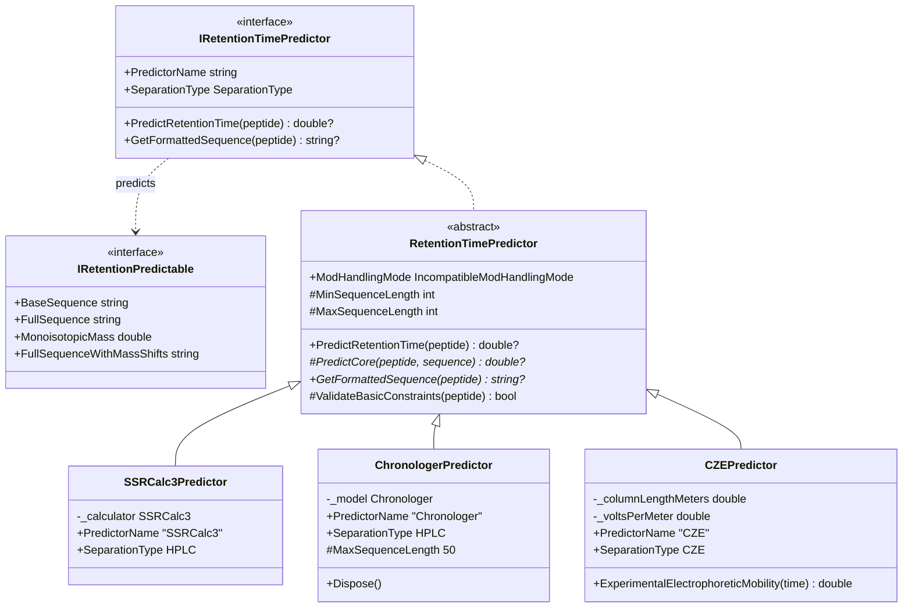
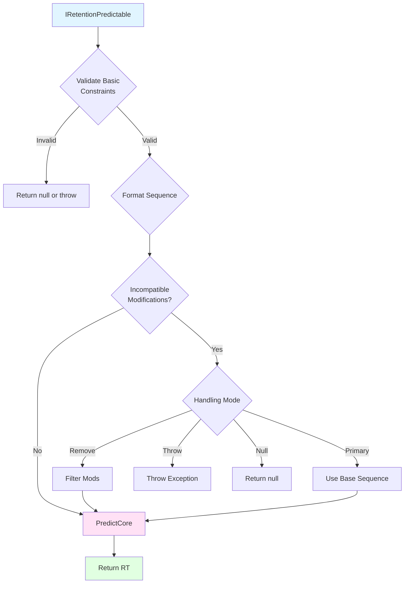

# Retention Time Prediction

## Overview

The Retention Time Prediction infrastructure provides a flexible, extensible framework for predicting chromatographic retention times and electrophoretic migration times for peptides. This system supports multiple prediction algorithms and separation techniques, with built-in handling of post-translational modifications.

### Key Features

- **Multiple Prediction Algorithms**: SSRCalc3 (HPLC), Chronologer (HPLC), and CZE predictors
- **Flexible Modification Handling**: Configurable strategies for dealing with unsupported modifications
- **Type-Safe Design**: Strong interfaces and abstract base classes ensure consistency
- **Extensible Architecture**: Easy to add new prediction algorithms

### Quick Start

```csharp
// Create a predictor
var predictor = new SSRCalc3RetentionTimePredictor();

// Predict retention time for a peptide
double? retentionTime = predictor.PredictRetentionTime(peptide, out RetenionTimeFailureReason? failureReason);

if (retentionTime.HasValue)
{
    Console.WriteLine($"Predicted RT: {retentionTime.Value} minutes");
}
else
{
    Console.WriteLine($"Prediction failed: {failureReason?.Reason}");
}
```

## Supported Predictors

| Predictor | Separation Type | Algorithm | Key Features |
|-----------|----------------|-----------|--------------|
| **SSRCalc3** | HPLC | Krokhin 2006 | Fast, uses base sequence only |
| **Chronologer** | HPLC | Deep Learning | Supports specific PTMs, ML-based, max 50 residues |
| **CZE** | CZE | Mobility 2017 | Electrophoretic migration prediction |

## System Design

### Architecture Overview

The system is built on three core abstractions:

1. **IRetentionPredictable** - Defines what can be predicted (implemented by peptides)
2. **IRetentionTimePredictor** - Contract for all retention time predictors
3. **RetentionTimePredictor** - Abstract base class providing common functionality



### Core Components

#### IRetentionPredictable
Defines the contract for objects that can have retention times predicted. Implemented by `PeptideWithSetModifications` in the Proteomics project.

```csharp
public interface IRetentionPredictable
{
    string BaseSequence { get; }
    string FullSequence { get; }
    double MonoisotopicMass { get; }
    string FullSequenceWithMassShifts { get; }
}
```

#### IRetentionTimePredictor
The main interface for all retention time predictors. Defines the prediction contract.

```csharp
public interface IRetentionTimePredictor
{
    string PredictorName { get; }
    SeparationType SeparationType { get; }
    double? PredictRetentionTime(IRetentionPredictable peptide);
    string? GetFormattedSequence(IRetentionPredictable peptide, 
        out RetentionTimeFailureReason? failureReason);
}
```

#### RetentionTimePredictor (Abstract Base Class)
Provides common functionality for all predictors including validation and modification handling.

## Modification Handling (Currently only in ChronologerPredictor)

One of the key features is flexible handling of post-translational modifications that may not be supported by specific prediction algorithms.

### Handling Modes

| Mode | Behavior | Use Case |
|------|----------|----------|
| **RemoveIncompatibleMods** | Strip unsupported modifications and predict with remaining sequence | Best effort prediction |
| **UsePrimarySequence** | Ignore all modifications, use base sequence only | Quick approximation |
| **ThrowException** | Fail with descriptive error | Strict validation required |
| **ReturnNull** | Return null if incompatible modifications present | Silent failure handling |

### Example Usage

```csharp
var predictor = new ChronologerRetentionTimePredictor()
{
    IncompatibleModHandlingMode = IncompatibleModHandlingMode.RemoveIncompatibleMods
};

// Will predict even if some modifications are unsupported
double? rt = predictor.PredictRetentionTime(peptideWithMods);
```

## Prediction Flow

The prediction process follows a consistent flow across all predictors:



### Prediction Steps

1. **Basic Constraints**: Null checks and basic validation
2. **Sequence Formatting**: Convert to predictor-specific format
3. **Modification Compatibility**: Check for supported modifications
4. **Core Prediction**: Algorithm-specific calculation

## Predictor Details

### SSRCalc3Predictor

**Algorithm**: Krokhin OV et al., *Anal. Chem.* 2006, 78(22):7785-95

- **Separation Type**: HPLC
- **Modification Support**: Uses base sequence only (ignores modifications)
- **Performance**: Fast, deterministic

### ChronologerPredictor

**Algorithm**: Wilburn, D. B. et al., (2023). [Paper](https://doi.org/10.1101/2023.05.30.542978) [Github](https://github.com/searlelab/chronologer)

- **Separation Type**: HPLC
- **Maximum Sequence Length**: 50 residues
- **Modification Support**: Specific PTMs supported
- **Performance**: High accuracy for supported modifications

### CZEPredictor

**Algorithm**: Krokhin OV et al., *Anal. Chem.* 2017, 89(3):2000-08

- **Separation Type**: Capillary Zone Electrophoresis
- **Modification Support**: Limited (primarily base sequence)
- **Performance**: Physics-based calculation

```csharp
var czePredictor = new CZERetentionTimePredictor(
    columnLengthMeters: 0.8,
    voltsPerMeter: 25000
);

double? migrationTime = czePredictor.PredictRetentionTime(peptide, out RetenionTimeFailureReason? failureReason);
```

## Extending the System

### Adding a New Predictor

To add a new retention time prediction algorithm:

```csharp
public class NewPredictor : RetentionTimePredictor
{
    // 1. Define predictor properties
    public override string PredictorName => "NewPredictor";
    public override SeparationType SeparationType => SeparationType.HPLC;
    
    // 2. Implement sequence formatting
    public override string? GetFormattedSequence(
        IRetentionPredictable peptide, 
        out RetentionTimeFailureReason? failureReason)
    {
        failureReason = null;
        
        // Convert peptide to your predictor's required format
        // Return null if conversion fails
        
        return formattedSequence;
    }
    
    // 3. Implement core prediction logic
    protected override double? PredictCore(
        IRetentionPredictable peptide,
        string? formattedSequence)
    {
        // Your prediction algorithm here
        // Use formattedSequence if needed
        
        return predictedTime;
    }
}
```

### Checklist for New Predictors

- [ ] Inherit from `RetentionTimePredictor`
- [ ] Set `PredictorName` and `SeparationType`
- [ ] Implement `GetFormattedSequence()` with proper error handling
- [ ] Implement `PredictCore()` with your algorithm
- [ ] Implement `ValidateBasicConstraints()` if needed
- [ ] Add unit tests for edge cases
- [ ] Update this wiki with algorithm details


## Design Patterns

### Template Method Pattern

The `RetentionTimePredictor` base class uses the Template Method pattern to enforce a consistent prediction workflow:

```csharp
public double? PredictRetentionTime(IRetentionPredictable peptide)
{
    // 1. Validate basic constraints
    if (!ValidateBasicConstraints(peptide))
        return null;
    
    // 2. Format sequence (abstract - implemented by subclasses) (handles mod compatibility)
    string? formattedSequence = GetFormattedSequence(peptide, out var failureReason);
    
    // 3. Perform prediction (abstract - implemented by subclasses)
    return PredictCore(peptide, formattedSequence);
}
```


## Error Handling

### RetentionTimeFailureReason

The system provides detailed failure reasons through the `RetentionTimeFailureReason` class:

```csharp
public class RetentionTimeFailureReason
{
    public string Reason { get; }
    public Exception? Exception { get; }
}
```

### IncompatibleModificationException

Thrown when `IncompatibleModHandlingMode.ThrowException` is set and incompatible modifications are encountered:

```csharp
try
{
    var predictor = new ChronologerPredictor()
    {
        IncompatibleModHandlingMode = IncompatibleModHandlingMode.ThrowException
    };
    
    double? rt = predictor.PredictRetentionTime(peptide);
}
catch (IncompatibleModificationException ex)
{
    Console.WriteLine($"Unsupported modification: {ex.Message}");
}
```

## Integration

### Dependencies

```
Chromatography (this project)
  ↓
  IRetentionPredictable
  ↓
Proteomics
  ↓
  PeptideWithSetModifications : IRetentionPredictable
```

## References

- **SSRCalc3**: Krokhin OV et al., *Anal. Chem.* 2006, 78(22):7785-95
  - "Sequence-specific retention calculator. Algorithm for peptide retention prediction in ion-pair RP-HPLC"

- **Chronologer**: Searle Lab, University of Washington
  - Harmonized peptide retention time libraries
  - Deep learning-based prediction

- **CZE**: Krokhin OV et al., *Anal. Chem.* 2017, 89(3):2000-08
  - "Electrophoretic mobility determination of peptides by CZE-MS"