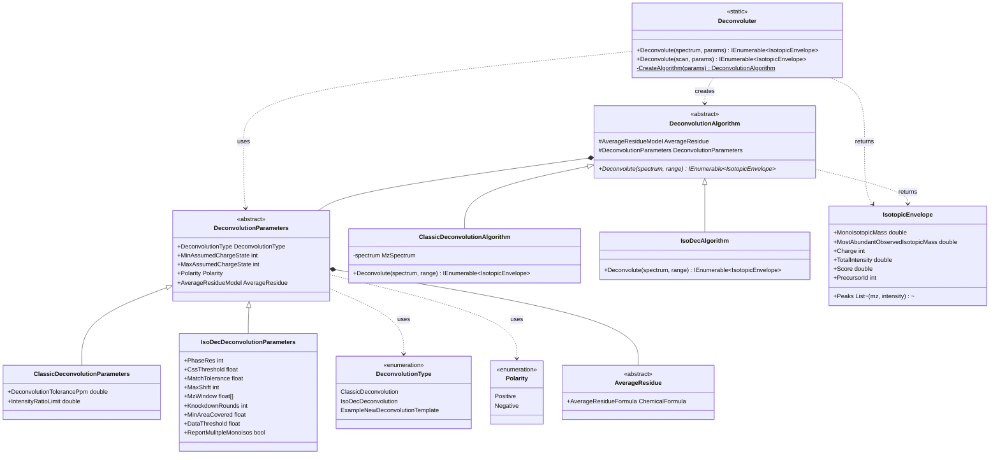
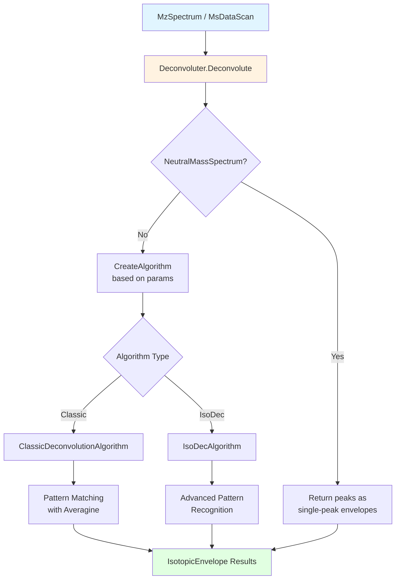

# Mass Spectrum Deconvolution

## Overview

The Mass Spectrum Deconvolution infrastructure provides a flexible framework for converting mass spectrometry m/z peaks into neutral mass isotopic envelopes. This system supports multiple deconvolution algorithms and handles both positive and negative ion mode data, with configurable parameters for different experimental setups.

### Key Features

- **Multiple Deconvolution Algorithms**: Classic Deconvolution and IsoDec algorithms
- **Flexible Parameterization**: Algorithm-specific parameters for optimal performance
- **Charge State Determination**: Automatic inference of charge states from isotopic spacing
- **Type-Safe Design**: Strong interfaces and abstract base classes ensure consistency
- **Extensible Architecture**: Easy to add new deconvolution algorithms

### Quick Start

```csharp
// Create deconvolution parameters
var deconParams = new ClassicDeconvolutionParameters(
    minCharge: 1,
    maxCharge: 60,
    deconPpm: 20,
    intensityRatio: 3,
    polarity: Polarity.Positive
);

// Deconvolute a spectrum
IEnumerable<IsotopicEnvelope> envelopes = Deconvoluter.Deconvolute(spectrum, deconParams);

// Process results
foreach (var envelope in envelopes)
{
    Console.WriteLine($"Mass: {envelope.MonoisotopicMass:F4}, Charge: {envelope.Charge}, Intensity: {envelope.TotalIntensity:E2}");
}
```

## Supported Algorithms

| Algorithm | Best For | Key Features | Performance |
|-----------|----------|--------------|-------------|
| **Classic Deconvolution** | Isotopically resolved data | Pattern matching with averagine model | Fast, deterministic |
| **IsoDec** | Complex mixtures, overlapping isotope patterns | Advanced pattern recognition, missed monoisotopic handling | High accuracy, moderate speed |

## System Design

### Architecture Overview

The system is built on three core abstractions:

1. **Deconvoluter** - Static context class that orchestrates deconvolution
2. **DeconvolutionParameters** - Abstract base for algorithm-specific parameters
3. **DeconvolutionAlgorithm** - Abstract base class for deconvolution implementations



### Core Components

#### Deconvoluter (Static Context Class)
The main entry point for all deconvolution operations. Uses a factory pattern to create the appropriate algorithm based on parameters.

```csharp
public static class Deconvoluter
{
    public static IEnumerable<IsotopicEnvelope> Deconvolute(
        MzSpectrum spectrum,
        DeconvolutionParameters deconvolutionParameters, 
        MzRange rangeToGetPeaksFrom = null);
        
    public static IEnumerable<IsotopicEnvelope> Deconvolute(
        MsDataScan scan,
        DeconvolutionParameters deconvolutionParameters, 
        MzRange rangeToGetPeaksFrom = null);
}
```

#### DeconvolutionParameters (Abstract Base)
Base class for all deconvolution parameters. Contains common settings used by all algorithms.

```csharp
public abstract class DeconvolutionParameters
{
    public abstract DeconvolutionType DeconvolutionType { get; protected set; }
    public int MinAssumedChargeState { get; set; }
    public int MaxAssumedChargeState { get; set; }
    public Polarity Polarity { get; set; }
    public AverageResidue AverageResidueModel { get; set; }
}
```

#### DeconvolutionAlgorithm (Abstract Base)
Abstract base class for all deconvolution algorithm implementations.

```csharp
public abstract class DeconvolutionAlgorithm
{
    protected readonly AverageResidue AverageResidueModel;
    protected readonly DeconvolutionParameters DeconvolutionParameters;
    
    internal abstract IEnumerable<IsotopicEnvelope> Deconvolute(
        MzSpectrum spectrum, 
        MzRange range);
}
```

#### IsotopicEnvelope (Result Type)
Represents a deconvoluted isotopic pattern with charge state and mass information.

```csharp
public class IsotopicEnvelope : IHasMass
{
    public readonly List<(double mz, double intensity)> Peaks;
    public double MonoisotopicMass { get; private set; }
    internal double MostAbundantObservedIsotopicMass { get; private set; }
    public readonly int Charge;
    public readonly double TotalIntensity;
    public readonly int PrecursorId;
    public double Score { get; private set; }
}
```

## Deconvolution Flow



### Deconvolution Steps

1. **Input Validation**: Check spectrum type and range
2. **Algorithm Selection**: Factory creates appropriate algorithm from parameters
3. **Charge State Scanning**: Test charge states within specified range
4. **Pattern Matching**: Compare observed peaks to theoretical isotopic distributions
5. **Scoring**: Evaluate quality of each isotopic envelope match
6. **Result Generation**: Return scored isotopic envelopes

## Algorithm Details

### Classic Deconvolution

**Algorithm**: Pattern matching with averagine model

**Key Parameters**:
- **DeconvolutionTolerancePpm**: Mass tolerance for peak matching (typically 10-20 ppm)
- **IntensityRatioLimit**: Filters out envelopes with poor relative peak intensities (typically 3)
- **MinAssumedChargeState**: Minimum charge state to consider
- **MaxAssumedChargeState**: Maximum charge state to consider

**How It Works**:
1. For each peak in the spectrum, assume it's the most abundant isotope
2. Calculate theoretical isotopic distribution using averagine model
3. Search for matching peaks at expected m/z values for each charge state
4. Score matches based on peak count, intensity ratios, and standard deviation
5. Return highest-scoring envelopes

**Best Used For**:
- High-resolution data (isotopically resolved)
- Single-component or simple mixtures
- When speed is important

**Example**:
```csharp
var classicParams = new ClassicDeconvolutionParameters(
    minCharge: 1,
    maxCharge: 60,
    deconPpm: 20,
    intensityRatio: 3,
    polarity: Polarity.Positive,
    averageResidueModel: new Averagine()  // or new OxyriboAveragine() for RNA
);

var results = Deconvoluter.Deconvolute(spectrum, classicParams);
```

### IsoDec Deconvolution

**Algorithm**: Advanced pattern recognition with C++ library integration

**Key User-Accessible Parameters**:
- **PhaseRes**: Precision of encoding matrix (default: 8, higher = more precise but slower)
- **CssThreshold**: Minimum cosine similarity score (default: 0.7, range: 0-1)
- **MatchTolerance**: Peak matching tolerance in ppm (default: 5)
- **MaxShift**: Maximum allowed isotopic shift (default: 3)
- **MzWindow**: M/z window for pattern matching (default: [-1.05, 2.05])
- **KnockdownRounds**: Iterative refinement rounds (default: 5)
- **MinAreaCovered**: Minimum isotopic pattern coverage (default: 0.20)
- **DataThreshold**: Relative intensity threshold (default: 0.05)
- **ReportMultipleMonoisos**: Report multiple monoisotopic mass predictions (default: true)

**How It Works**:
1. Detects peaks using configurable window and threshold
2. Encodes spectrum into phase-resolved representation
3. Matches encoded patterns against theoretical distributions
4. Uses cosine similarity scoring for pattern quality
5. Iteratively "knocks down" matched patterns to find overlapping signals
6. Can report multiple charge states and missed monoisotopic peaks

**Best Used For**:
- Complex mixtures with overlapping isotope patterns
- When monoisotopic peak may be missing or low intensity
- Maximum accuracy requirements

**Example**:
```csharp
var isoDecParams = new IsoDecDeconvolutionParameters(
    polarity: Polarity.Negative,
    phaseRes: 8,
    reportMultipleMonoisos: true,
    cssThreshold: 0.7f,
    matchTolerance: 5f,
    maxShift: 3,
    knockdownRounds: 5,
    minAreaCovered: 0.20f,
    relativeDataThreshold: 0.05f,
    averageResidueModel: new OxyriboAveragine()
);

var results = Deconvoluter.Deconvolute(spectrum, isoDecParams);
```

## Averagine Models

The system supports different averagine models for different biomolecule types:

| Model | Use Case | Formula |
|-------|----------|---------|
| **Averagine** | Proteins/Peptides | C4.9384 H7.7583 N1.3577 O1.4773 S0.0417 |
| **OxyriboAveragine** | RNA/Nucleotides | C9.75 H12.25 N3.75 O7 P |

**Example**:
```csharp
// For protein data
var proteinParams = new ClassicDeconvolutionParameters(
    1, 60, 20, 3, averageResidueModel: new Averagine()
);

// For RNA data
var rnaParams = new ClassicDeconvolutionParameters(
    1, 60, 20, 3, averageResidueModel: new OxyriboAveragine()
);
```

## Extending the System

### Adding a New Deconvolution Algorithm

To add a new deconvolution algorithm:

```csharp
// 1. Add enum value
public enum DeconvolutionType
{
    ClassicDeconvolution,
    IsoDecDeconvolution,
    NewAlgorithm  // Add your algorithm here
}

// 2. Create parameter class
public class NewAlgorithmParameters : DeconvolutionParameters
{
    public override DeconvolutionType DeconvolutionType { get; protected set; } 
        = DeconvolutionType.NewAlgorithm;
    
    // Add algorithm-specific parameters
    public double CustomParameter { get; set; }
    
    public NewAlgorithmParameters(
        int minCharge, 
        int maxCharge, 
        Polarity polarity = Polarity.Positive,
        AverageResidue? averageResidueModel = null)
        : base(minCharge, maxCharge, polarity, averageResidueModel)
    {
    }
}

// 3. Create algorithm implementation
internal class NewAlgorithm : DeconvolutionAlgorithm
{
    internal NewAlgorithm(DeconvolutionParameters deconParameters) 
        : base(deconParameters)
    {
    }
    
    internal override IEnumerable<IsotopicEnvelope> Deconvolute(
        MzSpectrum spectrum, 
        MzRange range)
    {
        var deconParams = DeconvolutionParameters as NewAlgorithmParameters 
            ?? throw new MzLibException("Deconvolution params and algorithm do not match");
        
        // Implement your deconvolution logic here
        
        yield return new IsotopicEnvelope(
            peaks: matchedPeaks,
            monoisotopicMass: calculatedMass,
            chargeState: determinedCharge,
            totalIntensity: summedIntensity,
            stDev: calculatedStDev
        );
    }
}

// 4. Update factory in Deconvoluter.cs
private static DeconvolutionAlgorithm CreateAlgorithm(DeconvolutionParameters parameters)
{
    return parameters.DeconvolutionType switch
    {
        DeconvolutionType.ClassicDeconvolution => new ClassicDeconvolutionAlgorithm(parameters),
        DeconvolutionType.IsoDecDeconvolution => new IsoDecAlgorithm(parameters),
        DeconvolutionType.NewAlgorithm => new NewAlgorithm(parameters),  // Add here
        _ => throw new MzLibException("DeconvolutionType not yet supported")
    };
}
```

### Checklist for New Algorithms

- [ ] Add `DeconvolutionType` enum value
- [ ] Create parameter class inheriting from `DeconvolutionParameters`
- [ ] Implement algorithm class inheriting from `DeconvolutionAlgorithm`
- [ ] Override `Deconvolute()` method with algorithm logic
- [ ] Update `CreateAlgorithm()` factory method in `Deconvoluter`
- [ ] Add unit tests for algorithm
- [ ] Document parameters and use cases
- [ ] Update this wiki with algorithm details

## Working with Results

### IsotopicEnvelope Properties

```csharp
var envelope = envelopes.First();

// Mass information
double monoisotopicMass = envelope.MonoisotopicMass;
double mostAbundantMass = envelope.MostAbundantObservedIsotopicMass;

// Charge and intensity
int charge = envelope.Charge;
double intensity = envelope.TotalIntensity;

// Quality score (higher is better)
double score = envelope.Score;

// Individual peaks
foreach (var (mz, intensity) in envelope.Peaks)
{
    Console.WriteLine($"m/z: {mz:F4}, Intensity: {intensity:E2}");
}
```

### Filtering Results

```csharp
// Filter by score
var highQualityEnvelopes = envelopes.Where(e => e.Score > 100);

// Filter by charge state
var doublyCharged = envelopes.Where(e => e.Charge == 2);

// Filter by mass range
var massRange = envelopes.Where(e => 
    e.MonoisotopicMass >= 1000 && e.MonoisotopicMass <= 5000);

// Get most intense
var mostIntense = envelopes.OrderByDescending(e => e.TotalIntensity).First();
```

### Handling Specific Ranges

```csharp
// Deconvolute only a specific m/z range
var range = new MzRange(500, 1500);
var results = Deconvoluter.Deconvolute(spectrum, deconParams, range);

// Deconvolute isolation window (for MS2)
if (scan.IsolationRange != null)
{
    var isolatedResults = Deconvoluter.Deconvolute(
        scan, 
        deconParams, 
        scan.IsolationRange
    );
}
```

## Design Patterns

### Factory Pattern

The `Deconvoluter` class uses a factory pattern to create the appropriate algorithm:

```csharp
private static DeconvolutionAlgorithm CreateAlgorithm(DeconvolutionParameters parameters)
{
    return parameters.DeconvolutionType switch
    {
        DeconvolutionType.ClassicDeconvolution => new ClassicDeconvolutionAlgorithm(parameters),
        DeconvolutionType.IsoDecDeconvolution => new IsoDecAlgorithm(parameters),
        _ => throw new MzLibException("DeconvolutionType not yet supported")
    };
}
```

### Strategy Pattern

The `DeconvolutionType` enum and parameter classes implement a strategy pattern:
- Different parameters classes encapsulate algorithm-specific settings
- The enum drives algorithm selection at runtime
- Allows easy switching between algorithms

## Integration

### Dependencies

```
MassSpectrometry (this project)
  ↓
  MzLibUtil
  ↓
  Chemistry (for ChemicalFormula in AverageResidue)
```

### External Libraries

- **IsoDec**: C++ library for advanced deconvolution (isodeclib.dll, isogenmass.dll)
- **MathNet.Numerics**: Statistical calculations
- **Intel Math Kernel Library**: Performance optimization (libmmd.dll, svml_dispmd.dll)

### Usage in Other Projects

The deconvolution system is used by:
- **Proteomics**: Precursor mass determination from MS1
- **FlashLFQ**: Quantification of isotopic envelopes
- **MetaMorpheus**: Precursor refinement
- **mzLib applications**: Any analysis requiring charge state determination

## Common Use Cases

### Precursor Mass Determination

```csharp
// Get MS1 scan
var ms1Scan = dataFile.GetOneBasedScan(scanNumber);

// Deconvolute to get neutral masses
var deconParams = new ClassicDeconvolutionParameters(1, 10, 10, 3);
var envelopes = Deconvoluter.Deconvolute(ms1Scan, deconParams);

// Find precursor in isolation window
var precursorMz = ms2Scan.IsolationMz;
var tolerance = new PpmTolerance(10);
var precursorEnvelope = envelopes
    .FirstOrDefault(e => e.Peaks.Any(p => tolerance.Within(p.mz, precursorMz)));

if (precursorEnvelope != null)
{
    double precursorMass = precursorEnvelope.MonoisotopicMass;
    int precursorCharge = precursorEnvelope.Charge;
}
```

### RNA Analysis (Negative Mode)

```csharp
var rnaParams = new IsoDecDeconvolutionParameters(
    polarity: Polarity.Negative,
    phaseRes: 8,
    cssThreshold: 0.7f,
    averageResidueModel: new OxyriboAveragine()
);

var envelopes = Deconvoluter.Deconvolute(spectrum, rnaParams);

foreach (var envelope in envelopes)
{
    // RNA typically has lower charge states
    if (envelope.Charge >= -10 && envelope.Charge <= -1)
    {
        Console.WriteLine($"RNA mass: {envelope.MonoisotopicMass:F2} Da");
    }
}
```

### Top-Down Proteomics

```csharp
// High charge states expected for intact proteins
var topDownParams = new ClassicDeconvolutionParameters(
    minCharge: 10,
    maxCharge: 100,
    deconPpm: 20,
    intensityRatio: 3
);

var proteinEnvelopes = Deconvoluter.Deconvolute(spectrum, topDownParams);

// Filter for high-quality, high-mass results
var proteins = proteinEnvelopes
    .Where(e => e.MonoisotopicMass > 10000 && e.Score > 50)
    .OrderByDescending(e => e.TotalIntensity);
```

## Performance Considerations

### Algorithm Selection

- **Classic Deconvolution**: 
  - Very fast (typically <1ms per spectrum)
  - Suitable for high-throughput workflows
  - Works best with isotopically resolved data

- **IsoDec**: 
  - Moderate speed (typically 1-10ms per spectrum)
  - Better for complex data
  - Can handle overlapping patterns

### Parameter Tuning

**For Speed**:
- Reduce charge state range
- Increase intensity ratio limit (Classic)
- Reduce knockdown rounds (IsoDec)
- Reduce phase resolution (IsoDec)

**For Accuracy**:
- Expand charge state range
- Decrease intensity ratio limit (Classic)
- Increase knockdown rounds (IsoDec)
- Increase phase resolution (IsoDec)
- Enable multiple monoisotopic reporting (IsoDec)

## References

- **Classic Deconvolution**: Based on Thrash algorithm and developed by Stefan Solntsev and others at University of Wisconsin-Madison
- **IsoDec**: Delafield, D. G., & Li, L. (2021). *Analytical Chemistry*, 93(35), 11801-11808. [DOI: 10.1021/acs.analchem.1c01557](https://doi.org/10.1021/acs.analchem.1c01557)
- **Averagine Model**: Senko, M. W., et al. (1995). *Journal of the American Society for Mass Spectrometry*, 6(4), 229-233.

