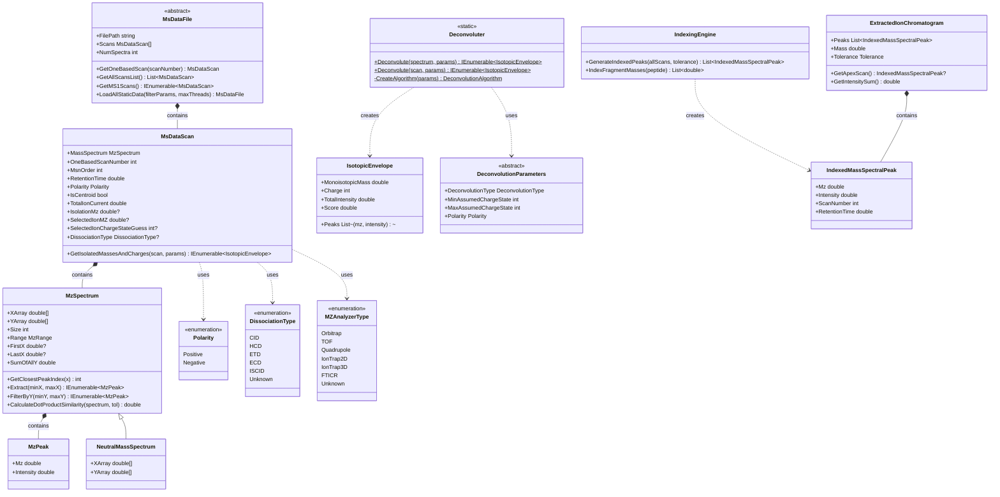

# Mass Spectrometry Library

## Overview

The Mass Spectrometry library provides core data structures and algorithms for representing and manipulating mass spectrometry data. This library implements fundamental concepts including spectra, scans, peaks, deconvolution, and spectral similarity, serving as the foundation for all MS data processing in mzLib.

### Key Features

- **Spectrum Representation**: Flexible data structures for m/z and neutral mass spectra
- **Scan Management**: Complete MS scan metadata and hierarchy
- **Deconvolution**: Multiple algorithms for charge state deconvolution
- **Peak Indexing**: Efficient peak searching and extracted ion chromatogram (XIC) generation
- **Spectral Similarity**: Calculate similarity between spectra using various metrics
- **Type-Safe Design**: Enumerations for dissociation types, polarities, and analyzer types

### Quick Start

```csharp
// Working with a spectrum
var spectrum = new MzSpectrum(mzArray, intensityArray, shouldCopy: false);

// Find closest peak
int peakIndex = spectrum.GetClosestPeakIndex(targetMz);
double peakMz = spectrum.XArray[peakIndex];
double peakIntensity = spectrum.YArray[peakIndex];

// Extract region
var peaks = spectrum.Extract(minMz: 400.0, maxMz: 500.0);

// Deconvolute spectrum
var deconParams = new ClassicDeconvolutionParameters(
    minCharge: 1,
    maxCharge: 60,
    deconPpm: 20,
    intensityRatio: 3
);
var envelopes = Deconvoluter.Deconvolute(spectrum, deconParams);

// Calculate spectral similarity
double similarity = spectrum.CalculateDotProductSimilarity(otherSpectrum, tolerance);
```

## System Design

### Architecture Overview



### Core Components

#### MzSpectrum
The fundamental representation of a mass spectrum with m/z and intensity arrays.

```csharp
public class MzSpectrum : IEquatable<MzSpectrum>
{
    // Data arrays
    public double[] XArray { get; }  // m/z values
    public double[] YArray { get; }  // Intensity values
    
    // Properties
    public int Size { get; }
    public MzRange Range { get; }
    public double? FirstX { get; }
    public double? LastX { get; }
    public double SumOfAllY { get; }
    
    // Peak access
    public int GetClosestPeakIndex(double x);
    public IEnumerable<MzPeak> Extract(double minX, double maxX);
    public IEnumerable<MzPeak> FilterByY(double minY, double maxY);
    
    // Analysis
    public double CalculateDotProductSimilarity(MzSpectrum other, Tolerance tol);
}
```

#### MsDataScan
Represents a complete MS scan with spectrum and metadata.

```csharp
public class MsDataScan
{
    // Core properties
    public MzSpectrum MassSpectrum { get; }
    public int OneBasedScanNumber { get; }
    public int MsnOrder { get; }
    public double RetentionTime { get; }
    public bool IsCentroid { get; }
    
    // MS/MS properties
    public double? IsolationMz { get; }
    public double? SelectedIonMZ { get; }
    public int? SelectedIonChargeStateGuess { get; }
    public DissociationType? DissociationType { get; }
    
    // Methods
    public IEnumerable<IsotopicEnvelope> GetIsolatedMassesAndCharges(
        MsDataScan precursorScan, DeconvolutionParameters params);
}
```

#### MsDataFile
Abstract base for reading MS data files.

```csharp
public abstract class MsDataFile
{
    public string FilePath { get; }
    public MsDataScan[] Scans { get; }
    public int NumSpectra { get; }
    
    // Abstract methods
    public abstract MsDataFile LoadAllStaticData(
        FilteringParams filterParams = null, int maxThreads = 1);
    
    // Common methods
    public virtual MsDataScan GetOneBasedScan(int scanNumber);
    public virtual List<MsDataScan> GetAllScansList();
    public virtual IEnumerable<MsDataScan> GetMS1Scans();
}
```

## Working with Spectra

### Creating Spectra

```csharp
// From arrays
double[] mzArray = { 100.0, 200.0, 300.0 };
double[] intensityArray = { 1000.0, 5000.0, 2000.0 };

// Spectrum takes ownership (no copy)
var spectrum = new MzSpectrum(mzArray, intensityArray, shouldCopy: false);

// Spectrum creates copy
var spectrumCopy = new MzSpectrum(mzArray, intensityArray, shouldCopy: true);

// From 2D array
double[,] mzIntensities = new double[2, 3]
{
    { 100.0, 200.0, 300.0 },      // m/z
    { 1000.0, 5000.0, 2000.0 }    // intensity
};
var spectrum2 = new MzSpectrum(mzIntensities);
```

### Accessing Spectrum Data

```csharp
var spectrum = new MzSpectrum(mzArray, intensityArray, false);

// Basic properties
int numPeaks = spectrum.Size;
double minMz = spectrum.FirstX.Value;
double maxMz = spectrum.LastX.Value;
double totalIntensity = spectrum.SumOfAllY;
MzRange range = spectrum.Range;  // minMz to maxMz

// Find base peak
int basePeakIndex = spectrum.IndexOfPeakWithHighesetY.Value;
double basePeakMz = spectrum.XofPeakWithHighestY.Value;
double basePeakIntensity = spectrum.YofPeakWithHighestY.Value;

// Direct array access
for (int i = 0; i < spectrum.Size; i++)
{
    double mz = spectrum.XArray[i];
    double intensity = spectrum.YArray[i];
    Console.WriteLine($"Peak {i}: m/z={mz:F4}, Intensity={intensity:E2}");
}
```

### Finding Peaks

```csharp
var spectrum = new MzSpectrum(mzArray, intensityArray, false);

// Find closest peak to target m/z
double targetMz = 445.12;
int closestIndex = spectrum.GetClosestPeakIndex(targetMz);
double actualMz = spectrum.XArray[closestIndex];
double intensity = spectrum.YArray[closestIndex];

Console.WriteLine($"Target: {targetMz:F2}, Actual: {actualMz:F4}");

// Get closest m/z value
double? closestMz = spectrum.GetClosestPeakXvalue(targetMz);

// Count peaks in range
int peakCount = spectrum.NumPeaksWithinRange(400.0, 500.0);
```

### Extracting Peak Regions

```csharp
var spectrum = new MzSpectrum(mzArray, intensityArray, false);

// Extract peaks in m/z range
var peaksInRange = spectrum.Extract(minX: 400.0, maxX: 500.0);
foreach (var peak in peaksInRange)
{
    Console.WriteLine($"m/z: {peak.Mz:F4}, Intensity: {peak.Intensity:E2}");
}

// Extract using MzRange
var range = new MzRange(400.0, 500.0);
var peaks2 = spectrum.Extract(range);

// Filter by intensity
var highIntensityPeaks = spectrum.FilterByY(minY: 1e5, maxY: 1e8);

// Filter by intensity range
var intensityRange = new DoubleRange(1e5, 1e8);
var peaks3 = spectrum.FilterByY(intensityRange);

// Get top N peaks
int topN = 100;
var topPeaks = spectrum.FilterByNumberOfMostIntense(topN);
```

### Spectrum Transformations

```csharp
// Replace m/z values using custom function
spectrum.ReplaceXbyApplyingFunction(peak => 
{
    // Custom calibration function
    return peak.Mz + CalculateMassError(peak.Mz);
});

// Convert to 2D array
double[,] data = spectrum.CopyTo2DArray();
// data[0, i] = m/z
// data[1, i] = intensity
```

## Working with Scans

### Accessing Scan Properties

```csharp
MsDataScan scan = msDataFile.GetOneBasedScan(100);

// Basic information
int scanNumber = scan.OneBasedScanNumber;
int msLevel = scan.MsnOrder;  // 1 for MS1, 2 for MS2, etc.
double retentionTime = scan.RetentionTime;  // minutes
bool isCentroid = scan.IsCentroid;
Polarity polarity = scan.Polarity;

// Spectrum data
MzSpectrum spectrum = scan.MassSpectrum;
double tic = scan.TotalIonCurrent;
MzRange scanRange = scan.ScanWindowRange;

// Instrument metadata
MZAnalyzerType analyzer = scan.MzAnalyzer;
double? injectionTime = scan.InjectionTime;
string nativeId = scan.NativeId;
string scanFilter = scan.ScanFilter;
```

### MS2 Scan Properties

```csharp
MsDataScan ms2Scan = msDataFile.GetOneBasedScan(200);

// Check if MS2
if (ms2Scan.MsnOrder == 2)
{
    // Precursor information
    double? precursorMz = ms2Scan.SelectedIonMZ;
    int? charge = ms2Scan.SelectedIonChargeStateGuess;
    double? precursorIntensity = ms2Scan.SelectedIonIntensity;
    
    // Isolation information
    double? isolationMz = ms2Scan.IsolationMz;
    double? isolationWidth = ms2Scan.IsolationWidth;
    MzRange isolationRange = ms2Scan.IsolationRange;
    
    // Fragmentation
    DissociationType? dissociation = ms2Scan.DissociationType;
    string hcdEnergy = ms2Scan.HcdEnergy;
    
    // Precursor scan
    int? precursorScanNumber = ms2Scan.OneBasedPrecursorScanNumber;
    
    // Monoisotopic mass guess (if refined)
    double? monoMz = ms2Scan.SelectedIonMonoisotopicGuessMz;
    double? monoIntensity = ms2Scan.SelectedIonMonoisotopicGuessIntensity;
}
```

### Deconvolution from Scans

```csharp
// Get precursor isotopic envelopes within isolation window
var deconParams = new ClassicDeconvolutionParameters(
    minCharge: 1,
    maxCharge: 60,
    deconPpm: 20,
    intensityRatio: 3
);

// From precursor scan
var envelopes = ms2.GetIsolatedMassesAndCharges(ms1, deconParams);

foreach (var envelope in envelopes)
{
    Console.WriteLine($"Mass: {envelope.MonoisotopicMass:F4}");
    Console.WriteLine($"Charge: {envelope.Charge}");
    Console.WriteLine($"Intensity: {envelope.TotalIntensity:E2}");
    Console.WriteLine($"Score: {envelope.Score:F2}");
}

// From precursor spectrum directly
var envelopes2 = ms2.GetIsolatedMassesAndCharges(ms1.MassSpectrum, deconParams);
```

## Deconvolution

The deconvolution system is detailed in the [Deconvolution Wiki](https://github.com/smith-chem-wisc/mzLib/wiki/Spectral-Deconvolution-(Decharging-and-Deisotoping)). Here's a brief overview:

### Quick Deconvolution

```csharp
// Create parameters
var params = new ClassicDeconvolutionParameters(
    minCharge: 1,
    maxCharge: 60,
    deconPpm: 20,
    intensityRatio: 3,
    polarity: Polarity.Positive
);

// Deconvolute spectrum
var envelopes = Deconvoluter.Deconvolute(spectrum, params);

// Deconvolute scan
var envelopes2 = Deconvoluter.Deconvolute(scan, params);

// Deconvolute specific range
var range = new MzRange(400, 500);
var envelopes3 = Deconvoluter.Deconvolute(spectrum, params, range);
```

### Working with Isotopic Envelopes

```csharp
foreach (var envelope in envelopes)
{
    // Mass and charge
    double monoMass = envelope.MonoisotopicMass;
    int charge = envelope.Charge;
    double mostAbundantMass = envelope.MostAbundantObservedIsotopicMass;
    
    // Intensity and quality
    double totalIntensity = envelope.TotalIntensity;
    double score = envelope.Score;
    
    // Individual peaks
    foreach (var (mz, intensity) in envelope.Peaks)
    {
        Console.WriteLine($"  Peak: m/z={mz:F4}, I={intensity:E2}");
    }
}
```

## Peak Indexing and XICs

### Indexing Peaks

```csharp
// Index all peaks from all scans
var indexEngine = new IndexingEngine();
var allScans = msDataFile.GetAllScansList();
var tolerance = new PpmTolerance(10);

var indexedPeaks = indexEngine.GenerateIndexedPeaks(
    allScans, 
    tolerance
);

// Access indexed peaks
foreach (var peak in indexedPeaks.Take(10))
{
    Console.WriteLine($"m/z: {peak.Mz:F4}");
    Console.WriteLine($"Intensity: {peak.Intensity:E2}");
    Console.WriteLine($"Scan: {peak.ScanNumber}");
    Console.WriteLine($"RT: {peak.RetentionTime:F2} min");
}
```

### Extracted Ion Chromatograms

```csharp
// Create XIC for specific mass
double targetMz = 445.12;
var tolerance = new PpmTolerance(10);

var xic = new ExtractedIonChromatogram(
    mass: targetMz,
    tolerance: tolerance,
    peaks: indexedPeaks.Where(p => tolerance.Within(p.Mz, targetMz)).ToList()
);

// Get apex (most intense point)
var apex = xic.GetApexScan();
if (apex != null)
{
    Console.WriteLine($"Apex RT: {apex.RetentionTime:F2} min");
    Console.WriteLine($"Apex Intensity: {apex.Intensity:E2}");
}

// Sum intensity across chromatogram
double totalIntensity = xic.GetIntensitySum();

// Access all peaks
foreach (var peak in xic.Peaks)
{
    Console.WriteLine($"RT: {peak.RetentionTime:F2}, I: {peak.Intensity:E2}");
}
```

### XIC Splines

```csharp
// Create spline for smoothing XIC
var spline = new XicSpline(xic.Peaks);

// Evaluate at specific retention time
double rtToEvaluate = 15.5;
double interpolatedIntensity = spline.Evaluate(rtToEvaluate);

// Find local maxima
var maxima = spline.FindLocalMaxima();

// Different spline types available:
// - XicLinearSpline: Linear interpolation
// - xICCubicSpline: Cubic spline (smoother)
// - Bspline: B-spline basis functions
```

## Spectral Similarity

### Dot Product Similarity

```csharp
var spectrum1 = new MzSpectrum(mz1, intensity1, false);
var spectrum2 = new MzSpectrum(mz2, intensity2, false);

var tolerance = new PpmTolerance(20);

// Calculate similarity (0 to 1)
double similarity = spectrum1.CalculateDotProductSimilarity(
    spectrum2, 
    tolerance
);

Console.WriteLine($"Similarity: {similarity:F4}");

// Values close to 1 = very similar
// Values close to 0 = dissimilar
```

### How It Works

The dot product similarity algorithm:
1. Converts both spectra to vectors
2. Matches peaks within tolerance
3. Fills unmatched positions with zeros
4. Calculates normalized dot product

**Formula**: 
```
similarity = (Σ(I₁ᵢ * I₂ᵢ)) / (√(Σ I₁ᵢ²) * √(Σ I₂ᵢ²))
```

### Use Cases

```csharp
// Compare experimental to library spectrum
double libraryMatch = experimentalSpectrum.CalculateDotProductSimilarity(
    librarySpectrum, 
    tolerance
);

if (libraryMatch > 0.7)
{
    Console.WriteLine("Good match to library");
}

// Compare two experimental spectra
double similarity = spectrum1.CalculateDotProductSimilarity(spectrum2, tolerance);

// Compare across charge states (normalize first)
var normalizedSpec1 = NormalizeSpectrum(spectrum1);
var normalizedSpec2 = NormalizeSpectrum(spectrum2);
double crossChargeMatch = normalizedSpec1.CalculateDotProductSimilarity(
    normalizedSpec2, 
    tolerance
);
```

## Spectrum Processing

### XCorr Preprocessing

Transform spectrum for cross-correlation scoring (used in SEQUEST-style searches):

```csharp
var spectrum = scan.MassSpectrum;

// Apply XCorr preprocessing
spectrum.XCorrPrePreprocessing(
    scanRangeMinMz: 200.0,
    scanRangeMaxMz: 2000.0,
    precursorMz: 445.12,
    precursorDiscardRange: 1.5,
    discreteMassBin: 1.0005079,
    minimumAllowedIntensityRatioToBasePeak: 0.05
);

// Spectrum is now preprocessed
bool isProcessed = spectrum.XcorrProcessed;  // true
```

**What It Does**:
1. Bins spectrum into discrete m/z units
2. Square-roots intensities
3. Removes precursor region (±1.5 Da)
4. Filters low-intensity peaks
5. Subtracts local background
6. Normalizes intensities

### Filtering Peaks

```csharp
// Filter by intensity threshold
var params = new FilteringParams(
    numberOfPeaksToKeepPerWindow: 200,
    minimumAllowedIntensityRatioToBasePeak: 0.01,
    windowWidthThomsons: 100,
    numberOfWindows: null,
    applyTrimmingToMs1: true,
    applyTrimmingToMsMs: true
);

// Apply to spectrum
WindowModeHelper.Run(
    ref intensities, 
    ref mzs, 
    params,
    minMz, 
    maxMz,
    normalizePeaksFirst: true
);
```

## Enumerations

### Polarity

```csharp
public enum Polarity
{
    Positive = 1,
    Negative = -1
}

// Usage
if (scan.Polarity == Polarity.Positive)
{
    // Handle positive mode
}
```

### DissociationType

```csharp
public enum DissociationType
{
    CID,      // Collision-Induced Dissociation
    HCD,      // Higher-energy Collisional Dissociation
    ETD,      // Electron Transfer Dissociation
    ECD,      // Electron Capture Dissociation
    ISCID,    // In-Source CID
    PQD,      // Pulsed Q Dissociation
    EThcD,    // ETD with supplemental HCD
    Unknown
}

// Usage
switch (scan.DissociationType)
{
    case DissociationType.HCD:
        // HCD-specific processing
        break;
    case DissociationType.ETD:
        // ETD-specific processing
        break;
}
```

### MZAnalyzerType

```csharp
public enum MZAnalyzerType
{
    Orbitrap,
    TOF,
    Quadrupole,
    IonTrap2D,
    IonTrap3D,
    FTICR,
    Sector,
    Unknown
}

// Usage
if (scan.MzAnalyzer == MZAnalyzerType.Orbitrap)
{
    // High-resolution processing
}
```

## Data Structures

### MzPeak

```csharp
public class MzPeak
{
    public double Mz { get; }
    public double Intensity { get; }
    
    public MzPeak(double mz, double intensity)
    {
        Mz = mz;
        Intensity = intensity;
    }
}

// Usage
var peak = new MzPeak(445.12, 1.5e6);
Console.WriteLine($"Peak at {peak.Mz:F4} m/z with intensity {peak.Intensity:E2}");
```

### MzRange

```csharp
public class MzRange
{
    public double Minimum { get; }
    public double Maximum { get; }
    
    public MzRange(double min, double max)
    {
        Minimum = min;
        Maximum = max;
    }
    
    public bool Contains(double value);
    public double Width { get; }
}

// Usage
var range = new MzRange(400.0, 500.0);
bool inRange = range.Contains(445.12);  // true
double width = range.Width;  // 100.0
```

### SourceFile

```csharp
public class SourceFile
{
    public string FilePath { get; }
    public string NativeIdFormat { get; }
    public string FileFormat { get; }
    public string InstrumentName { get; }
    public string InstrumentModel { get; }
    public string InstrumentSerialNumber { get; }
    
    // Checksums
    public string Sha1CheckSum { get; }
    public string Md5CheckSum { get; }
}

// Access from scan
var sourceFile = msDataFile.SourceFile;
Console.WriteLine($"Instrument: {sourceFile.InstrumentName}");
Console.WriteLine($"Model: {sourceFile.InstrumentModel}");
```

## Common Use Cases

### Extract Precursor Spectrum

```csharp
// Get MS2 scan
MsDataScan ms2 = msDataFile.GetOneBasedScan(200);

// Get precursor scan
int precursorScanNum = ms2.OneBasedPrecursorScanNumber.Value;
MsDataScan ms1 = msDataFile.GetOneBasedScan(precursorScanNum);

// Extract isolation window
if (ms2.IsolationRange != null)
{
    var isolatedPeaks = ms1.MassSpectrum.Extract(ms2.IsolationRange);
    
    foreach (var peak in isolatedPeaks)
    {
        Console.WriteLine($"Isolated peak: {peak.Mz:F4}");
    }
}
```

### Find Charge State from Precursor

```csharp
// Get isotopic envelopes in isolation window
var deconParams = new ClassicDeconvolutionParameters(1, 10, 20, 3);
var envelopes = ms2.GetIsolatedMassesAndCharges(ms1, deconParams);

// Find envelope containing selected ion
var precursorMz = ms2.SelectedIonMZ.Value;
var tolerance = new PpmTolerance(10);

var precursorEnvelope = envelopes
    .FirstOrDefault(e => e.Peaks.Any(p => tolerance.Within(p.mz, precursorMz)));

if (precursorEnvelope != null)
{
    int charge = precursorEnvelope.Charge;
    double mass = precursorEnvelope.MonoisotopicMass;
    
    Console.WriteLine($"Precursor charge: {charge}");
    Console.WriteLine($"Precursor mass: {mass:F4} Da");
}
```

### Generate XICs for Multiple Masses

```csharp
// Target masses to extract
double[] targetMasses = { 445.12, 672.34, 891.56 };
var tolerance = new PpmTolerance(10);

// Index all peaks
var indexEngine = new IndexingEngine();
var allScans = msDataFile.GetAllScansList();
var allPeaks = indexEngine.GenerateIndexedPeaks(allScans, tolerance);

// Create XIC for each mass
foreach (var targetMass in targetMasses)
{
    var xicPeaks = allPeaks
        .Where(p => tolerance.Within(p.Mz, targetMass))
        .ToList();
    
    var xic = new ExtractedIonChromatogram(targetMass, tolerance, xicPeaks);
    
    var apex = xic.GetApexScan();
    if (apex != null)
    {
        Console.WriteLine($"Mass {targetMass:F2}: Apex at RT {apex.RetentionTime:F2} min");
    }
}
```

### Compare MS/MS Spectra

```csharp
// Get two MS2 scans
MsDataScan ms2_1 = msDataFile.GetOneBasedScan(200);
MsDataScan ms2_2 = msDataFile.GetOneBasedScan(400);

var tolerance = new PpmTolerance(20);

// Calculate similarity
double similarity = ms2_1.MassSpectrum.CalculateDotProductSimilarity(
    ms2_2.MassSpectrum,
    tolerance
);

Console.WriteLine($"Spectral similarity: {similarity:F3}");

if (similarity > 0.8)
{
    Console.WriteLine("Likely same peptide/molecule");
}
else if (similarity > 0.5)
{
    Console.WriteLine("Possibly related peptides");
}
else
{
    Console.WriteLine("Different peptides");
}
```

### Filter Scans by Criteria

```csharp
var allScans = msDataFile.GetAllScansList();

// Get high-quality MS2 scans
var goodMs2Scans = allScans
    .Where(s => s.MsnOrder == 2)
    .Where(s => s.TotalIonCurrent > 1e6)
    .Where(s => s.MassSpectrum.Size > 50)
    .Where(s => s.SelectedIonChargeStateGuess.HasValue)
    .ToList();

Console.WriteLine($"Found {goodMs2Scans.Count} high-quality MS2 scans");

// Get MS1 scans in retention time range
var ms1InRange = allScans
    .Where(s => s.MsnOrder == 1)
    .Where(s => s.RetentionTime >= 10.0 && s.RetentionTime <= 20.0)
    .ToList();
```

## Integration with mzLib

The MassSpectrometry library is fundamental to all mzLib components:

### With Readers

```csharp
// Readers provide MsDataFile and MsDataScan
var msDataFile = MsDataFileReader.GetDataFile(filePath);
msDataFile.LoadAllStaticData();

var scan = msDataFile.GetOneBasedScan(1);
MzSpectrum spectrum = scan.MassSpectrum;
```

### With Chemistry

```csharp
// Use chemistry for theoretical isotopic distributions
var formula = ChemicalFormula.ParseFormula("C100H150N30O30");
var theoreticalDist = IsotopicDistribution.GetDistribution(formula);

// Compare to experimental
var experimentalSpectrum = scan.MassSpectrum;
// ... match peaks ...
```

### With Proteomics

```csharp
// Proteomics uses MassSpectrometry for all spectral processing
// - Peptide mass calculation
// - Fragment ion generation
// - Spectral matching
// - Modification localization
```

## Best Practices

### Spectrum Access

```csharp
// Good: Check size before accessing
if (spectrum.Size > 0)
{
    double firstMz = spectrum.FirstX.Value;
    double lastMz = spectrum.LastX.Value;
}

// Avoid: Assuming spectrum has peaks
// double firstMz = spectrum.FirstX.Value;  // May throw if empty
```

### Scan Metadata

```csharp
// Good: Check for null MS/MS properties
if (scan.MsnOrder == 2 && scan.SelectedIonMZ.HasValue)
{
    double precursorMz = scan.SelectedIonMZ.Value;
    // ...
}

// Avoid: Assuming MS2 properties exist
// double precursorMz = scan.SelectedIonMZ.Value;  // May be null for MS1
```

### Deconvolution

```csharp
// Good: Choose appropriate algorithm and parameters
var params = scan.Polarity == Polarity.Positive
    ? new ClassicDeconvolutionParameters(1, 60, 20, 3, Polarity.Positive)
    : new ClassicDeconvolutionParameters(1, 60, 20, 3, Polarity.Negative);

// Good: Use range when possible
var range = scan.IsolationRange ?? new MzRange(400, 1600);
var envelopes = Deconvoluter.Deconvolute(spectrum, params, range);
```

## Dependencies

### Project References

```
MassSpectrometry
  ↓
  Chemistry (ChemicalFormula, IsotopicDistribution)
  ↓
  MzLibUtil (Utilities, Tolerances)
```

### NuGet Packages

- **MathNet.Numerics**: Statistical calculations (standard deviation, quantiles)
- **CsvHelper**: Export/import functionality

## See Also

- [Deconvolution Wiki](https://github.com/smith-chem-wisc/mzLib/wiki/Spectral-Deconvolution-(Decharging-and-Deisotoping))) - Detailed deconvolution documentation
- [MS Data File Reading Wiki](https://github.com/smith-chem-wisc/mzLib/wiki/File-Reading-%E2%80%90-Mass-Spec) - Reading MS data files
- [Chemistry Wiki](https://github.com/smith-chem-wisc/mzLib/wiki/Chemistry) - Chemical formula and mass calculations
- [Spectral Averaging Wiki](https://github.com/smith-chem-wisc/mzLib/wiki/Spectral-Averaging) - Averaging multiple scans
