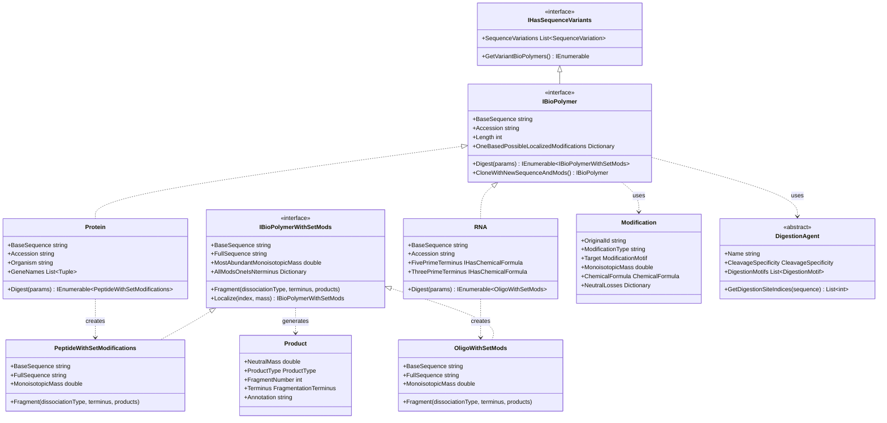

# Omics: Base Foundation

## Overview

The Omics library provides the foundational infrastructure for working with biological polymers (proteins, RNA, DNA) and their fragments in mass spectrometry applications. It implements a unified, type-safe architecture that serves as the base for both Proteomics and Transcriptomics workflows, ensuring consistent handling of sequences, modifications, digestion, and fragmentation across different omics domains.

### Key Features

- **Unified Architecture**: Common interfaces and base classes for all biological polymers
- **Modification System**: Comprehensive modification representation with motif matching
- **Enzymatic Digestion**: Flexible digestion framework supporting custom enzymes
- **Fragmentation**: MS/MS fragmentation with multiple dissociation types
- **Sequence Variants**: SNP, indel, and substitution support
- **Type Safety**: Strong typing through interfaces and inheritance

### Quick Start

```csharp
// Working with proteins (via Proteomics library)
var protein = new Protein("MAQTQVLQVAKEATPTPLPTAVPR", "P12345");

// Digest with trypsin
var digestionParams = new DigestionParams(protease: "trypsin");
var peptides = protein.Digest(digestionParams, fixedMods, variableMods).ToList();

// Fragment a peptide
var peptide = peptides.First();
var products = new List<Product>();
peptide.Fragment(DissociationType.HCD, FragmentationTerminus.Both, products);

// Working with RNA (via Transcriptomics library)
var rna = new RNA("AUGCCGUACGAU", "RNA001");

// Digest with RNase
var rnaDigestionParams = new RnaDigestionParams(rnase: "RNase T1");
var oligos = rna.Digest(rnaDigestionParams, fixedMods, variableMods).ToList();
```

## System Design

### Architecture Overview

The Omics library uses a hierarchical interface-based design:



## Core Concepts

### IBioPolymer Interface

The `IBioPolymer` interface represents an undigested biological polymer (protein, RNA, DNA):

```csharp
public interface IBioPolymer : IEquatable<IBioPolymer>, IHasSequenceVariants
{
    string Name { get; }
    string FullName { get; }
    string BaseSequence { get; }
    int Length { get; }
    string DatabaseFilePath { get; }
    bool IsDecoy { get; }
    bool IsContaminant { get; }
    string Organism { get; }
    string Accession { get; }
    List<Tuple<string, string>> GeneNames { get; }
    IDictionary<int, List<Modification>> OneBasedPossibleLocalizedModifications { get; }
    
    // Core methods
    IEnumerable<IBioPolymerWithSetMods> Digest(
        IDigestionParams digestionParams, 
        List<Modification> allKnownFixedModifications,
        List<Modification> variableModifications);
    
    IBioPolymer CloneWithNewSequenceAndMods(
        string newBaseSequence, 
        IDictionary<int, List<Modification>>? newMods);
}
```

**Key Properties**:
- **BaseSequence**: The unmodified sequence (e.g., "PEPTIDE" or "AUGC")
- **Accession**: Unique identifier from database
- **OneBasedPossibleLocalizedModifications**: Modifications that can occur at each position

**Implemented By**:
- `Protein` (Proteomics library)
- `RNA` (Transcriptomics library)

### IBioPolymerWithSetMods Interface

The `IBioPolymerWithSetMods` interface represents a digested fragment with specific modifications:

```csharp
public interface IBioPolymerWithSetMods : IHasChemicalFormula, IEquatable<IBioPolymerWithSetMods>
{
    string BaseSequence { get; }
    string FullSequence { get; }
    double MostAbundantMonoisotopicMass { get; }
    int OneBasedStartResidue { get; }
    int OneBasedEndResidue { get; }
    int MissedCleavages { get; }
    Dictionary<int, Modification> AllModsOneIsNterminus { get; }
    int NumMods { get; }
    IBioPolymer Parent { get; }
    
    // Fragmentation
    void Fragment(
        DissociationType dissociationType, 
        FragmentationTerminus fragmentationTerminus,
        List<Product> products);
    
    void FragmentInternally(
        DissociationType dissociationType, 
        int minLengthOfFragments,
        List<Product> products);
    
    // Modification localization
    IBioPolymerWithSetMods Localize(int indexOfMass, double massToLocalize);
}
```

**Key Properties**:
- **BaseSequence**: Sequence without modification annotations
- **FullSequence**: Sequence with modification annotations (e.g., "PEP[+80]TIDE")
- **AllModsOneIsNterminus**: Dictionary of modifications (1 = N-terminus, 2 = first residue, etc.)

**Implemented By**:
- `PeptideWithSetModifications` (Proteomics library)
- `OligoWithSetMods` (Transcriptomics library)

## Modifications

The Omics library provides a comprehensive modification system. See [Omics: Modifications](https://github.com/smith-chem-wisc/mzLib/wiki/Omics:-Modifications) for detailed documentation.

### Basic Modification Usage

```csharp
// Create a modification
var phospho = new Modification(
    _originalId: "Phosphorylation",
    _modificationType: "Common",
    _target: ModificationMotif.GetMotif("S"),
    _locationRestriction: "Anywhere.",
    _chemicalFormula: ChemicalFormula.ParseFormula("HO3P")
);

// Access modification properties
Console.WriteLine($"ID: {phospho.IdWithMotif}");
Console.WriteLine($"Mass: {phospho.MonoisotopicMass:F4} Da");
Console.WriteLine($"Target: {phospho.Target}");
Console.WriteLine($"Formula: {phospho.ChemicalFormula.Formula}");

// Modifications with neutral losses
var acetyl = new Modification(
    _originalId: "Acetylation",
    _target: ModificationMotif.GetMotif("K"),
    _chemicalFormula: ChemicalFormula.ParseFormula("C2H2O"),
    _neutralLosses: new Dictionary<DissociationType, List<double>>
    {
        { DissociationType.HCD, new List<double> { 42.0106 } }
    }
);
```

### Modification Motifs

```csharp
// Simple motif - single residue
var singleResidue = ModificationMotif.GetMotif("S");

// Complex motif with context
var motif = ModificationMotif.GetMotif("T");  // Threonine

// Check if motif fits sequence
bool fits = ModificationMotif.ModFits(modification, "PEPTIDE", 0, 7, position: 2);
```

## Enzymatic Digestion

The Omics library provides a flexible digestion framework. See [Omics: Digestion](https://github.com/smith-chem-wisc/mzLib/wiki/Omics:-Digestion) for detailed documentation.

### Basic Digestion

```csharp
// Define fixed and variable modifications
var fixedMods = new List<Modification> { carbamidomethyl };
var variableMods = new List<Modification> { oxidation, phosphorylation };

// Digest protein with trypsin
var digestionParams = new DigestionParams(
    protease: "trypsin",
    maxMissedCleavages: 2,
    minPeptideLength: 7,
    maxPeptideLength: 30
);

var peptides = protein.Digest(digestionParams, fixedMods, variableMods);

// Process digestion products
foreach (var peptide in peptides)
{
    Console.WriteLine($"Sequence: {peptide.FullSequence}");
    Console.WriteLine($"Mass: {peptide.MonoisotopicMass:F4} Da");
    Console.WriteLine($"Missed cleavages: {peptide.MissedCleavages}");
}
```

### Digestion Parameters

Common parameters across all digestion types:

| Parameter | Description | Typical Values |
|-----------|-------------|----------------|
| **Enzyme** | Protease or RNase | "trypsin", "RNase T1" |
| **MaxMissedCleavages** | Maximum missed cleavage sites | 0-3 |
| **MinLength** | Minimum fragment length | 5-7 |
| **MaxLength** | Maximum fragment length | 30-50 |
| **SearchModifications** | Variable modifications to consider | List of modifications |
| **InitiatorMethionine** | N-terminal methionine handling | Variable, Retain, Cleave |

## Fragmentation

The Omics library supports MS/MS fragmentation for all polymer types. See [Omics: Fragmentation](https://github.com/smith-chem-wisc/mzLib/wiki/Omics:-Fragmentation) for detailed documentation.

### Basic Fragmentation

```csharp
// Fragment a peptide
var products = new List<Product>();
peptide.Fragment(
    dissociationType: DissociationType.HCD,
    fragmentationTerminus: FragmentationTerminus.Both,
    products: products
);

// Process fragment ions
foreach (var product in products)
{
    Console.WriteLine($"Ion: {product.Annotation}");
    Console.WriteLine($"Mass: {product.NeutralMass:F4} Da");
    Console.WriteLine($"Type: {product.ProductType}");
}
```

### Dissociation Types

The library supports multiple fragmentation methods:

```csharp
public enum DissociationType
{
    CID,      // Collision-Induced Dissociation
    HCD,      // Higher-energy Collisional Dissociation
    ETD,      // Electron Transfer Dissociation
    ECD,      // Electron Capture Dissociation
    EThcD,    // ETD with supplemental HCD
    UVPD,     // Ultraviolet Photodissociation
    Custom,   // User-defined
    AnyActivationType
}
```

### Product Types

Different fragmentation methods produce different ion types:

**Peptide Ions** (CID/HCD):
- b-ions: N-terminal fragments
- y-ions: C-terminal fragments
- a-ions: b-ions minus CO
- c-ions: N-terminal + NH3
- z-ions: C-terminal - NH3

**Oligo Ions** (CID/HCD):
- a/b/c/d-ions: 5' fragments
- w/x/y/z-ions: 3' fragments

**Internal Fragments**:
- Generated from multiple cleavages
- Annotation: `yIb[18-36]`

## Sequence Variants

The Omics library supports sequence variations (SNPs, indels, substitutions):

```csharp
// Protein with variant
var variant = new SequenceVariation(
    oneBasedBeginPosition: 10,
    oneBasedEndPosition: 10,
    originalSequence: "A",
    variantSequence: "V",
    description: "A10V substitution"
);

protein.SequenceVariations.Add(variant);

// Get all variant forms
var variantProteins = protein.GetVariantBioPolymers(
    maxAllowedVariants: 4,
    minAlleleDepth: 1
);

// Each variant has modified sequence
foreach (var variantProtein in variantProteins)
{
    Console.WriteLine($"Accession: {variantProtein.Accession}");
    Console.WriteLine($"Sequence: {variantProtein.BaseSequence}");
}
```

### Variant Application

Variants can be combined:
- **Homozygous**: Single variant applied
- **Heterozygous**: Multiple variants combined
- **Max combinations**: Controlled by `maxAllowedVariants`

## Full Sequence Format

Both `IBioPolymer` and `IBioPolymerWithSetMods` use a standardized full sequence format:

### Format Specification

```
[N-terminal mod]SEQUENCE[residue mod][residue mod]-[C-terminal mod]
```

**Examples**:

Protein peptide:
```
[Acetyl:Acetylation on X]PEPTIDE[Common:Oxidation on M]
```

RNA oligo:
```
[Variable:m6A on A]AUGC[Common:Pseudouridine on U]-[Variable:Phosphorylation on 3']
```

### Parsing Full Sequences

```csharp
// Parse base sequence from full sequence
string baseSeq = IBioPolymerWithSetMods.GetBaseSequenceFromFullSequence(fullSequence);

// Parse modifications from full sequence
var allKnownMods = new Dictionary<string, Modification> { /* ... */ };
var mods = IBioPolymerWithSetMods.GetModificationDictionaryFromFullSequence(
    fullSequence, 
    allKnownMods
);

// Build full sequence from base sequence and mods
string reconstructed = IBioPolymerWithSetMods.DetermineFullSequence(
    baseSequence, 
    allModsOneIsNterminus
);
```

## Common Operations

### Create and Digest Polymer

```csharp
// Create protein
var protein = new Protein(
    sequence: "MAQTQVLQVAKEATPTPLPTAVPR",
    accession: "P12345",
    organism: "Homo sapiens",
    geneNames: new List<Tuple<string, string>> { Tuple.Create("primary", "GENE1") }
);

// Define modifications
var carbamidomethyl = new Modification(/* ... */);
var oxidation = new Modification(/* ... */);

// Digest
var digestionParams = new DigestionParams(protease: "trypsin");
var peptides = protein.Digest(
    digestionParams, 
    fixedMods: new List<Modification> { carbamidomethyl },
    variableModifications: new List<Modification> { oxidation }
).ToList();

Console.WriteLine($"Generated {peptides.Count} peptides");
```

### Fragment and Match Ions

```csharp
// Get a peptide
var peptide = peptides[0];

// Generate theoretical fragments
var products = new List<Product>();
peptide.Fragment(DissociationType.HCD, FragmentationTerminus.Both, products);

// Match to experimental spectrum
var tolerance = new PpmTolerance(20);
var matches = new List<MatchedFragmentIon>();

foreach (var product in products)
{
    int closestPeakIndex = spectrum.GetClosestPeakIndex(product.NeutralMass);
    double experimentalMz = spectrum.XArray[closestPeakIndex];
    
    if (tolerance.Within(product.NeutralMass, experimentalMz))
    {
        matches.Add(new MatchedFragmentIon(
            product, 
            experimentalMz, 
            spectrum.YArray[closestPeakIndex],
            1  // charge
        ));
    }
}

Console.WriteLine($"Matched {matches.Count}/{products.Count} ions");
```

### Work with Modifications

```csharp
// Access modifications on a polymer
foreach (var posMod in protein.OneBasedPossibleLocalizedModifications)
{
    int position = posMod.Key;
    foreach (var mod in posMod.Value)
    {
        Console.WriteLine($"Position {position}: {mod.IdWithMotif}");
    }
}

// Access modifications on a digestion product
foreach (var mod in peptide.AllModsOneIsNterminus)
{
    int position = mod.Key;
    Console.WriteLine($"Position {position}: {mod.Value.IdWithMotif}");
    Console.WriteLine($"  Mass shift: {mod.Value.MonoisotopicMass:F4} Da");
}

// Check modification compatibility
if (ModificationLocalization.ModFits(modification, sequence, 0, sequence.Length, position))
{
    Console.WriteLine($"Modification fits at position {position}");
}
```

## Inheritance Hierarchy

Understanding the inheritance relationships:

```
IHasChemicalFormula (Chemistry)
    ↓
IHasSequenceVariants (Omics)
    ↓
IBioPolymer (Omics)
    ↓
    ├─ Protein (Proteomics)
    └─ RNA (Transcriptomics)

IBioPolymerWithSetMods (Omics)
    ↓
    ├─ PeptideWithSetModifications (Proteomics)
    │    ↓
    └─ OligoWithSetMods (Transcriptomics)
         ↓
         NucleolyticOligo (Transcriptomics)
```

## Integration

### Dependencies

```
Omics
  ↓
  Chemistry (ChemicalFormula, PeriodicTable)
  ↓
  MassSpectrometry (DissociationType, Polarity)
  ↓
  MzLibUtil (Utilities)
```

### Used By

```
Omics
  ↓
  ├─ Proteomics (protein-specific implementations)
  ├─ Transcriptomics (RNA-specific implementations)
  └─ UsefulProteomicsDatabases (database loading)
```

### External Packages

- **CsvHelper**: Reading enzyme/modification definitions
- No other external dependencies (pure .NET 8)

## Best Practices

### Working with Polymers

```csharp
// Good: Check sequence validity
if (protein.Length > 0 && !protein.IsDecoy)
{
    var peptides = protein.Digest(params, fixed, variable);
}

// Good: Handle digestion results efficiently
var peptidesList = protein.Digest(params, fixed, variable)
    .Where(p => p.Length >= 7 && p.Length <= 30)
    .ToList();

// Avoid: Repeated digestion
// Bad pattern - digest once and cache results
```

### Working with Modifications

```csharp
// Good: Cache modification dictionaries
var modDict = allMods.ToDictionary(m => m.IdWithMotif);

// Good: Validate modifications before use
if (modification.ValidModification)
{
    // Use modification
}

// Good: Check modification compatibility
if (ModificationLocalization.ModFits(mod, sequence, 0, len, pos))
{
    // Apply modification
}
```

### Fragmentation

```csharp
// Good: Reuse product list for multiple fragmentations
var products = new List<Product>();
foreach (var peptide in peptides)
{
    products.Clear();
    peptide.Fragment(DissociationType.HCD, FragmentationTerminus.Both, products);
    // Process products
}

// Good: Filter products before ion matching
var relevantProducts = products
    .Where(p => p.ProductType == ProductType.b || p.ProductType == ProductType.y)
    .Where(p => p.NeutralMass >= minMz && p.NeutralMass <= maxMz)
    .ToList();
```

## See Also

- [Omics: Modifications](https://github.com/smith-chem-wisc/mzLib/wiki/Omics:-Modifications) - Detailed modification system
- [Omics: Digestion](https://github.com/smith-chem-wisc/mzLib/wiki/Omics:-Digestion) - Enzymatic digestion
- [Omics: Fragmentation](https://github.com/smith-chem-wisc/mzLib/wiki/Omics:-Fragmentation) - MS/MS fragmentation
- [Omics: Decoy Generation](https://github.com/smith-chem-wisc/mzLib/wiki/Omics:-Decoy-Generation) - Generating decoys
- [Proteomics](https://github.com/smith-chem-wisc/mzLib/wiki/Proteomics) - Protein-specific features
- [Transcriptomics](https://github.com/smith-chem-wisc/mzLib/wiki/Transcriptomics) - RNA-specific features
- [Chemistry](https://github.com/smith-chem-wisc/mzLib/wiki/Chemistry) - Chemical formula operations
- [Mass Spectrometry](https://github.com/smith-chem-wisc/mzLib/wiki/Mass-Spectrometry) - MS data processing
