# Omics: Digestion

## Overview

The Omics digestion framework provides a unified, extensible system for enzymatic cleavage of biological polymers (proteins, RNA, DNA). It supports various cleavage specificities, modification handling, and custom enzyme definitions, enabling both standard and advanced digestion workflows for mass spectrometry analysis.

### Key Features

- **Unified Enzyme Framework**: Abstract base class for all digestion agents (proteases, RNases)
- **Flexible Cleavage Rules**: Motif-based cleavage with support for preventing sequences
- **Multiple Specificity Modes**: Full, semi-specific, non-specific, single-terminus digestion
- **Modification Integration**: Fixed and variable modifications applied during digestion
- **Custom Enzyme Support**: Define custom enzymes with specific cleavage rules
- **Performance Optimized**: Efficient digestion with memory pooling and caching

### Quick Start

```csharp
using Proteomics;
using Proteomics.ProteolyticDigestion;
using Omics.Modifications;

// Protein digestion with trypsin
var protein = new Protein("MAQTQVLQVAKEATPTPLPTAVPR", "P12345");

var digestionParams = new DigestionParams(
    protease: "trypsin",
    maxMissedCleavages: 2,
    minPeptideLength: 7,
    maxPeptideLength: 30
);

var fixedMods = new List<Modification> { carbamidomethyl };
var variableMods = new List<Modification> { oxidation };

var peptides = protein.Digest(digestionParams, fixedMods, variableMods).ToList();

foreach (var peptide in peptides)
{
    Console.WriteLine($"{peptide.FullSequence} ({peptide.MonoisotopicMass:F4} Da)");
    Console.WriteLine($"  Missed cleavages: {peptide.MissedCleavages}");
    Console.WriteLine($"  Positions: {peptide.OneBasedStartResidue}-{peptide.OneBasedEndResidue}");
}
```

## System Design

### Architecture Overview

```mermaid
classDiagram
    %% Core Digestion Framework
    class DigestionAgent {
        <<abstract>>
        +string Name
        +CleavageSpecificity CleavageSpecificity
        +List~DigestionMotif~ DigestionMotifs
        +Modification CleavageMod
        +GetDigestionSiteIndices(sequence) List~int~
    }

    class DigestionMotif {
        +string InducingCleavage
        +string PreventingCleavage
        +int CutIndex
        +string ExcludeFromWildcard
        +Fits(sequence, location) bool
        +ParseDigestionMotifsFromString(string) List~DigestionMotif~
    }

    class IDigestionParams {
        <<interface>>
        +DigestionAgent DigestionAgent
        +int MaxMissedCleavages
        +int MinLength
        +int MaxLength
        +int MaxMods
    }

    class CleavageSpecificity {
        <<enumeration>>
        None
        Semi
        Full
        SingleN
        SingleC
        Unknown
    }

    %% Protein Implementation
    class Protease {
        +string PsiMsAccessionNumber
        +string PsiMsName
        +GetUnmodifiedPeptides() IEnumerable~ProteolyticPeptide~
        +GetCleavageSpecificity() CleavageSpecificity
    }

    class DigestionParams {
        +Protease Protease
        +int MaxMissedCleavages
        +int MinPeptideLength
        +int MaxPeptideLength
        +InitiatorMethionineBehavior InitiatorMethionineBehavior
        +CleavageSpecificity SearchModeType
    }

    class ProteaseDictionary {
        +Dictionary~string, Protease~ Dictionary
        +LoadProteaseDictionary() Dictionary~string, Protease~
    }

    %% RNA Implementation
    class Rnase {
        +GetUnmodifiedOligos() IEnumerable~NucleolyticOligo~
    }

    class RnaDigestionParams {
        +Rnase Rnase
        +int MaxMissedCleavages
        +int MinOligoLength
        +int MaxOligoLength
    }

    class RnaseDictionary {
        +Dictionary~string, Rnase~ Dictionary
        +LoadRnaseDictionary() Dictionary~string, Rnase~
    }

    %% Digestion Products
    class DigestionProduct {
        <<abstract>>
        +IBioPolymer Parent
        +int OneBasedStartResidue
        +int OneBasedEndResidue
        +int MissedCleavages
        +string BaseSequence
        +CleavageSpecificity CleavageSpecificityForFdrCategory
    }

    class ProteolyticPeptide {
        +char PreviousResidue
        +char NextResidue
    }

    class NucleolyticOligo {
        +char FivePrimeResidue
        +char ThreePrimeResidue
    }

    %% Relationships
    DigestionAgent <|-- Protease
    DigestionAgent <|-- Rnase
    DigestionAgent *-- DigestionMotif
    DigestionAgent -- CleavageSpecificity
    IDigestionParams <|.. DigestionParams
    IDigestionParams <|.. RnaDigestionParams
    DigestionParams *-- Protease
    RnaDigestionParams *-- Rnase
    ProteaseDictionary ..> Protease : creates
    RnaseDictionary ..> Rnase : creates
    DigestionProduct <|-- ProteolyticPeptide
    DigestionProduct <|-- NucleolyticOligo
```



## Core Concepts

### DigestionAgent (Abstract Base)

`DigestionAgent` is the abstract base class for all enzymatic digestion agents:

```csharp
public abstract class DigestionAgent
{
    public readonly string Name;
    public CleavageSpecificity CleavageSpecificity { get; init; }
    public List<DigestionMotif> DigestionMotifs { get; init; }
    public Modification CleavageMod { get; set; }
    
    public List<int> GetDigestionSiteIndices(string sequence);
}
```

**Key Properties**:
- **Name**: Unique identifier for the enzyme (e.g., "trypsin", "RNase T1")
- **CleavageSpecificity**: Defines how strictly cleavage rules are applied
- **DigestionMotifs**: List of sequence motifs that trigger cleavage
- **CleavageMod**: Optional modification added at cleavage sites

**Subclasses**:
- `Protease` (Proteomics library)
- `Rnase` (Transcriptomics library)

### DigestionMotif

`DigestionMotif` represents sequence patterns that induce or prevent enzymatic cleavage:

```csharp
public class DigestionMotif
{
    public readonly string InducingCleavage;    // Pattern that triggers cleavage
    public readonly string PreventingCleavage;  // Pattern that blocks cleavage
    public readonly int CutIndex;               // Position to cut relative to motif start
    public readonly string ExcludeFromWildcard; // Residues to exclude from 'X'
    
    public (bool, bool) Fits(string sequence, int location);
    public static List<DigestionMotif> ParseDigestionMotifsFromString(string motifsString);
}
```

**Motif Syntax**:

| Syntax | Meaning | Example |
|--------|---------|---------|
| `K` | Specific residue | Lysine |
| `X` | Any residue (wildcard) | Any amino acid/nucleotide |
| `\|` | Cut position | `K\|` cuts after K |
| `[...]` | Preventing sequence | `K\|[P]` cuts after K unless followed by P |
| `{...}` | Wildcard exclusions | `X{P}\|` cuts after any residue except P |
| `,` | Multiple motifs | `K\|,R\|` cuts after K or R |

**Examples**:

```csharp
// Trypsin: cuts after K or R, not before P
var trypsinMotif = "K|,R|[P]";

// Asp-N: cuts before D
var aspNMotif = "|D";

// Glu-C: cuts after E, not before E or P
var gluCMotif = "E|[EP]";

// RNase T1: cuts after G
var rnaseT1Motif = "G|";
```

### CleavageSpecificity Enum

Defines how strictly digestion rules are enforced:

```csharp
public enum CleavageSpecificity
{
    None,      // Non-specific (any cleavage)
    Semi,      // One terminus must follow rules
    Full,      // Both termini must follow rules
    SingleN,   // Only N-terminus varies
    SingleC,   // Only C-terminus varies
    Unknown    // Determined post-search
}
```

**Use Cases**:

| Specificity | Description | Typical Application |
|-------------|-------------|---------------------|
| **Full** | Classic enzymatic digestion | Standard bottom-up proteomics |
| **Semi** | One end follows enzyme rules | Extended search space |
| **None** | No enzyme constraints | Top-down, non-specific searches |
| **SingleN** | C-terminus fixed, N varies | Limited non-specific search |
| **SingleC** | N-terminus fixed, C varies | Limited non-specific search |

## Digestion Parameters

### Protein Digestion Parameters

```csharp
public class DigestionParams : IDigestionParams
{
    public Protease Protease { get; private set; }
    public int MaxMissedCleavages { get; set; }
    public int MinPeptideLength { get; set; }
    public int MaxPeptideLength { get; set; }
    public InitiatorMethionineBehavior InitiatorMethionineBehavior { get; private set; }
    public int MaxModificationIsoforms { get; set; }
    public int MaxModsForPeptide { get; set; }
    public CleavageSpecificity SearchModeType { get; private set; }
    public FragmentationTerminus FragmentationTerminus { get; private set; }
}
```

**Common Parameters**:

| Parameter | Type | Default | Description |
|-----------|------|---------|-------------|
| **protease** | string | "trypsin" | Protease name from dictionary |
| **maxMissedCleavages** | int | 2 | Maximum allowed missed cleavage sites |
| **minPeptideLength** | int | 7 | Minimum peptide length (residues) |
| **maxPeptideLength** | int | int.MaxValue | Maximum peptide length (residues) |
| **initiatorMethionineBehavior** | enum | Variable | How to handle N-terminal methionine |
| **maxModificationIsoforms** | int | 1024 | Max modification combinations per peptide |
| **maxModsForPeptides** | int | 2 | Max variable modifications per peptide |
| **searchModeType** | enum | Full | Cleavage specificity |

**Initiator Methionine Behavior**:

```csharp
public enum InitiatorMethionineBehavior
{
    Retain,    // Always keep N-terminal Met
    Cleave,    // Always remove N-terminal Met
    Variable   // Generate both forms
}
```

### RNA Digestion Parameters

```csharp
public class RnaDigestionParams : IDigestionParams
{
    public Rnase Rnase { get; private set; }
    public int MaxMissedCleavages { get; set; }
    public int MinOligoLength { get; set; }
    public int MaxOligoLength { get; set; }
}
```

## Enzyme Dictionaries

### Built-in Proteases

The `ProteaseDictionary` provides access to common proteases:

```csharp
using Proteomics.ProteolyticDigestion;

// Access built-in proteases
var trypsin = ProteaseDictionary.Dictionary["trypsin"];
var lysC = ProteaseDictionary.Dictionary["Lys-C (don't cleave before proline)"];
var aspN = ProteaseDictionary.Dictionary["Asp-N"];
var gluC = ProteaseDictionary.Dictionary["Glu-C"];

// List all available proteases
foreach (var protease in ProteaseDictionary.Dictionary.Values)
{
    Console.WriteLine($"{protease.Name}: {protease.PsiMsName}");
}
```

**Common Proteases**:

| Name | Cleavage Rule | Missed Cleavage Rule |
|------|---------------|----------------------|
| **trypsin** | After K or R | Not before P |
| **Lys-C** | After K | Not before P |
| **Arg-C** | After R | Not before P |
| **Asp-N** | Before D | - |
| **Glu-C** | After E | Not before E or P |
| **chymotrypsin** | After F, Y, W, L | Not before P |
| **pepsin** | After F, L | - |
| **top-down** | No cleavage | - |

### Built-in RNases

The `RnaseDictionary` provides RNA-specific nucleases:

```csharp
using Transcriptomics.Digestion;

// Access built-in RNases
var rnaseT1 = RnaseDictionary.Dictionary["RNase T1"];
var rnaseA = RnaseDictionary.Dictionary["RNase A"];

// List all available RNases
foreach (var rnase in RnaseDictionary.Dictionary.Values)
{
    Console.WriteLine($"{rnase.Name}");
}
```

**Common RNases**:

| Name | Cleavage Rule | Specificity |
|------|---------------|-------------|
| **RNase T1** | After G | 3' side of guanosine |
| **RNase A** | After pyrimidines (C, U) | 3' side of pyrimidines |
| **RNase U2** | After A | 3' side of adenosine |
| **Colicin E5** | After A, U, G, C | Non-specific |

## Digestion Workflows

### Basic Protein Digestion

```csharp
using Proteomics;
using Proteomics.ProteolyticDigestion;

// Create protein
var protein = new Protein("MAQTQVLQVAKEATPTPLPTAVPR", "P12345");

// Configure digestion
var digestionParams = new DigestionParams(
    protease: "trypsin",
    maxMissedCleavages: 2,
    minPeptideLength: 7,
    maxPeptideLength: 30,
    initiatorMethionineBehavior: InitiatorMethionineBehavior.Variable
);

// Perform digestion
var peptides = protein.Digest(
    digestionParams,
    new List<Modification>(),  // Fixed modifications
    new List<Modification>()   // Variable modifications
).ToList();

Console.WriteLine($"Generated {peptides.Count} peptides");
```

### Digestion with Modifications

```csharp
// Define modifications
var carbamidomethyl = new Modification(
    _originalId: "Carbamidomethyl",
    _target: ModificationMotif.GetMotif("C"),
    _locationRestriction: "Anywhere.",
    _chemicalFormula: ChemicalFormula.ParseFormula("C2H3N1O1")
);

var oxidation = new Modification(
    _originalId: "Oxidation",
    _target: ModificationMotif.GetMotif("M"),
    _locationRestriction: "Anywhere.",
    _chemicalFormula: ChemicalFormula.ParseFormula("O1")
);

var phospho = new Modification(
    _originalId: "Phosphorylation",
    _target: ModificationMotif.GetMotif("S"),
    _locationRestriction: "Anywhere.",
    _chemicalFormula: ChemicalFormula.ParseFormula("HO3P")
);

// Fixed mods applied to all peptides
var fixedMods = new List<Modification> { carbamidomethyl };

// Variable mods generate multiple isoforms
var variableMods = new List<Modification> { oxidation, phospho };

var peptides = protein.Digest(digestionParams, fixedMods, variableMods);

// Each peptide may have different modification states
foreach (var peptide in peptides.Take(10))
{
    Console.WriteLine(peptide.FullSequence);
    // Example outputs:
    // MAQTQVLQVAK
    // MAQTQVLQVAK[Common:Oxidation on M]
    // [Common:Phosphorylation on S]PEPTIDE
}
```

### Semi-Specific Digestion

```csharp
// Semi-specific: one terminus follows enzyme rules, other is free
var semiParams = new DigestionParams(
    protease: "trypsin",
    maxMissedCleavages: 2,
    minPeptideLength: 7,
    maxPeptideLength: 30,
    searchModeType: CleavageSpecificity.Semi  // Enable semi-specific
);

var semiPeptides = protein.Digest(semiParams, fixedMods, variableMods);

// Results include:
// - Fully tryptic peptides (both ends follow rules)
// - Semi-tryptic peptides (only one end follows rules)
```

### Non-Specific Digestion (Top-Down)

```csharp
// Non-specific: no enzymatic constraints
var topDownParams = new DigestionParams(
    protease: "top-down",
    maxMissedCleavages: 0,
    minPeptideLength: 50,
    maxPeptideLength: int.MaxValue,
    searchModeType: CleavageSpecificity.None
);

var intactProteins = protein.Digest(topDownParams, fixedMods, variableMods);

// Returns intact protein (with/without N-terminal Met)
```

### RNA Digestion

```csharp
using Transcriptomics;
using Transcriptomics.Digestion;

// Create RNA
var rna = new RNA("AUGCCGUACGAU", "RNA001");

// Configure RNA digestion
var rnaParams = new RnaDigestionParams(
    rnase: "RNase T1",
    maxMissedCleavages: 1,
    minOligoLength: 3,
    maxOligoLength: 20
);

// Perform digestion
var oligos = rna.Digest(rnaParams, fixedMods, variableMods).ToList();

foreach (var oligo in oligos)
{
    Console.WriteLine($"{oligo.BaseSequence} ({oligo.MonoisotopicMass:F4} Da)");
}
```

## Custom Enzyme Definition

### Define Custom Protease

```csharp
using Proteomics.ProteolyticDigestion;
using Omics.Digestion;

// Define custom protease that cuts after Q, not before P
var customMotifs = DigestionMotif.ParseDigestionMotifsFromString("Q|[P]");

var customProtease = new Protease(
    name: "Custom-Protease",
    cleavageSpecificity: CleavageSpecificity.Full,
    psiMSAccessionNumber: "MS:1001999",
    psiMSName: "Custom protease",
    motifList: customMotifs
);

// Use in digestion
var customParams = new DigestionParams(
    protease: customProtease.Name,
    maxMissedCleavages: 2,
    minPeptideLength: 5,
    maxPeptideLength: 50
);

// Register for reuse
ProteaseDictionary.Dictionary[customProtease.Name] = customProtease;
```

### Complex Motif Examples

```csharp
// Cut after K or R, not before P (trypsin)
var trypsinMotif = DigestionMotif.ParseDigestionMotifsFromString("K|[P],R|[P]");

// Cut before D (Asp-N)
var aspNMotif = DigestionMotif.ParseDigestionMotifsFromString("|D");

// Cut after F, Y, W, L, not before P (chymotrypsin)
var chymoMotif = DigestionMotif.ParseDigestionMotifsFromString("F|[P],Y|[P],W|[P],L|[P]");

// Cut after E, not before E or P (Glu-C)
var gluCMotif = DigestionMotif.ParseDigestionMotifsFromString("E|[EP]");

// Cut after any residue except P
var nonspecificMotif = DigestionMotif.ParseDigestionMotifsFromString("X{P}|");
```

### Define Custom RNase

```csharp
using Transcriptomics.Digestion;

// Custom RNase that cuts after purines (A, G)
var purineMotifs = DigestionMotif.ParseDigestionMotifsFromString("A|,G|");

var customRnase = new Rnase(
    name: "Purine-Specific-RNase",
    cleavageSpecificity: CleavageSpecificity.Full,
    motifList: purineMotifs
);

// Register for reuse
RnaseDictionary.Dictionary[customRnase.Name] = customRnase;
```

## Digestion Products

### ProteolyticPeptide

```csharp
public class ProteolyticPeptide : DigestionProduct
{
    public char PreviousResidue { get; }  // Residue before peptide
    public char NextResidue { get; }      // Residue after peptide
    public string BaseSequence { get; }
    public int OneBasedStartResidue { get; }
    public int OneBasedEndResidue { get; }
    public int MissedCleavages { get; }
    public CleavageSpecificity CleavageSpecificityForFdrCategory { get; }
}
```

**Properties**:
- **PreviousResidue**: The residue immediately before the peptide (or '-' if N-terminal)
- **NextResidue**: The residue immediately after the peptide (or '-' if C-terminal)
- **MissedCleavages**: Number of potential cleavage sites within the peptide

**Example**:

```csharp
var peptide = peptides.First();
Console.WriteLine($"Sequence: {peptide.BaseSequence}");
Console.WriteLine($"Position: {peptide.OneBasedStartResidue}-{peptide.OneBasedEndResidue}");
Console.WriteLine($"Context: {peptide.PreviousResidue}.{peptide.BaseSequence}.{peptide.NextResidue}");
Console.WriteLine($"Missed cleavages: {peptide.MissedCleavages}");
Console.WriteLine($"Specificity: {peptide.CleavageSpecificityForFdrCategory}");

// Example output:
// Sequence: PEPTIDE
// Position: 5-11
// Context: K.PEPTIDE.R
// Missed cleavages: 0
// Specificity: Full
```

### NucleolyticOligo

```csharp
public class NucleolyticOligo : DigestionProduct
{
    public char FivePrimeResidue { get; }   // 5' adjacent base
    public char ThreePrimeResidue { get; }  // 3' adjacent base
    public IHasChemicalFormula FivePrimeTerminus { get; }
    public IHasChemicalFormula ThreePrimeTerminus { get; }
}
```

## Advanced Topics

### Modification Isoforms

When multiple variable modifications can occur, digestion generates all valid combinations:

```csharp
var digestionParams = new DigestionParams(
    protease: "trypsin",
    maxMissedCleavages: 2,
    minPeptideLength: 7,
    maxPeptideLength: 30,
    maxModificationIsoforms: 1024,    // Max total combinations
    maxModsForPeptides: 2             // Max mods per peptide
);

// Peptide "PEPTIDE" with 2 possible Ser phosphorylation sites:
// - Unmodified: PEPTIDE
// - Singly modified: PEP[Phospho]TIDE, PEPTI[Phospho]DE
// - Doubly modified: PEP[Phospho]TI[Phospho]DE

var peptides = protein.Digest(digestionParams, fixedMods, variableMods);
```

**Isoform Limits**:
- **MaxModificationIsoforms**: Total number of modification combinations allowed across all peptides
- **MaxModsForPeptides**: Maximum variable modifications on a single peptide
- Prevents combinatorial explosion with many modification sites

### Missed Cleavages

Missed cleavages occur when an enzyme doesn't cleave at a potential site:

```csharp
// Sequence: ...K.PEPTIDE.K.SEQUENCE.R...
// With maxMissedCleavages = 2:

// 0 missed cleavages:
// - PEPTIDE
// - SEQUENCE

// 1 missed cleavage:
// - PEPTIDEK (missed cleavage at K)
// - KSEQUENCE (missed cleavage at K)

// 2 missed cleavages:
// - PEPTIDEKSEQUENCE (missed both K sites)
```

**Implementation**:

```csharp
var params0 = new DigestionParams(maxMissedCleavages: 0);  // No missed cleavages
var params1 = new DigestionParams(maxMissedCleavages: 1);  // Up to 1 missed
var params2 = new DigestionParams(maxMissedCleavages: 2);  // Up to 2 missed

var peptides0 = protein.Digest(params0, fixedMods, variableMods).Count();
var peptides1 = protein.Digest(params1, fixedMods, variableMods).Count();
var peptides2 = protein.Digest(params2, fixedMods, variableMods).Count();

// peptides0 < peptides1 < peptides2
```

### Proteolysis Products

Some proteins have natural proteolytic processing (signal peptides, propeptides):

```csharp
// Protein with signal peptide and mature form
var protein = new Protein(
    "MAQTQVLQVAKEATPTPLPTAVPR",
    "P12345"
);

// Add proteolysis product information
protein.TruncationProducts.Add(new ProteolysisProduct(
    oneBasedBeginPosition: 1,
    oneBasedEndPosition: 20,
    type: "signal peptide"
));

protein.TruncationProducts.Add(new ProteolysisProduct(
    oneBasedBeginPosition: 21,
    oneBasedEndPosition: protein.Length,
    type: "mature protein"
));

// Digestion generates peptides from both forms
var peptides = protein.Digest(digestionParams, fixedMods, variableMods);
```

### Performance Optimization

```csharp
// Efficient digestion for large protein databases

// 1. Reuse modification lists
var fixedModsShared = new List<Modification> { carbamidomethyl };
var variableModsShared = new List<Modification> { oxidation };

// 2. Filter peptides efficiently
var peptides = proteins
    .AsParallel()  // Parallel digestion
    .SelectMany(p => p.Digest(digestionParams, fixedModsShared, variableModsShared))
    .Where(p => p.Length >= 7 && p.Length <= 30)
    .Where(p => p.MonoisotopicMass >= 500 && p.MonoisotopicMass <= 5000)
    .Distinct()  // Remove duplicates
    .ToList();

// 3. Use object pooling (handled internally)
// DigestionAgent uses HashSetPool for efficient memory management
```

## Common Use Cases

### Database Search Preparation

```csharp
// Load protein database
var proteins = ProteinDbLoader.LoadProteinFasta("database.fasta", true, DecoyType.Reverse, false, out _);

// Configure search parameters
var digestionParams = new DigestionParams(
    protease: "trypsin",
    maxMissedCleavages: 2,
    minPeptideLength: 7,
    maxPeptideLength: 50,
    initiatorMethionineBehavior: InitiatorMethionineBehavior.Variable,
    searchModeType: CleavageSpecificity.Full
);

// Generate theoretical peptides
var theoreticalPeptides = proteins
    .AsParallel()
    .SelectMany(p => p.Digest(digestionParams, fixedMods, variableMods))
    .ToList();

Console.WriteLine($"Generated {theoreticalPeptides.Count} theoretical peptides");
```

### Multi-Protease Digestion

```csharp
// Combine results from multiple proteases
var trypsinParams = new DigestionParams(protease: "trypsin");
var lysCParams = new DigestionParams(protease: "Lys-C (don't cleave before proline)");

var trypsinPeptides = protein.Digest(trypsinParams, fixedMods, variableMods);
var lysCPeptides = protein.Digest(lysCParams, fixedMods, variableMods);

var allPeptides = trypsinPeptides.Concat(lysCPeptides).Distinct().ToList();
```

### Peptide Validation

```csharp
// Check if a peptide sequence is theoretically possible
bool IsPossiblePeptide(Protein protein, string sequence, DigestionParams digestionParams)
{
    var theoreticalPeptides = protein.Digest(
        digestionParams,
        new List<Modification>(),
        new List<Modification>()
    );
    
    return theoreticalPeptides.Any(p => p.BaseSequence == sequence);
}

// Usage
if (IsPossiblePeptide(protein, "PEPTIDE", digestionParams))
{
    Console.WriteLine("Peptide is theoretically possible");
}
```

### Coverage Calculation

```csharp
// Calculate sequence coverage from identified peptides
double CalculateCoverage(Protein protein, List<PeptideWithSetModifications> identifiedPeptides)
{
    var coveredResidues = new HashSet<int>();
    
    foreach (var peptide in identifiedPeptides)
    {
        for (int i = peptide.OneBasedStartResidue; i <= peptide.OneBasedEndResidue; i++)
        {
            coveredResidues.Add(i);
        }
    }
    
    return (double)coveredResidues.Count / protein.Length * 100;
}

// Usage
double coverage = CalculateCoverage(protein, identifiedPeptides);
Console.WriteLine($"Sequence coverage: {coverage:F1}%");
```

## Integration

### Dependencies

```
Omics.Digestion
  ?
  Omics.Modifications (Modification, ModificationMotif)
  ?
  MzLibUtil (Utilities, Pooling)
```

### Domain-Specific Implementations

```
Omics.Digestion (base framework)
  ?
  ?? Proteomics.ProteolyticDigestion (protein digestion)
  ?    - Protease
  ?    - DigestionParams
  ?    - ProteaseDictionary
  ?    - ProteolyticPeptide
  ?
  ?? Transcriptomics.Digestion (RNA digestion)
       - Rnase
       - RnaDigestionParams
       - RnaseDictionary
       - NucleolyticOligo
```

### Used By

- **MetaMorpheus**: Protein database searching
- **FlashLFQ**: Peptide quantification
- **Proteomics Library**: Peptide analysis
- **Transcriptomics Library**: Oligo analysis

## Best Practices

### Digestion Parameter Selection

```csharp
// Good: Standard bottom-up proteomics
var standardParams = new DigestionParams(
    protease: "trypsin",
    maxMissedCleavages: 2,
    minPeptideLength: 7,
    maxPeptideLength: 30
);

// Good: Extended search space (more permissive)
var extendedParams = new DigestionParams(
    protease: "trypsin",
    maxMissedCleavages: 3,
    minPeptideLength: 5,
    maxPeptideLength: 50
);

// Avoid: Too many missed cleavages (slow, many duplicates)
var badParams = new DigestionParams(
    protease: "trypsin",
    maxMissedCleavages: 10  // Too many
);
```

### Modification Management

```csharp
// Good: Separate fixed and variable modifications
var fixedMods = new List<Modification>
{
    carbamidomethylCys  // Applied to all C residues
};

var variableMods = new List<Modification>
{
    oxidationMet,       // Optional on M
    phosphoSer         // Optional on S
};

// Good: Limit modification isoforms
var params = new DigestionParams(
    maxModificationIsoforms: 1024,  // Reasonable limit
    maxModsForPeptides: 2           // Max 2 variable mods per peptide
);

// Avoid: Too many variable modifications
var tooManyMods = new List<Modification>
{
    mod1, mod2, mod3, mod4, mod5  // Combinatorial explosion
};
```

### Performance Considerations

```csharp
// Good: Parallel digestion for large databases
var peptides = proteins
    .AsParallel()
    .WithDegreeOfParallelism(Environment.ProcessorCount)
    .SelectMany(p => p.Digest(params, fixed, variable))
    .ToList();

// Good: Filter early
var peptides = proteins
    .AsParallel()
    .SelectMany(p => p.Digest(params, fixed, variable))
    .Where(p => p.MonoisotopicMass >= minMass && p.MonoisotopicMass <= maxMass)
    .ToList();

// Avoid: Digesting repeatedly
foreach (var protein in proteins)
{
    var peptides1 = protein.Digest(params, fixed, variable);  // Bad
    var peptides2 = protein.Digest(params, fixed, variable);  // Repeated
}

// Good: Digest once, cache results
var proteinPeptides = proteins
    .ToDictionary(p => p, p => p.Digest(params, fixed, variable).ToList());
```

## See Also

- [Omics: Base Foundation](https://github.com/smith-chem-wisc/mzLib/wiki/Omics:-Base-Foundation) - Core omics concepts
- [Omics: Modifications](https://github.com/smith-chem-wisc/mzLib/wiki/Omics:-Modifications) - Modification system
- [Omics: Fragmentation](https://github.com/smith-chem-wisc/mzLib/wiki/Omics:-Fragmentation) - MS/MS fragmentation
- [Proteomics](https://github.com/smith-chem-wisc/mzLib/wiki/Proteomics) - Protein-specific features
- [Transcriptomics](https://github.com/smith-chem-wisc/mzLib/wiki/Transcriptomics) - RNA-specific features
- [File Reading: Sequence Databases](https://github.com/smith-chem-wisc/mzLib/wiki/File-Reading:-Sequence-Databases) - Loading protein/RNA databases
