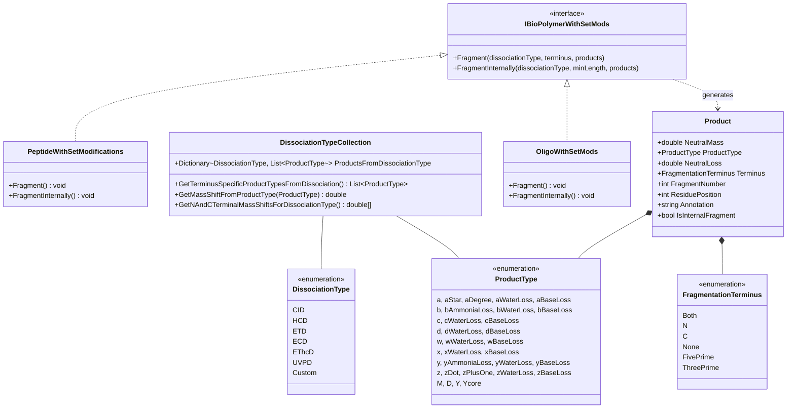

# Omics: Fragmentation

## Overview

The Omics fragmentation framework provides comprehensive MS/MS fragmentation simulation for biological polymers (proteins, RNA, DNA). It supports multiple dissociation types (CID, HCD, ETD, etc.), generates theoretical fragment ions with modifications and neutral losses, and enables spectral matching for mass spectrometry analysis.

### Key Features

- **Multi-Dissociation Support**: CID, HCD, ETD, ECD, EThcD, UVPD, and custom methods
- **Unified Framework**: Common fragmentation interface for proteins and nucleic acids
- **Ion Type Diversity**: b/y-ions, c/z-ions, a-ions, internal fragments, diagnostic ions
- **Neutral Losses**: Automatic water, ammonia, and modification-specific losses
- **Terminus Control**: Fragment from N-terminus, C-terminus, or both
- **Performance Optimized**: Efficient product generation with caching

### Quick Start

```csharp
using Proteomics.ProteolyticDigestion;
using Omics.Fragmentation;
using MassSpectrometry;

// Get a peptide from digestion
var peptide = peptides.First();

// Fragment with HCD
var products = new List<Product>();
peptide.Fragment(
    dissociationType: DissociationType.HCD,
    fragmentationTerminus: FragmentationTerminus.Both,
    products: products
);

// Process fragment ions
foreach (var product in products)
{
    Console.WriteLine($"{product.Annotation}: {product.NeutralMass:F4} Da");
}

// Example output:
// b1: 87.0558 Da
// b2: 186.1242 Da
// y1: 147.1128 Da
// y2: 248.1605 Da
```

## System Design

### Architecture Overview



## Core Concepts

### Product Class

The `Product` class represents a single theoretical fragment ion:

```csharp
public class Product : IHasMass
{
    public double NeutralMass { get; }
    public ProductType ProductType { get; }
    public double NeutralLoss { get; }
    public FragmentationTerminus Terminus { get; }
    public int FragmentNumber { get; }
    public int ResiduePosition { get; }
    public string Annotation { get; }
    public bool IsInternalFragment { get; }
    public ProductType? SecondaryProductType { get; }  // For internal fragments
    public int SecondaryFragmentNumber { get; }        // For internal fragments
}
```

**Key Properties**:
- **NeutralMass**: Mass of the neutral fragment
- **ProductType**: Ion type (b, y, c, z, etc.)
- **NeutralLoss**: Mass lost from modification (H?O, NH?, etc.)
- **FragmentNumber**: Position in sequence (e.g., 3 in b3)
- **ResiduePosition**: Zero-based residue position in sequence
- **Annotation**: Human-readable ion label (e.g., "b3", "y5-17.03")

**Examples**:

```csharp
// Regular b-ion
var bIon = new Product(
    productType: ProductType.b,
    terminus: FragmentationTerminus.N,
    neutralMass: 228.1343,
    fragmentNumber: 2,
    residuePosition: 1,
    neutralLoss: 0.0
);
// Annotation: "b2"

// y-ion with water loss
var yIonWithLoss = new Product(
    productType: ProductType.yWaterLoss,
    terminus: FragmentationTerminus.C,
    neutralMass: 230.1133,
    fragmentNumber: 3,
    residuePosition: 4,
    neutralLoss: 18.0106
);
// Annotation: "y3-18.01"

// Internal fragment (yIb)
var internalIon = new Product(
    productType: ProductType.y,
    terminus: FragmentationTerminus.None,
    neutralMass: 485.2641,
    fragmentNumber: 5,
    residuePosition: 2,
    neutralLoss: 0.0,
    secondaryProductType: ProductType.b,
    secondaryFragmentNumber: 3
);
// Annotation: "yIb[3-5]"
```

### ProductType Enum

Defines the types of fragment ions that can be generated:

```csharp
public enum ProductType
{
    // Peptide N-terminal ions
    a,             // [N]+[M]-CHO
    aStar,         // a-NH?
    aDegree,       // a-H?O
    b,             // [N]+[M]-H
    bAmmoniaLoss,  // b-NH?
    bWaterLoss,    // b-H?O
    c,             // [N]+[M]+NH?
    
    // Peptide C-terminal ions
    x,             // [C]+[M]+CO-H
    y,             // [C]+[M]+H
    yAmmoniaLoss,  // y-NH?
    yWaterLoss,    // y-H?O
    z,             // [C]+[M]-NH?
    zDot,          // z• radical
    zPlusOne,      // z+H
    
    // RNA 5'-terminal ions
    a,             // 5' fragments
    aWaterLoss,    // a-H?O
    aBaseLoss,     // a-Base
    b,             // 5' fragments
    bBaseLoss,     // b-Base
    c,             // 5' fragments
    cWaterLoss,    // c-H?O
    cBaseLoss,     // c-Base
    d,             // 5' fragments
    dWaterLoss,    // d-H?O
    dBaseLoss,     // d-Base
    
    // RNA 3'-terminal ions
    w,             // 3' fragments
    wWaterLoss,    // w-H?O
    wBaseLoss,     // w-Base
    x,             // 3' fragments
    xWaterLoss,    // x-H?O
    xBaseLoss,     // x-Base
    y,             // 3' fragments
    yWaterLoss,    // y-H?O
    yBaseLoss,     // y-Base
    z,             // 3' fragments
    zWaterLoss,    // z-H?O
    zBaseLoss,     // z-Base
    
    // Special ions
    M,             // Molecular ion [M]
    D,             // Diagnostic ion
    Y,             // Glyco Y ion
    Ycore          // Glyco core Y ion
}
```

### DissociationType Enum

Specifies the fragmentation method used:

```csharp
public enum DissociationType
{
    CID,                 // Collision-Induced Dissociation
    HCD,                 // Higher-energy Collisional Dissociation
    ETD,                 // Electron Transfer Dissociation
    ECD,                 // Electron Capture Dissociation
    EThcD,               // ETD with supplemental HCD
    IRMPD,               // Infrared Multiphoton Dissociation
    UVPD,                // Ultraviolet Photodissociation
    aEPD,                // activated Electron Photodetachment
    NETD,                // Negative Electron Transfer Dissociation
    LowCID,              // Low-energy CID
    PQD,                 // Pulsed Q Dissociation
    ISCID,               // In-Source CID
    Custom,              // User-defined
    AnyActivationType,   // Any/all ions
    Unknown              // Unknown method
}
```

### FragmentationTerminus Enum

Controls which terminus to fragment from:

```csharp
public enum FragmentationTerminus
{
    Both,        // Fragment from both N- and C-terminus (default)
    N,           // Fragment from N-terminus only (b, c ions)
    C,           // Fragment from C-terminus only (x, y, z ions)
    None,        // No terminus (internal fragments, intact mass)
    FivePrime,   // Fragment from 5' end (RNA a, b, c, d ions)
    ThreePrime   // Fragment from 3' end (RNA w, x, y, z ions)
}
```

## Dissociation-Specific Ion Types

Different dissociation methods produce characteristic ion types:

### Peptide Fragmentation

#### CID/HCD (Collision-Based)

```csharp
// CID/HCD produces primarily b and y ions
peptide.Fragment(DissociationType.HCD, FragmentationTerminus.Both, products);

// Generates:
// - b ions: b1, b2, b3, ...
// - y ions: y1, y2, y3, ...
```

**Ion Types Generated**:
- **b ions**: N-terminal fragments (backbone cleavage)
- **y ions**: C-terminal fragments (backbone cleavage)

**Mass Shifts**:
- b ions: +0.0 Da (no shift from backbone)
- y ions: +18.0106 Da (H?O addition)

#### ETD/ECD (Electron-Based)

```csharp
// ETD/ECD produces c and z• ions
peptide.Fragment(DissociationType.ETD, FragmentationTerminus.Both, products);

// Generates:
// - c ions: c1, c2, c3, ...
// - z• ions: z1•, z2•, z3•, ...
```

**Ion Types Generated**:
- **c ions**: N-terminal fragments (N-C? bond cleavage)
- **z• ions**: C-terminal radical fragments (N-C? bond cleavage)

**Mass Shifts**:
- c ions: +17.0265 Da (NH? addition)
- z• ions: +1.9918 Da (radical formation)

#### EThcD (Hybrid)

```csharp
// EThcD combines ETD and HCD
peptide.Fragment(DissociationType.EThcD, FragmentationTerminus.Both, products);

// Generates:
// - b ions: b1, b2, b3, ...
// - y ions: y1, y2, y3, ...
// - c ions: c1, c2, c3, ...
// - z• ions: z1•, z2•, z3•, ...
```

**Ion Types Generated**: All of b, y, c, z• ions

### RNA Fragmentation

#### HCD (Nucleic Acids)

```csharp
// HCD produces a/b/c/d (5') and w/x/y/z (3') ions
oligo.Fragment(DissociationType.HCD, FragmentationTerminus.Both, products);

// Generates:
// - 5' ions: a1, b1, c1, d1, ...
// - 3' ions: w1, x1, y1, z1, ...
```

**Ion Type Reference**:


**5'-Terminal Ions** (reading left to right):
- **a-ion**: Base + sugar (no phosphate)
- **b-ion**: Base + sugar + OH
- **c-ion**: Base + sugar + phosphate
- **d-ion**: Base + sugar + phosphate + OH

**3'-Terminal Ions** (reading right to left):
- **w-ion**: Base + sugar (no phosphate)
- **x-ion**: Base + sugar - O
- **y-ion**: Base + sugar - phosphate
- **z-ion**: Base + sugar - phosphate - O

#### Base Loss Ions

RNA fragments can lose their nucleobase, creating base loss ions:

```csharp
// Base loss ions (a-B, b-B, c-B, etc.)
// Most common in 5' fragments

// Example: a-ion with base loss
// a2-Base (sugar-phosphate backbone without base)
```

## Fragmentation Methods

### Basic Fragmentation

```csharp
using Proteomics.ProteolyticDigestion;
using Omics.Fragmentation;

// Get a peptide
var peptide = peptides[0];

// Create product list
var products = new List<Product>();

// Fragment with HCD
peptide.Fragment(
    dissociationType: DissociationType.HCD,
    fragmentationTerminus: FragmentationTerminus.Both,
    products: products
);

// Examine products
Console.WriteLine($"Generated {products.Count} fragment ions");
foreach (var product in products.Take(10))
{
    Console.WriteLine($"{product.Annotation}: {product.NeutralMass:F4} Da");
}
```

### Terminus-Specific Fragmentation

```csharp
// N-terminal ions only (b, c ions)
var nTermProducts = new List<Product>();
peptide.Fragment(
    DissociationType.HCD,
    FragmentationTerminus.N,
    nTermProducts
);

// C-terminal ions only (x, y, z ions)
var cTermProducts = new List<Product>();
peptide.Fragment(
    DissociationType.HCD,
    FragmentationTerminus.C,
    cTermProducts
);

// Both termini (default)
var bothProducts = new List<Product>();
peptide.Fragment(
    DissociationType.HCD,
    FragmentationTerminus.Both,
    bothProducts
);

Console.WriteLine($"N-terminal ions: {nTermProducts.Count}");
Console.WriteLine($"C-terminal ions: {cTermProducts.Count}");
Console.WriteLine($"Total ions: {bothProducts.Count}");
```

### Internal Fragmentation

Internal fragments result from multiple backbone cleavages:

```csharp
// Generate internal fragments
var internalProducts = new List<Product>();
peptide.FragmentInternally(
    dissociationType: DissociationType.HCD,
    minLengthOfFragments: 3,  // Minimum fragment length
    products: internalProducts
);

// Internal fragments annotated as: yIb[start-end]
foreach (var internal in internalProducts.Take(5))
{
    Console.WriteLine(internal.Annotation);
    // Example output:
    // yIb[2-5]
    // yIb[3-7]
}
```

### Custom Fragmentation

```csharp
// Define custom dissociation with specific product types
DissociationTypeCollection.ProductsFromDissociationType[DissociationType.Custom] = 
    new List<ProductType> 
    {
        ProductType.b,
        ProductType.y,
        ProductType.c
    };

var customProducts = new List<Product>();
peptide.Fragment(
    DissociationType.Custom,
    FragmentationTerminus.Both,
    customProducts
);
```

## Neutral Losses

Neutral losses occur when modifications or residues lose small molecules during fragmentation:

### Common Neutral Losses

| Loss Type | Formula | Mass (Da) | Residues/Mods |
|-----------|---------|-----------|---------------|
| **Water** | H?O | 18.0106 | S, T, E, D |
| **Ammonia** | NH? | 17.0265 | R, K, N, Q |
| **Phosphoric acid** | H?PO? | 97.9769 | Phosphorylation |
| **CO** | CO | 27.9949 | b ? a ion |

### Automatic Neutral Loss Generation

```csharp
// Neutral losses generated automatically based on:
// 1. Residue composition (S, T, E, D ? water loss)
// 2. Modifications with defined neutral losses

// Example: Peptide with phosphorylation
var phospho = new Modification(
    _originalId: "Phosphorylation",
    _target: ModificationMotif.GetMotif("S"),
    _chemicalFormula: ChemicalFormula.ParseFormula("HO3P"),
    _neutralLosses: new Dictionary<DissociationType, List<double>>
    {
        { DissociationType.HCD, new List<double> { 97.9769 } },  // H?PO? loss
        { DissociationType.CID, new List<double> { 97.9769 } }
    }
);

// Fragment phosphorylated peptide
var products = new List<Product>();
phosphoPeptide.Fragment(DissociationType.HCD, FragmentationTerminus.Both, products);

// Generates ions with and without phosphate loss:
// - b3: 456.2341 Da (with phosphate)
// - b3-97.98: 358.2572 Da (phosphate loss)
```

### Water and Ammonia Losses

```csharp
// Get product types that can lose water/ammonia
var lossTypes = DissociationTypeCollection.GetWaterAndAmmoniaLossProductTypesFromDissociation(
    DissociationType.HCD,
    FragmentationTerminus.Both
);

// For HCD, includes:
// - bWaterLoss
// - bAmmoniaLoss
// - yWaterLoss
// - yAmmoniaLoss
```

## Ion Mass Calculation

### Mass Shifts by Product Type

Each product type has a specific mass shift from the base fragment mass:

```csharp
// Get mass shift for product type
double shift = DissociationTypeCollection.GetMassShiftFromProductType(ProductType.b);
// b-ion: 0.0 Da (no shift)

double yShift = DissociationTypeCollection.GetMassShiftFromProductType(ProductType.y);
// y-ion: +18.0106 Da (H?O)

double cShift = DissociationTypeCollection.GetMassShiftFromProductType(ProductType.c);
// c-ion: +17.0265 Da (NH?)
```

**Peptide Ion Mass Shifts**:

| Ion Type | Formula Shift | Mass Shift (Da) |
|----------|---------------|-----------------|
| **a** | -CO | -27.9949 |
| **a*** | -CO - NH? | -45.0215 |
| **a°** | -CO - H?O | -45.9928 |
| **b** | None | 0.0000 |
| **b - NH?** | -NH? | -17.0265 |
| **b - H?O** | -H?O | -18.0106 |
| **c** | +NH? | +17.0265 |
| **x** | +CO? | +43.9898 |
| **y** | +H?O | +18.0106 |
| **y - NH?** | +H?O - NH? | +0.9840 |
| **y - H?O** | None | 0.0000 |
| **z•** | +OH• - NH | +1.9918 |
| **z+1** | +OH - NH | +2.9997 |

### RNA Ion Mass Shifts

RNA fragmentation has different mass shifts due to phosphate groups:

```csharp
// Get RNA-specific mass shift
double rnaShift = ProductType.c.GetRnaMassShiftFromProductType();
// c-ion (RNA): +79.9663 Da (H?PO?)
```

**RNA Ion Mass Shifts**:

| Ion Type | Formula Shift | Mass Shift (Da) |
|----------|---------------|-----------------|
| **a** | +H | +1.0078 |
| **b** | +OH | +17.0027 |
| **c** | +H?PO? | +79.9663 |
| **d** | +H?PO? | +97.9769 |
| **w** | +H | +1.0078 |
| **x** | -OH | -15.9949 |
| **y** | -H?PO? | -79.9663 |
| **z** | -H?PO? | -97.9769 |

## Advanced Topics

### Product Annotation

Products are annotated using standard nomenclature:

```csharp
// Standard ion: "b3"
var standard = new Product(
    ProductType.b, 
    FragmentationTerminus.N, 
    mass: 300.15, 
    fragmentNumber: 3, 
    residuePosition: 2, 
    neutralLoss: 0
);
Console.WriteLine(standard.Annotation);  // "b3"

// Ion with neutral loss: "y5-18.01"
var withLoss = new Product(
    ProductType.y, 
    FragmentationTerminus.C, 
    mass: 582.31, 
    fragmentNumber: 5, 
    residuePosition: 7, 
    neutralLoss: 18.0106
);
Console.WriteLine(withLoss.Annotation);  // "y5-18.01"

// Internal fragment: "yIb[3-7]"
var internal = new Product(
    ProductType.y,
    FragmentationTerminus.None,
    mass: 485.26,
    fragmentNumber: 3,
    residuePosition: 2,
    neutralLoss: 0,
    secondaryProductType: ProductType.b,
    secondaryFragmentNumber: 7
);
Console.WriteLine(internal.Annotation);  // "yIb[3-7]"
```

### Diagnostic Ions

Diagnostic ions are characteristic fragments from modifications:

```csharp
// Create diagnostic ion
var diagnosticIon = new Product(
    productType: ProductType.D,
    terminus: FragmentationTerminus.None,
    neutralMass: 216.0423,  // Phosphotyrosine immonium ion
    fragmentNumber: 217,    // Reported as m/z assuming z=1
    residuePosition: 0,
    neutralLoss: 0
);

Console.WriteLine(diagnosticIon.Annotation);  // "D217"
```

**Common Diagnostic Ions**:

| Modification | Ion Mass (Da) | Description |
|--------------|---------------|-------------|
| **Phosphotyrosine** | 216.0423 | Immonium ion |
| **Phosphoserine** | 167.0321 | Neutral loss marker |
| **Hexose** | 163.0601 | Glycan marker |
| **HexNAc** | 204.0866 | Glycan marker |

### Matching Experimental Spectra

```csharp
using MassSpectrometry;

// Generate theoretical ions
var theoreticalProducts = new List<Product>();
peptide.Fragment(DissociationType.HCD, FragmentationTerminus.Both, theoreticalProducts);

// Load experimental spectrum
var spectrum = /* load from file */;

// Match ions
var tolerance = new PpmTolerance(20);  // 20 ppm
var matches = new List<(Product theoretical, double experimentalMz, double intensity)>();

foreach (var product in theoreticalProducts)
{
    int closestPeakIndex = spectrum.GetClosestPeakIndex(product.NeutralMass);
    
    if (closestPeakIndex >= 0)
    {
        double experimentalMz = spectrum.XArray[closestPeakIndex];
        double ppmError = tolerance.GetTolerance(product.NeutralMass);
        
        if (Math.Abs(product.NeutralMass - experimentalMz) <= ppmError)
        {
            matches.Add((product, experimentalMz, spectrum.YArray[closestPeakIndex]));
        }
    }
}

Console.WriteLine($"Matched {matches.Count}/{theoreticalProducts.Count} ions");
double coverage = (double)matches.Count / theoreticalProducts.Count * 100;
Console.WriteLine($"Spectral coverage: {coverage:F1}%");
```

### Charge State Handling

```csharp
// Convert neutral mass to m/z for different charge states
var product = theoreticalProducts.First();

for (int charge = 1; charge <= 3; charge++)
{
    double mz = (product.NeutralMass + charge * Constants.ProtonMass) / charge;
    Console.WriteLine($"{product.Annotation}+{charge}: {mz:F4} m/z");
}

// Example output:
// b3+1: 300.1557 m/z
// b3+2: 150.5815 m/z
// b3+3: 100.7234 m/z
```

## Common Use Cases

### Generate Complete Ion Series

```csharp
// Generate all possible ions for a peptide
var peptide = peptides[0];
var allProducts = new List<Product>();

// Fragment with HCD
peptide.Fragment(DissociationType.HCD, FragmentationTerminus.Both, allProducts);

// Group by ion type
var byType = allProducts.GroupBy(p => p.ProductType)
    .OrderBy(g => g.Key);

foreach (var group in byType)
{
    Console.WriteLine($"\n{group.Key} ions ({group.Count()}):");
    foreach (var ion in group.OrderBy(p => p.FragmentNumber).Take(5))
    {
        Console.WriteLine($"  {ion.Annotation}: {ion.NeutralMass:F4} Da");
    }
}
```

### Filter Ions by Mass Range

```csharp
// Filter products within m/z range for instrument
double minMz = 200.0;
double maxMz = 2000.0;

var filteredProducts = allProducts
    .Where(p => p.NeutralMass >= minMz && p.NeutralMass <= maxMz)
    .ToList();

Console.WriteLine($"Products in range: {filteredProducts.Count}/{allProducts.Count}");
```

### Compare Dissociation Methods

```csharp
// Compare ion types from different methods
var dissociationTypes = new[] 
{ 
    DissociationType.HCD, 
    DissociationType.ETD, 
    DissociationType.EThcD 
};

foreach (var dissociation in dissociationTypes)
{
    var products = new List<Product>();
    peptide.Fragment(dissociation, FragmentationTerminus.Both, products);
    
    var ionTypes = products
        .Select(p => p.ProductType)
        .Distinct()
        .OrderBy(t => t);
    
    Console.WriteLine($"\n{dissociation} generates:");
    Console.WriteLine($"  Ion types: {string.Join(", ", ionTypes)}");
    Console.WriteLine($"  Total ions: {products.Count}");
}

// Example output:
// HCD generates:
//   Ion types: b, y
//   Total ions: 24
//
// ETD generates:
//   Ion types: c, y, zDot
//   Total ions: 36
//
// EThcD generates:
//   Ion types: b, c, y, zDot
//   Total ions: 48
```

### Spectral Annotation

```csharp
// Annotate experimental spectrum with matched ions
var annotatedPeaks = new List<(double mz, double intensity, string annotation)>();

foreach (var (theoretical, experimentalMz, intensity) in matches)
{
    annotatedPeaks.Add((experimentalMz, intensity, theoretical.Annotation));
}

// Sort by m/z
annotatedPeaks.Sort((a, b) => a.mz.CompareTo(b.mz));

// Export annotations
using (var writer = new StreamWriter("annotated_spectrum.tsv"))
{
    writer.WriteLine("m/z\tIntensity\tAnnotation");
    foreach (var (mz, intensity, annotation) in annotatedPeaks)
    {
        writer.WriteLine($"{mz:F4}\t{intensity:E2}\t{annotation}");
    }
}
```

### Calculate Ion Series Coverage

```csharp
// Calculate coverage of b and y ion series
var bIons = allProducts.Where(p => p.ProductType == ProductType.b).ToList();
var yIons = allProducts.Where(p => p.ProductType == ProductType.y).ToList();

int maxFragmentNumber = peptide.Length - 1;

var bIonNumbers = bIons.Select(p => p.FragmentNumber).Distinct().OrderBy(n => n).ToList();
var yIonNumbers = yIons.Select(p => p.FragmentNumber).Distinct().OrderBy(n => n).ToList();

Console.WriteLine($"b-ion series: {string.Join(", ", bIonNumbers)} ({bIonNumbers.Count}/{maxFragmentNumber})");
Console.WriteLine($"y-ion series: {string.Join(", ", yIonNumbers)} ({yIonNumbers.Count}/{maxFragmentNumber})");

// Example output:
// b-ion series: 1, 2, 3, 4, 5, 6 (6/6)
// y-ion series: 1, 2, 3, 4, 5, 6 (6/6)
```

## Performance Optimization

### Reuse Product Lists

```csharp
// Reuse product list for multiple peptides
var products = new List<Product>(capacity: 100);

foreach (var peptide in peptides)
{
    products.Clear();  // Clear, don't reallocate
    peptide.Fragment(DissociationType.HCD, FragmentationTerminus.Both, products);
    
    // Process products...
}
```

### Pre-filter Product Types

```csharp
// Only generate specific ion types
var desiredTypes = new HashSet<ProductType> 
{ 
    ProductType.b, 
    ProductType.y 
};

var allProducts = new List<Product>();
peptide.Fragment(DissociationType.HCD, FragmentationTerminus.Both, allProducts);

var filteredProducts = allProducts
    .Where(p => desiredTypes.Contains(p.ProductType))
    .ToList();
```

### Parallel Fragmentation

```csharp
// Fragment multiple peptides in parallel
var allFragments = peptides
    .AsParallel()
    .WithDegreeOfParallelism(Environment.ProcessorCount)
    .SelectMany(peptide =>
    {
        var products = new List<Product>();
        peptide.Fragment(DissociationType.HCD, FragmentationTerminus.Both, products);
        return products;
    })
    .ToList();
```

## Integration

### Dependencies

```
Omics.Fragmentation
  ?
  Chemistry (ChemicalFormula, PeriodicTable)
  ?
  MassSpectrometry (DissociationType, MsDataScan)
  ?
  MzLibUtil (Utilities)
```

### Domain-Specific Implementations

```
Omics.Fragmentation (base framework)
  ?
  ?? Omics.Fragmentation.Peptide
  ?    - DissociationTypeCollection (peptide ions)
  ?    - TerminusSpecificProductTypes
  ?
  ?? Omics.Fragmentation.Oligo
       - DissociationTypeCollection (RNA ions)
       - Base loss handling
```

### Used By

- **MetaMorpheus**: Spectral matching and scoring
- **Proteomics Library**: Peptide analysis
- **Transcriptomics Library**: RNA analysis
- **FlashLFQ**: Ion extraction

## Best Practices

### Choose Appropriate Dissociation Type

```csharp
// Good: Match experimental method
var hcdProducts = new List<Product>();
peptide.Fragment(DissociationType.HCD, FragmentationTerminus.Both, hcdProducts);

// Good: Use hybrid method for comprehensive coverage
var ethcdProducts = new List<Product>();
peptide.Fragment(DissociationType.EThcD, FragmentationTerminus.Both, ethcdProducts);

// Avoid: Mismatched dissociation type
// If experiment used ETD, don't fragment with HCD
```

### Handle Modifications Properly

```csharp
// Good: Ensure modifications have neutral loss definitions
var phospho = new Modification(
    _originalId: "Phosphorylation",
    _target: ModificationMotif.GetMotif("S"),
    _chemicalFormula: ChemicalFormula.ParseFormula("HO3P"),
    _neutralLosses: new Dictionary<DissociationType, List<double>>
    {
        { DissociationType.HCD, new List<double> { 97.9769 } },
        { DissociationType.CID, new List<double> { 97.9769 } }
    }
);

// Good: Fragment modified peptides
var products = new List<Product>();
modifiedPeptide.Fragment(DissociationType.HCD, FragmentationTerminus.Both, products);
```

### Filter Intelligently

```csharp
// Good: Filter by mass range for instrument
var instrumentRange = allProducts
    .Where(p => p.NeutralMass >= 200 && p.NeutralMass <= 2000)
    .ToList();

// Good: Filter by ion type for analysis
var majorIons = allProducts
    .Where(p => p.ProductType == ProductType.b || p.ProductType == ProductType.y)
    .ToList();

// Good: Filter by intensity threshold after matching
var significantMatches = matches
    .Where(m => m.intensity > intensityThreshold)
    .ToList();
```

## See Also

- [Omics: Base Foundation](https://github.com/smith-chem-wisc/mzLib/wiki/Omics:-Base-Foundation) - Core omics concepts
- [Omics: Modifications](https://github.com/smith-chem-wisc/mzLib/wiki/Omics:-Modifications) - Modification system with neutral losses
- [Omics: Digestion](https://github.com/smith-chem-wisc/mzLib/wiki/Omics:-Digestion) - Enzymatic digestion
- [Proteomics](https://github.com/smith-chem-wisc/mzLib/wiki/Proteomics) - Protein-specific fragmentation
- [Transcriptomics](https://github.com/smith-chem-wisc/mzLib/wiki/Transcriptomics) - RNA-specific fragmentation
- [Mass Spectrometry](https://github.com/smith-chem-wisc/mzLib/wiki/Mass-Spectrometry) - MS data structures and operations
