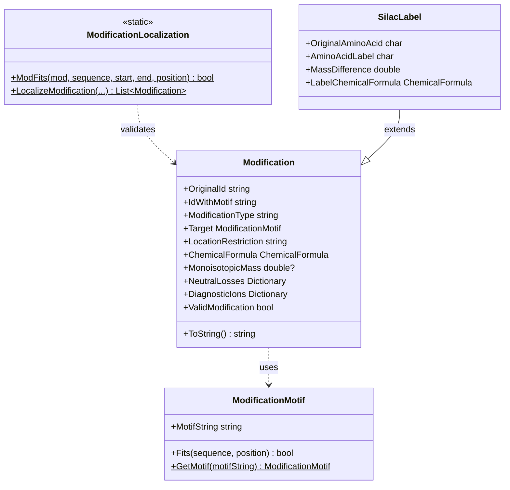

# Omics: Modifications

## Overview

The Modifications system provides comprehensive infrastructure for representing, managing, and applying post-translational modifications (PTMs) and nucleotide modifications. The system supports modifications from multiple databases (UniMod, PSI-MOD, UniProt), custom modifications, and handles modification motifs, neutral losses, diagnostic ions, and localization.

### Key Features

- **Multiple Sources**: UniMod, PSI-MOD, UniProt, and custom modifications
- **Motif System**: Context-aware modification targeting
- **Chemical Formulas**: Exact mass calculations
- **Neutral Losses**: Dissociation-specific neutral losses
- **Diagnostic Ions**: Modification-specific reporter ions
- **Location Restrictions**: N-terminus, C-terminus, or anywhere
- **Validation**: Automatic validation of modification definitions

### Quick Start

```csharp
// Create a modification
var phospho = new Modification(
    _originalId: "Phosphorylation",
    _modificationType: "Common",
    _target: ModificationMotif.GetMotif("S"),
    _locationRestriction: "Anywhere.",
    _chemicalFormula: ChemicalFormula.ParseFormula("HO3P")
);

// Access properties
Console.WriteLine($"ID: {phospho.IdWithMotif}");              // "Phosphorylation on S"
Console.WriteLine($"Mass: {phospho.MonoisotopicMass:F4}");    // 79.9663
Console.WriteLine($"Target: {phospho.Target}");                // "S"
Console.WriteLine($"Valid: {phospho.ValidModification}");      // true

// Check if modification fits a sequence
string sequence = "PEPTIDE";
bool fits = ModificationLocalization.ModFits(phospho, sequence, 0, 7, position: 4);
```

## System Design

### Architecture Overview



## Modification Class

### Core Properties

```csharp
public class Modification
{
    // Identification
    public string OriginalId { get; }           // "Phosphorylation"
    public string IdWithMotif { get; }          // "Phosphorylation on S"
    public string Accession { get; }            // MOD:00046 (PSI-MOD)
    public string ModificationType { get; }     // "Common", "UniMod", "UniProt"
    
    // Target and Location
    public ModificationMotif Target { get; }    // What residue(s)
    public string LocationRestriction { get; }  // Where on polymer
    
    // Mass Information
    public ChemicalFormula ChemicalFormula { get; }
    public double? MonoisotopicMass { get; }
    
    // MS/MS Behavior
    public Dictionary<DissociationType, List<double>> NeutralLosses { get; }
    public Dictionary<DissociationType, List<double>> DiagnosticIons { get; }
    
    // Metadata
    public Dictionary<string, IList<string>> DatabaseReference { get; }
    public List<string> Keywords { get; }
    
    // Validation
    public bool ValidModification { get; }
}
```

### Creating Modifications

```csharp
// Basic modification with formula
var oxidation = new Modification(
    _originalId: "Oxidation",
    _modificationType: "Common",
    _target: ModificationMotif.GetMotif("M"),
    _locationRestriction: "Anywhere.",
    _chemicalFormula: ChemicalFormula.ParseFormula("O")
);

// Modification with explicit mass
var customMod = new Modification(
    _originalId: "CustomMod",
    _modificationType: "Custom",
    _target: ModificationMotif.GetMotif("K"),
    _locationRestriction: "Anywhere.",
    _monoisotopicMass: 42.0106
);

// Modification with neutral loss
var phospho = new Modification(
    _originalId: "Phosphorylation",
    _target: ModificationMotif.GetMotif("STY"),
    _chemicalFormula: ChemicalFormula.ParseFormula("HO3P"),
    _neutralLosses: new Dictionary<DissociationType, List<double>>
    {
        { DissociationType.HCD, new List<double> { 97.9769 } },  // H3PO4
        { DissociationType.CID, new List<double> { 97.9769 } }
    }
);

// Modification with diagnostic ion
var tmt = new Modification(
    _originalId: "TMT6plex",
    _target: ModificationMotif.GetMotif("K"),
    _chemicalFormula: ChemicalFormula.ParseFormula("C12H20N2O2"),
    _diagnosticIons: new Dictionary<DissociationType, List<double>>
    {
        { DissociationType.HCD, new List<double> { 126.128, 127.125, 128.128 } }
    }
);
```

### Location Restrictions

Valid location restrictions:

| Restriction | Description | Example Use |
|-------------|-------------|-------------|
| `Anywhere.` | Any position | Phosphorylation, Oxidation |
| `N-terminal.` | Protein/transcript N-terminus | Acetylation |
| `C-terminal.` | Protein/transcript C-terminus | Amidation |
| `Peptide N-terminal.` | Peptide N-terminus only | Carbamylation |
| `Peptide C-terminal.` | Peptide C-terminus only | Label incorporation |
| `5'-terminal.` | RNA 5' terminus | Triphosphate |
| `3'-terminal.` | RNA 3' terminus | Phosphate |

```csharp
// N-terminal acetylation
var nTermAcetyl = new Modification(
    _originalId: "Acetylation",
    _target: ModificationMotif.GetMotif("X"),  // Any residue
    _locationRestriction: "N-terminal.",
    _chemicalFormula: ChemicalFormula.ParseFormula("C2H2O")
);

// C-terminal amidation
var cTermAmide = new Modification(
    _originalId: "Amidation",
    _target: ModificationMotif.GetMotif("X"),
    _locationRestriction: "C-terminal.",
    _chemicalFormula: ChemicalFormula.ParseFormula("HN-O")
);
```

## Modification Motifs

### ModificationMotif Class

```csharp
public class ModificationMotif
{
    public string MotifString { get; }
    
    // Get or create motif
    public static ModificationMotif GetMotif(string motifString);
    
    // Check if motif fits at position
    public (bool fits, bool preventsCleavage) Fits(string sequence, int position);
}
```

### Motif Syntax

**Simple Motifs**:
- `"S"` - Serine only
- `"M"` - Methionine only
- `"K"` - Lysine only

**Multiple Residues**:
- `"STY"` - Serine, Threonine, or Tyrosine
- `"KR"` - Lysine or Arginine

**Context-Aware Motifs**:
- `"S[T]"` - Serine followed by Threonine
- `"[R]K"` - Lysine preceded by Arginine
- `"K[^P]"` - Lysine NOT followed by Proline

**Wildcard**:
- `"X"` - Any amino acid/nucleotide

### Using Motifs

```csharp
// Create motifs
var serineOnly = ModificationMotif.GetMotif("S");
var phosphoMotif = ModificationMotif.GetMotif("STY");
var contextMotif = ModificationMotif.GetMotif("S[T]");

// Check if motif matches
string sequence = "PEPTIDES";
bool matches = phosphoMotif.Fits(sequence, 5);  // position 5 is 'S'

// Use in modification
var mod = new Modification(
    _originalId: "Phosphorylation",
    _target: phosphoMotif,
    _chemicalFormula: ChemicalFormula.ParseFormula("HO3P")
);
```

## Modification Localization

### ModificationLocalization Class

Static utility class for checking modification compatibility:

```csharp
public static class ModificationLocalization
{
    // Check if modification fits at position
    public static bool ModFits(
        Modification modification,
        string sequence,
        int proteinStart,
        int proteinEnd,
        int oneBasedModPos
    );
}
```

### Checking Modification Compatibility

```csharp
string sequence = "PEPTIDES";
var phospho = new Modification(
    _originalId: "Phosphorylation",
    _target: ModificationMotif.GetMotif("S"),
    _locationRestriction: "Anywhere.",
    _chemicalFormula: ChemicalFormula.ParseFormula("HO3P")
);

// Check specific position
int position = 6;  // Position of 'S'
bool fits = ModificationLocalization.ModFits(
    phospho, 
    sequence, 
    proteinStart: 0, 
    proteinEnd: sequence.Length, 
    oneBasedModPos: position + 1  // 1-based
);

Console.WriteLine($"Phosphorylation fits at position {position}: {fits}");

// Check all positions
for (int i = 0; i < sequence.Length; i++)
{
    if (ModificationLocalization.ModFits(phospho, sequence, 0, sequence.Length, i + 1))
    {
        Console.WriteLine($"Can phosphorylate at position {i}: {sequence[i]}");
    }
}
```

## Neutral Losses and Diagnostic Ions

### Neutral Losses

Neutral losses occur during MS/MS fragmentation:

```csharp
// Phosphorylation with neutral loss
var phospho = new Modification(
    _originalId: "Phosphorylation",
    _target: ModificationMotif.GetMotif("STY"),
    _chemicalFormula: ChemicalFormula.ParseFormula("HO3P"),
    _neutralLosses: new Dictionary<DissociationType, List<double>>
    {
        // Loss of H3PO4
        { DissociationType.HCD, new List<double> { 97.9769 } },
        { DissociationType.CID, new List<double> { 97.9769 } },
        // Loss of HPO3
        { DissociationType.ETD, new List<double> { 79.9663 } }
    }
);

// Multiple neutral losses
var glycan = new Modification(
    _originalId: "HexNAc",
    _target: ModificationMotif.GetMotif("NST"),
    _chemicalFormula: ChemicalFormula.ParseFormula("C8H13NO5"),
    _neutralLosses: new Dictionary<DissociationType, List<double>>
    {
        { 
            DissociationType.HCD, 
            new List<double> 
            { 
                203.0794,  // Full HexNAc
                186.0764,  // HexNAc - NH3
                144.0655   // Oxonium ion
            } 
        }
    }
);
```

### Diagnostic Ions

Diagnostic ions are modification-specific reporter ions:

```csharp
// TMT isobaric label
var tmt = new Modification(
    _originalId: "TMT6plex",
    _target: ModificationMotif.GetMotif("K"),
    _chemicalFormula: ChemicalFormula.ParseFormula("C12H20N2O2"),
    _diagnosticIons: new Dictionary<DissociationType, List<double>>
    {
        {
            DissociationType.HCD,
            new List<double>
            {
                126.127726,  // TMT6-126
                127.124761,  // TMT6-127
                128.128116,  // TMT6-128
                129.131471,  // TMT6-129
                130.134825,  // TMT6-130
                131.138180   // TMT6-131
            }
        }
    }
);

// iTRAQ label
var itraq = new Modification(
    _originalId: "iTRAQ4plex",
    _target: ModificationMotif.GetMotif("K"),
    _chemicalFormula: ChemicalFormula.ParseFormula("C4H12C3N2O"),
    _diagnosticIons: new Dictionary<DissociationType, List<double>>
    {
        {
            DissociationType.HCD,
            new List<double>
            {
                114.1112,  // iTRAQ-114
                115.1083,  // iTRAQ-115
                116.1116,  // iTRAQ-116
                117.1150   // iTRAQ-117
            }
        }
    }
);
```

## SILAC Labels

SILAC (Stable Isotope Labeling by Amino acids in Cell culture) is handled through a specialized modification type:

```csharp
public class SilacLabel : Modification
{
    public char OriginalAminoAcid { get; }
    public char AminoAcidLabel { get; }
    public double MassDifference { get; }
    public ChemicalFormula LabelChemicalFormula { get; }
}
```

### Using SILAC Labels

```csharp
// Heavy lysine (K8)
var heavyK = new SilacLabel(
    originalAminoAcid: 'K',
    aminoAcidLabel: 'a',  // Label identifier
    labelChemicalFormula: ChemicalFormula.ParseFormula("C{13}6C2H12N2O")
);

// Heavy arginine (R10)
var heavyR = new SilacLabel(
    originalAminoAcid: 'R',
    aminoAcidLabel: 'b',
    labelChemicalFormula: ChemicalFormula.ParseFormula("C{13}6H12N4O")
);

// Apply SILAC to protein digestion
var silacLabels = new List<SilacLabel> { heavyK, heavyR };
var peptides = protein.Digest(
    digestionParams,
    fixedMods,
    variableMods,
    silacLabels: silacLabels
);
```

## Modification Validation

### ValidModification Property

A modification must meet these criteria to be valid:

```csharp
public bool ValidModification
{
    get
    {
        return this.IdWithMotif != null
               && (this.ChemicalFormula != null || this.MonoisotopicMass != null)
               && this.Target != null
               && this.LocationRestriction != "Unassigned."
               && this.ModificationType != null
               && this.FeatureType != "CROSSLINK"
               && !this.ModificationType.Contains(':');
    }
}
```

### Validation Example

```csharp
// Valid modification
var valid = new Modification(
    _originalId: "Phosphorylation",
    _target: ModificationMotif.GetMotif("S"),
    _chemicalFormula: ChemicalFormula.ParseFormula("HO3P")
);
Console.WriteLine($"Valid: {valid.ValidModification}");  // true

// Invalid - missing target
var invalid1 = new Modification(
    _originalId: "InvalidMod",
    _target: null,  // Missing target!
    _chemicalFormula: ChemicalFormula.ParseFormula("C2H2O")
);
Console.WriteLine($"Valid: {invalid1.ValidModification}");  // false

// Invalid - no mass information
var invalid2 = new Modification(
    _originalId: "InvalidMod",
    _target: ModificationMotif.GetMotif("K"),
    _chemicalFormula: null,  // Missing formula and mass!
    _monoisotopicMass: null
);
Console.WriteLine($"Valid: {invalid2.ValidModification}");  // false
```

## Text Format (PTM List)

Modifications can be represented in a structured text format:

### Format Specification

```
ID   Phosphorylation
TG   Serine or Threonine or Tyrosine.
PP   Anywhere.
CF   H O3 P
MM   79.966331
DR   PSI-MOD; MOD:00046.
NL   HCD:97.9769 or CID:97.9769
KW   PTM; Phosphate
//
```

**Field Definitions**:
- `ID`: Modification identifier
- `AC`: Accession number
- `TG`: Target amino acid(s)
- `PP`: Position preference
- `CF`: Chemical formula
- `MM`: Monoisotopic mass
- `DR`: Database reference
- `TR`: Taxonomic range
- `KW`: Keywords
- `NL`: Neutral losses
- `DI`: Diagnostic ions
- `MT`: Modification type
- `//`: End marker

### Reading/Writing Text Format

```csharp
// Convert modification to text format
string textFormat = modification.ToString();
Console.WriteLine(textFormat);

// Output:
// ID   Phosphorylation on S
// MT   Common
// TG   S
// PP   Anywhere.
// CF   H O3 P
// MM   79.9663
// NL   HCD:97.9769 or CID:97.9769
// //

// Parse from text (via PtmListLoader in UsefulProteomicsDatabases)
var mods = PtmListLoader.ReadModsFromString(textFormat, out var warnings);
```

## Common Use Cases

### Creating Standard PTMs

```csharp
// Oxidation (Met)
var oxidation = new Modification(
    _originalId: "Oxidation",
    _target: ModificationMotif.GetMotif("M"),
    _chemicalFormula: ChemicalFormula.ParseFormula("O")
);

// Carbamidomethylation (Cys) - common fixed mod
var carbamidomethyl = new Modification(
    _originalId: "Carbamidomethyl",
    _target: ModificationMotif.GetMotif("C"),
    _chemicalFormula: ChemicalFormula.ParseFormula("C2H3NO")
);

// Acetylation (protein N-term)
var nTermAcetyl = new Modification(
    _originalId: "Acetylation",
    _target: ModificationMotif.GetMotif("X"),
    _locationRestriction: "N-terminal.",
    _chemicalFormula: ChemicalFormula.ParseFormula("C2H2O")
);

// Deamidation (Asn/Gln)
var deamidation = new Modification(
    _originalId: "Deamidation",
    _target: ModificationMotif.GetMotif("NQ"),
    _chemicalFormula: ChemicalFormula.ParseFormula("HN-O")
);
```

### Working with Modification Collections

```csharp
// Create modification dictionary by ID
var modList = new List<Modification> { oxidation, carbamidomethyl, phospho };
var modDict = modList.ToDictionary(m => m.IdWithMotif);

// Look up modification
if (modDict.TryGetValue("Oxidation on M", out var mod))
{
    Console.WriteLine($"Found: {mod.IdWithMotif}, Mass: {mod.MonoisotopicMass}");
}

// Filter valid modifications
var validMods = modList.Where(m => m.ValidModification).ToList();

// Group by target
var modsByTarget = modList
    .GroupBy(m => m.Target.MotifString)
    .ToDictionary(g => g.Key, g => g.ToList());
```

### Applying Modifications During Digestion

```csharp
// Define fixed and variable modifications
var fixedMods = new List<Modification>
{
    carbamidomethyl  // Always on Cys
};

var variableMods = new List<Modification>
{
    oxidation,       // Optional on Met
    phospho,         // Optional on Ser/Thr/Tyr
    deamidation      // Optional on Asn/Gln
};

// Digest with modifications
var peptides = protein.Digest(
    digestionParams,
    allKnownFixedModifications: fixedMods,
    variableModifications: variableMods
);

// Check modifications on peptides
foreach (var peptide in peptides.Take(10))
{
    if (peptide.NumMods > 0)
    {
        Console.WriteLine($"Peptide: {peptide.FullSequence}");
        Console.WriteLine($"  Mods: {peptide.NumMods}");
        Console.WriteLine($"  Mass: {peptide.MonoisotopicMass:F4}");
    }
}
```

### RNA Modifications

```csharp
// Pseudouridine (?)
var pseudoU = new Modification(
    _originalId: "Pseudouridine",
    _target: ModificationMotif.GetMotif("U"),
    _chemicalFormula: ChemicalFormula.ParseFormula("")  // Isomer, no mass change
);

// N6-methyladenosine (m6A)
var m6A = new Modification(
    _originalId: "m6A",
    _target: ModificationMotif.GetMotif("A"),
    _chemicalFormula: ChemicalFormula.ParseFormula("CH2")
);

// 5' triphosphate
var ppp = new Modification(
    _originalId: "Triphosphate",
    _target: ModificationMotif.GetMotif("X"),
    _locationRestriction: "5'-terminal.",
    _chemicalFormula: ChemicalFormula.ParseFormula("H4O10P3")
);
```

## Integration

### Dependencies

```
Omics.Modifications
  ?
  Chemistry (ChemicalFormula)
  ?
  MassSpectrometry (DissociationType)
```

### Used By

- **Omics**: Core modification system
- **Proteomics**: Protein PTMs
- **Transcriptomics**: RNA modifications
- **UsefulProteomicsDatabases**: Database loading with modifications

## See Also

- [Omics: Base Foundation](https://github.com/smith-chem-wisc/mzLib/wiki/Omics:-Base-Foundation) - Core omics concepts
- [Omics: Digestion](https://github.com/smith-chem-wisc/mzLib/wiki/Omics:-Digestion) - Using modifications during digestion
- [File Reading: Sequence Databases](https://github.com/smith-chem-wisc/mzLib/wiki/File-Reading:-Sequence-Databases) - Loading modifications from databases
- [Chemistry](https://github.com/smith-chem-wisc/mzLib/wiki/Chemistry) - Chemical formulas and mass calculations
