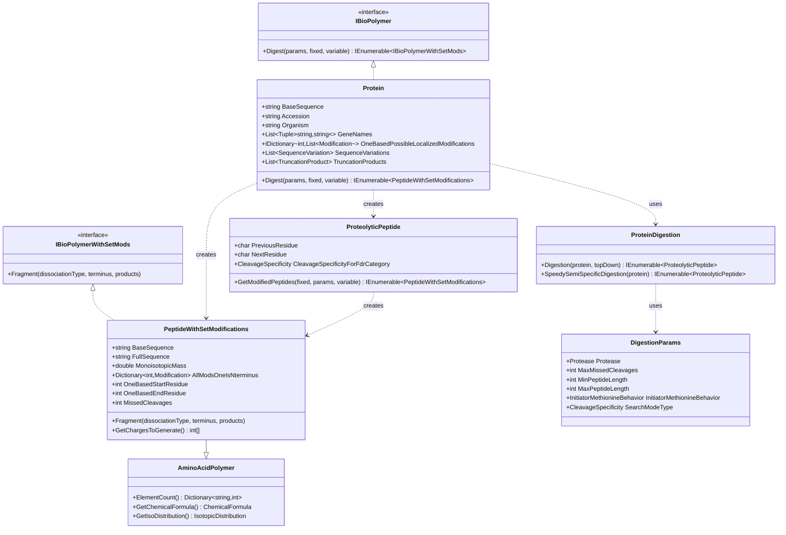

# Proteomics

## Overview

The Proteomics library provides protein-specific implementations of the Omics framework, enabling comprehensive protein analysis for mass spectrometry applications. It extends the base Omics interfaces with protein-specific features including enzymatic digestion, post-translational modifications (PTMs), sequence variants, and SILAC labeling support.

### Key Features

- **Protein Class**: Complete protein representation with metadata and modifications
- **Peptide Generation**: Advanced digestion with trypsin and other proteases
- **PTM Support**: Comprehensive post-translational modification handling
- **Sequence Variants**: SNP, indel, and splice variant support
- **SILAC Labeling**: Stable isotope labeling for quantitative proteomics
- **Glycoproteomics**: N-glycan and O-glycan peptide support
- **Top-Down Proteomics**: Intact protein and truncation product analysis

### Quick Start

```csharp
using Proteomics;
using Proteomics.ProteolyticDigestion;
using Omics.Modifications;

// Create a protein
var protein = new Protein(
    sequence: "MAQTQVLQVAKEATPTPLPTAVPR",
    accession: "P12345",
    organism: "Homo sapiens",
    geneNames: new List<Tuple<string, string>> 
    { 
        Tuple.Create("primary", "ALB") 
    }
);

// Configure digestion
var digestionParams = new DigestionParams(
    protease: "trypsin",
    maxMissedCleavages: 2,
    minPeptideLength: 7,
    maxPeptideLength: 30
);

// Digest with modifications
var carbamidomethyl = /* carbamidomethylation of C */;
var oxidation = /* oxidation of M */;

var peptides = protein.Digest(
    digestionParams,
    new List<Modification> { carbamidomethyl },  // Fixed mods
    new List<Modification> { oxidation }          // Variable mods
).ToList();

// Process peptides
foreach (var peptide in peptides)
{
    Console.WriteLine($"{peptide.FullSequence}");
    Console.WriteLine($"  Mass: {peptide.MonoisotopicMass:F4} Da");
    Console.WriteLine($"  Charge states: {string.Join(", ", peptide.GetChargesToGenerate())}");
    
    // Fragment the peptide
    var products = new List<Product>();
    peptide.Fragment(DissociationType.HCD, FragmentationTerminus.Both, products);
    Console.WriteLine($"  Fragment ions: {products.Count}");
}
```

## System Design

### Architecture Overview



## Core Classes

### Protein Class

The `Protein` class represents a complete protein with all associated metadata:

```csharp
public class Protein : IBioPolymer
{
    // Core Properties
    public string BaseSequence { get; }
    public string Accession { get; }
    public string Name { get; }
    public string FullName { get; }
    public string Organism { get; }
    public int Length => BaseSequence.Length;
    public bool IsDecoy { get; }
    public bool IsContaminant { get; }
    
    // Biological Information
    public List<Tuple<string, string>> GeneNames { get; }
    public IDictionary<int, List<Modification>> OneBasedPossibleLocalizedModifications { get; }
    public List<SequenceVariation> SequenceVariations { get; }
    public List<TruncationProduct> TruncationProducts { get; }
    public List<DisulfideBond> DisulfideBonds { get; }
    public List<SpliceSite> SpliceSites { get; }
    
    // Digestion
    public IEnumerable<PeptideWithSetModifications> Digest(
        DigestionParams digestionParams,
        List<Modification> allKnownFixedModifications,
        List<Modification> variableModifications);
}
```

**Constructor Options**:

```csharp
// Basic protein
var protein = new Protein(
    sequence: "MAQTQVLQVAK",
    accession: "P12345"
);

// Protein with full metadata
var proteinWithMetadata = new Protein(
    sequence: "MAQTQVLQVAK",
    accession: "P12345",
    organism: "Homo sapiens",
    geneNames: new List<Tuple<string, string>> 
    { 
        Tuple.Create("primary", "ALB"),
        Tuple.Create("ORF", "albumin") 
    },
    oneBasedModifications: new Dictionary<int, List<Modification>>
    {
        { 3, new List<Modification> { acetylation } }  // Acetylation at position 3
    },
    name: "ALB_HUMAN",
    fullName: "Serum albumin",
    isDecoy: false,
    isContaminant: false
);
```

### PeptideWithSetModifications Class

Represents a peptide with specific modifications applied:

```csharp
public class PeptideWithSetModifications : AminoAcidPolymer, IBioPolymerWithSetMods
{
    // Sequence Information
    public string BaseSequence { get; }
    public string FullSequence { get; }
    public int Length => BaseSequence.Length;
    
    // Position in Parent Protein
    public int OneBasedStartResidue { get; }
    public int OneBasedEndResidue { get; }
    public char PreviousResidue { get; }
    public char NextResidue { get; }
    
    // Digestion Information
    public int MissedCleavages { get; }
    public CleavageSpecificity CleavageSpecificityForFdrCategory { get; }
    public IBioPolymer Parent { get; }  // Parent protein
    
    // Modifications
    public Dictionary<int, Modification> AllModsOneIsNterminus { get; }
    public int NumMods { get; }
    public int NumFixedMods { get; }
    
    // Mass Properties
    public double MonoisotopicMass { get; }
    public double MostAbundantMonoisotopicMass { get; }
    
    // Fragmentation
    public void Fragment(
        DissociationType dissociationType,
        FragmentationTerminus fragmentationTerminus,
        List<Product> products);
    
    // Charge State Prediction
    public int[] GetChargesToGenerate();
}
```

**Key Features**:

```csharp
var peptide = peptides.First();

// Access sequence information
Console.WriteLine($"Sequence: {peptide.BaseSequence}");
Console.WriteLine($"Full: {peptide.FullSequence}");
Console.WriteLine($"Context: {peptide.PreviousResidue}.{peptide.BaseSequence}.{peptide.NextResidue}");

// Position in protein
Console.WriteLine($"Position: {peptide.OneBasedStartResidue}-{peptide.OneBasedEndResidue}");

// Modifications
foreach (var mod in peptide.AllModsOneIsNterminus)
{
    Console.WriteLine($"Mod at {mod.Key}: {mod.Value.IdWithMotif}");
}

// Mass
Console.WriteLine($"Monoisotopic mass: {peptide.MonoisotopicMass:F4} Da");

// Charge states
var charges = peptide.GetChargesToGenerate();
Console.WriteLine($"Predicted charges: {string.Join(", ", charges)}");
```

## Digestion

### Basic Protein Digestion

```csharp
// Create protein
var protein = new Protein("MAQTQVLQVAKEATPTPLPTAVPR", "P12345");

// Configure digestion parameters
var digestionParams = new DigestionParams(
    protease: "trypsin",
    maxMissedCleavages: 2,
    minPeptideLength: 7,
    maxPeptideLength: 30,
    initiatorMethionineBehavior: InitiatorMethionineBehavior.Variable
);

// Perform digestion
var peptides = protein.Digest(
    digestionParams,
    fixedModifications,
    variableModifications
).ToList();

Console.WriteLine($"Generated {peptides.Count} peptides");
```

### Digestion with Modifications

```csharp
// Define modifications
var fixedMods = new List<Modification>
{
    PtmListLoader.LoadPtmFromUnimodString("Carbamidomethyl on C")
};

var variableMods = new List<Modification>
{
    PtmListLoader.LoadPtmFromUnimodString("Oxidation on M"),
    PtmListLoader.LoadPtmFromUnimodString("Phospho on S"),
    PtmListLoader.LoadPtmFromUnimodString("Phospho on T")
};

// Digest
var peptides = protein.Digest(digestionParams, fixedMods, variableMods);

// Each peptide has specific modifications
foreach (var peptide in peptides.Take(10))
{
    Console.WriteLine(peptide.FullSequence);
    // Example: PEPTIDE[Common:Oxidation on M]
    // Example: [Common:Phospho on S]SEQUENCE
}
```

### Initiator Methionine Handling

```csharp
// Variable: Generate both with and without M
var variableParams = new DigestionParams(
    protease: "trypsin",
    initiatorMethionineBehavior: InitiatorMethionineBehavior.Variable
);
var variablePeptides = protein.Digest(variableParams, fixedMods, variableMods);
// Generates: MAQTQVLQVAK and AQTQVLQVAK

// Retain: Always keep M
var retainParams = new DigestionParams(
    protease: "trypsin",
    initiatorMethionineBehavior: InitiatorMethionineBehavior.Retain
);
var retainPeptides = protein.Digest(retainParams, fixedMods, variableMods);
// Generates: MAQTQVLQVAK only

// Cleave: Always remove M
var cleaveParams = new DigestionParams(
    protease: "trypsin",
    initiatorMethionineBehavior: InitiatorMethionineBehavior.Cleave
);
var cleavePeptides = protein.Digest(cleaveParams, fixedMods, variableMods);
// Generates: AQTQVLQVAK only
```

## Advanced Features

### Sequence Variants

Handle protein sequence variants (SNPs, indels):

```csharp
// Add sequence variant
var variant = new SequenceVariation(
    oneBasedBeginPosition: 10,
    oneBasedEndPosition: 10,
    originalSequence: "A",
    variantSequence: "V",
    description: "A10V missense"
);

protein.SequenceVariations.Add(variant);

// Generate variant proteins
var variantProteins = protein.GetVariantBioPolymers(
    maxAllowedVariants: 4,
    minAlleleDepth: 1
);

foreach (var variantProtein in variantProteins)
{
    Console.WriteLine($"Accession: {variantProtein.Accession}");
    Console.WriteLine($"Applied variants: {variantProtein.AppliedSequenceVariations.Count}");
    
    // Digest variant protein
    var variantPeptides = variantProtein.Digest(digestionParams, fixedMods, variableMods);
}
```

### SILAC Labeling

Support for stable isotope labeling:

```csharp
// Define SILAC label (heavy lysine: +8 Da)
var silacLabel = new SilacLabel(
    originalAminoAcid: 'K',
    aminoAcidLabel: 'a',  // Represent labeled K as 'a'
    labelChemicalFormula: ChemicalFormula.ParseFormula("C'6N'2"),  // Heavy C and N
    massDifference: 8.014199
);

// Add heavy arginine to same label
var heavyArg = new SilacLabel(
    originalAminoAcid: 'R',
    aminoAcidLabel: 'b',  // Represent labeled R as 'b'
    labelChemicalFormula: ChemicalFormula.ParseFormula("C'6N'4"),
    massDifference: 10.008269
);
silacLabel.AddAdditionalSilacLabel(heavyArg);

// Digest with SILAC
var silacPeptides = protein.Digest(
    digestionParams,
    fixedMods,
    variableMods,
    silacLabels: new List<SilacLabel> { silacLabel },
    turnoverLabels: null  // For multiplex experiments
).ToList();

// Results include both light and heavy peptides
foreach (var peptide in silacPeptides.Where(p => p.BaseSequence.Contains('a') || p.BaseSequence.Contains('b')))
{
    Console.WriteLine($"{peptide.FullSequence} (heavy)");
}
```

### Glycoproteomics

Filter for glycopeptides:

```csharp
// Keep only N-glycopeptides (NxS/NxT motif)
var nGlycoParams = new DigestionParams(
    protease: "trypsin",
    keepNGlycopeptide: true
);
var nGlycoPeptides = protein.Digest(nGlycoParams, fixedMods, variableMods);

// Keep only O-glycopeptides (contains S or T)
var oGlycoParams = new DigestionParams(
    protease: "trypsin",
    keepOGlycopeptide: true
);
var oGlycoPeptides = protein.Digest(oGlycoParams, fixedMods, variableMods);

// Keep both
var allGlycoParams = new DigestionParams(
    protease: "trypsin",
    keepNGlycopeptide: true,
    keepOGlycopeptide: true
);
var allGlycoPeptides = protein.Digest(allGlycoParams, fixedMods, variableMods);
```

### Top-Down Proteomics

Work with intact proteins and truncation products:

```csharp
// Configure for top-down
var topDownParams = new DigestionParams(
    protease: "top-down",
    minPeptideLength: 50,
    maxPeptideLength: int.MaxValue,
    searchModeType: CleavageSpecificity.None
);

// Add truncation products (N- and C-terminal truncations)
protein.AddTruncations(
    addFullProtein: true,                      // Include intact protein
    addForEachOrigninalProteolysisProduct: true,  // Truncate each proteolysis product
    addNterminalDigestionTruncations: true,
    addCterminalDigestionTruncations: true,
    minProductBaseSequenceLength: 50,
    lengthOfProteolysis: 5                     // Up to 5 aa removed from each end
);

// Digest (returns intact and truncated forms)
var topDownPeptides = protein.Digest(
    topDownParams,
    fixedMods,
    variableMods,
    topDownTruncationSearch: true
).ToList();

Console.WriteLine($"Generated {topDownPeptides.Count} proteoforms");
```

## Peptide Properties

### Chemical Formula and Mass

```csharp
var peptide = peptides.First();

// Get chemical formula
var formula = peptide.GetChemicalFormula();
Console.WriteLine($"Formula: {formula.Formula}");

// Get isotopic distribution
var isotopeDistribution = peptide.GetIsotopicDistribution();
foreach (var (mass, intensity) in isotopeDistribution.Masses.Zip(isotopeDistribution.Intensities))
{
    Console.WriteLine($"  m/z {mass:F4}: {intensity:F2}%");
}

// Element counts
var elementCounts = peptide.ElementCount();
foreach (var (element, count) in elementCounts)
{
    Console.WriteLine($"{element}: {count}");
}
```

### Charge State Prediction

```csharp
// Get predicted charge states based on peptide properties
var charges = peptide.GetChargesToGenerate();

Console.WriteLine($"Predicted charge states: {string.Join(", ", charges)}");

// Generate m/z values for each charge state
foreach (var charge in charges)
{
    double mz = (peptide.MonoisotopicMass + charge * Constants.ProtonMass) / charge;
    Console.WriteLine($"  +{charge}: {mz:F4} m/z");
}
```

### Peptide Descriptors

```csharp
// Access peptide metadata
Console.WriteLine($"Parent protein: {peptide.Parent.Accession}");
Console.WriteLine($"Start-End: {peptide.OneBasedStartResidue}-{peptide.OneBasedEndResidue}");
Console.WriteLine($"Previous: {peptide.PreviousResidue}, Next: {peptide.NextResidue}");
Console.WriteLine($"Missed cleavages: {peptide.MissedCleavages}");
Console.WriteLine($"Specificity: {peptide.CleavageSpecificityForFdrCategory}");
Console.WriteLine($"Description: {peptide.PeptideDescription}");
```

## Common Use Cases

### Database Search Preparation

```csharp
// Load protein database
var proteins = ProteinDbLoader.LoadProteinFasta(
    "uniprot_human.fasta",
    generateTargets: true,
    decoyType: DecoyType.Reverse,
    isContaminant: false,
    out var errors
);

Console.WriteLine($"Loaded {proteins.Count} proteins");

// Configure search parameters
var searchParams = new DigestionParams(
    protease: "trypsin",
    maxMissedCleavages: 2,
    minPeptideLength: 7,
    maxPeptideLength: 50,
    initiatorMethionineBehavior: InitiatorMethionineBehavior.Variable,
    searchModeType: CleavageSpecificity.Full
);

// Generate theoretical peptides
var theoreticalPeptides = proteins
    .AsParallel()
    .SelectMany(p => p.Digest(searchParams, fixedMods, variableMods))
    .Where(p => p.MonoisotopicMass >= 500 && p.MonoisotopicMass <= 5000)
    .Distinct()
    .ToList();

Console.WriteLine($"Generated {theoreticalPeptides.Count} unique peptides");
```

### Peptide-Spectrum Matching

```csharp
// Load experimental spectrum
var spectrum = /* load from file */;

// Get candidate peptides
var candidates = theoreticalPeptides
    .Where(p => Math.Abs(p.MonoisotopicMass - spectrum.PrecursorMass) < tolerance)
    .ToList();

// Score each candidate
foreach (var candidate in candidates)
{
    // Generate theoretical fragments
    var products = new List<Product>();
    candidate.Fragment(DissociationType.HCD, FragmentationTerminus.Both, products);
    
    // Match to experimental spectrum
    int matchedIons = 0;
    double totalIntensity = 0;
    
    foreach (var product in products)
    {
        int closestPeakIndex = spectrum.GetClosestPeakIndex(product.NeutralMass);
        if (closestPeakIndex >= 0)
        {
            double experimentalMz = spectrum.XArray[closestPeakIndex];
            if (Math.Abs(product.NeutralMass - experimentalMz) < ionTolerance)
            {
                matchedIons++;
                totalIntensity += spectrum.YArray[closestPeakIndex];
            }
        }
    }
    
    double score = matchedIons * totalIntensity;
    Console.WriteLine($"{candidate.FullSequence}: {score:F2}");
}
```

### Protein Coverage Analysis

```csharp
// Calculate sequence coverage
var identifiedPeptides = /* peptides identified from MS */;

var coveredResidues = new HashSet<int>();
foreach (var peptide in identifiedPeptides.Where(p => p.Parent.Accession == protein.Accession))
{
    for (int i = peptide.OneBasedStartResidue; i <= peptide.OneBasedEndResidue; i++)
    {
        coveredResidues.Add(i);
    }
}

double coverage = (double)coveredResidues.Count / protein.Length * 100;
Console.WriteLine($"Sequence coverage: {coverage:F1}%");

// Visualize coverage
var coverageArray = new bool[protein.Length];
foreach (int pos in coveredResidues)
{
    coverageArray[pos - 1] = true;
}

for (int i = 0; i < protein.Length; i++)
{
    Console.Write(coverageArray[i] ? protein[i] : protein[i].ToString().ToLower());
}
```

### Quantitative Analysis

```csharp
// Label-free quantification
var peptideIntensities = new Dictionary<string, List<double>>();

foreach (var run in experimentalRuns)
{
    foreach (var peptide in identifiedPeptides)
    {
        if (!peptideIntensities.ContainsKey(peptide.FullSequence))
        {
            peptideIntensities[peptide.FullSequence] = new List<double>();
        }
        
        peptideIntensities[peptide.FullSequence].Add(GetPeptideIntensity(peptide, run));
    }
}

// Calculate protein abundance
var proteinAbundance = peptideIntensities
    .Where(kvp => kvp.Value.Count >= 3)  // Require 3+ observations
    .Select(kvp => kvp.Value.Average())
    .Average();

Console.WriteLine($"Protein abundance: {proteinAbundance:E2}");
```

## Integration

### Dependencies

```
Proteomics
  ?
  Omics (IBioPolymer, IBioPolymerWithSetMods, Modifications, Digestion, Fragmentation)
  ?
  Chemistry (ChemicalFormula, PeriodicTable)
  ?
  MassSpectrometry (DissociationType)
  ?
  MzLibUtil (Utilities)
```

### Used By

- **MetaMorpheus**: Database searching and PTM discovery
- **FlashLFQ**: Label-free quantification
- **UsefulProteomicsDatabases**: Database loading and management

## Best Practices

### Memory Management

```csharp
// Good: Process proteins in batches for large databases
const int batchSize = 1000;
var allPeptides = new List<PeptideWithSetModifications>();

for (int i = 0; i < proteins.Count; i += batchSize)
{
    var batch = proteins.Skip(i).Take(batchSize);
    var batchPeptides = batch
        .AsParallel()
        .SelectMany(p => p.Digest(params, fixed, variable))
        .ToList();
    
    allPeptides.AddRange(batchPeptides);
    
    // Process or save batch results
    Console.WriteLine($"Processed {Math.Min(i + batchSize, proteins.Count)}/{proteins.Count} proteins");
}
```

### Modification Handling

```csharp
// Good: Load modifications from standard databases
var allMods = PtmListLoader.ReadModsFromFile("mods.txt");
var fixedMods = allMods.Where(m => m.ModificationType == "Fixed").ToList();
var variableMods = allMods.Where(m => m.ModificationType == "Variable").ToList();

// Good: Limit variable modifications to prevent explosion
var params = new DigestionParams(
    maxModificationIsoforms: 1024,
    maxModsForPeptides: 2  // Max 2 variable mods per peptide
);

// Avoid: Too many variable modifications
var tooManyMods = allMods.Where(m => m.ModificationType == "Variable").ToList();  // Bad
```

### Performance Optimization

```csharp
// Good: Use parallel processing
var peptides = proteins
    .AsParallel()
    .WithDegreeOfParallelism(Environment.ProcessorCount)
    .SelectMany(p => p.Digest(params, fixed, variable))
    .ToList();

// Good: Filter early
var peptides = proteins
    .AsParallel()
    .SelectMany(p => p.Digest(params, fixed, variable))
    .Where(p => p.MonoisotopicMass >= 500 && p.MonoisotopicMass <= 5000)
    .ToList();

// Good: Cache results
var proteinPeptideMap = proteins
    .ToDictionary(
        p => p.Accession,
        p => p.Digest(params, fixed, variable).ToList()
    );
```

## See Also

- [Omics: Base Foundation](https://github.com/smith-chem-wisc/mzLib/wiki/Omics:-Base-Foundation) - Core omics interfaces
- [Omics: Modifications](https://github.com/smith-chem-wisc/mzLib/wiki/Omics:-Modifications) - PTM system
- [Omics: Digestion](https://github.com/smith-chem-wisc/mzLib/wiki/Omics:-Digestion) - Enzymatic digestion framework
- [Omics: Fragmentation](https://github.com/smith-chem-wisc/mzLib/wiki/Omics:-Fragmentation) - MS/MS fragmentation
- [File Reading: Sequence Databases](https://github.com/smith-chem-wisc/mzLib/wiki/File-Reading:-Sequence-Databases) - Loading protein databases
- [Decoy Generation](https://github.com/smith-chem-wisc/mzLib/wiki/Omics:-Decoy-Generation) - Generating decoy proteins
