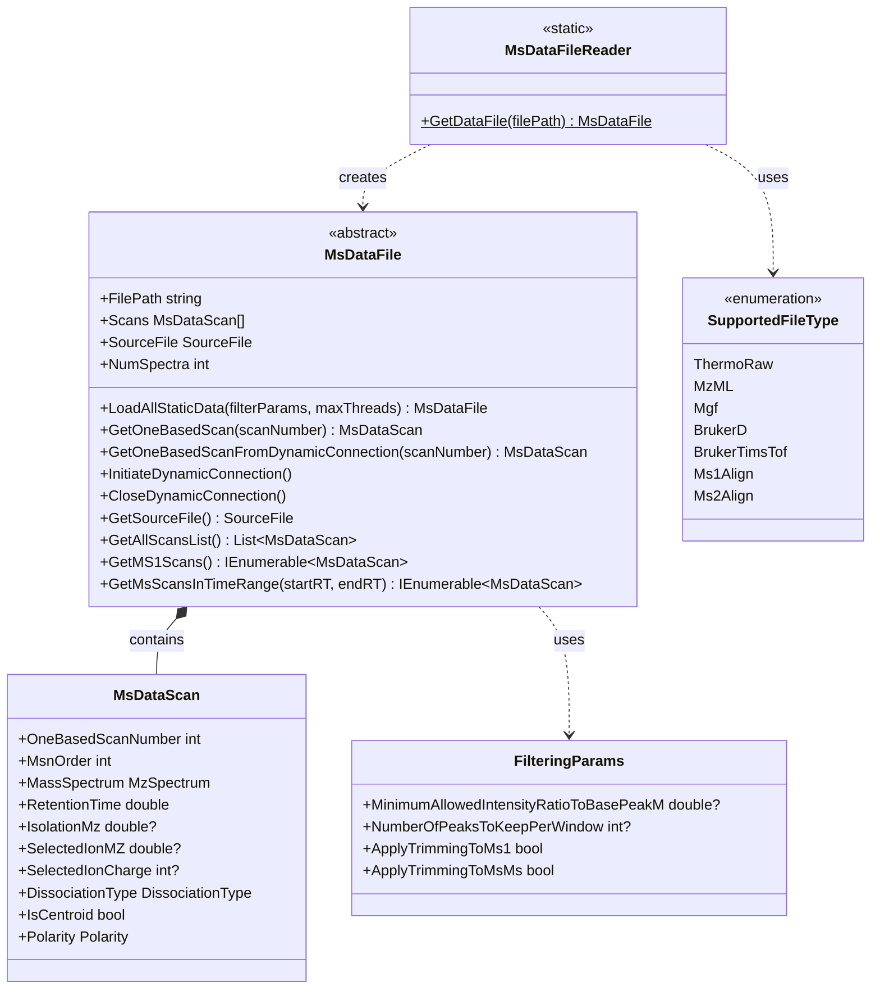

# Mass Spectrometry File Reading

## Overview

The Mass Spectrometry File Reading infrastructure provides a unified interface for reading various MS data file formats from different instrument vendors and processing software. The system automatically detects file types and provides consistent access to spectral data regardless of the underlying format.

### Key Features

- **Multi-Vendor Support**: Read Thermo RAW, Bruker .d, Waters, Agilent, and open formats
- **Automatic Format Detection**: File type automatically determined from extension and content
- **Unified Interface**: Consistent API across all file formats
- **Two Reading Modes**: Static (load all scans) or dynamic (on-demand reading)
- **Filtering Support**: Optional peak filtering during file loading
- **Thread-Safe Dynamic Reading**: Concurrent access to file data

### Quick Start

```csharp
// Automatically detect and load file
MsDataFile msDataFile = MsDataFileReader.GetDataFile(filePath);

// Load all scans into memory
msDataFile.LoadAllStaticData();

// Access scans
var allScans = msDataFile.GetAllScansList();
var singleScan = msDataFile.GetOneBasedScan(scanNumber);
var ms1Scans = msDataFile.GetMS1Scans();

// Access scan data
foreach (var scan in allScans)
{
    Console.WriteLine($"Scan {scan.OneBasedScanNumber}: RT={scan.RetentionTime:F2} min, " +
                      $"MS{scan.MsnOrder}, {scan.MassSpectrum.Size} peaks");
}
```

## Supported File Formats

| Format | Extension | Vendor/Source | Reading Mode | Key Features |
|--------|-----------|---------------|--------------|--------------|
| **Thermo RAW** | .raw | Thermo Fisher Scientific | Static & Dynamic | Native format, full metadata |
| **mzML** | .mzML | PSI Standard | Static & Dynamic | Open standard, compressed or uncompressed |
| **MGF** | .mgf | Mascot Generic Format | Static | Simple text format, MS2 focus |
| **Bruker BAF** | .d | Bruker Daltonics | Static & Dynamic | Requires proprietary DLLs |
| **Bruker TIMS-TOF** | .d | Bruker Daltonics | Static & Dynamic | Ion mobility data, TDF/TSF format |
| **MsAlign** | _ms1.msalign, _ms2.msalign | TopPIC, TopFD | Static | Deconvoluted neutral masses |

## System Design

### Architecture Overview

The system uses a factory pattern with format-specific implementations:

1. **MsDataFileReader** - Factory class for creating appropriate file readers
2. **MsDataFile** - Abstract base class defining the common interface
3. **Format-Specific Readers** - Implementations for each file format



### Core Components

#### MsDataFileReader (Factory)
Static factory class that automatically detects file type and returns appropriate reader.

```csharp
public static class MsDataFileReader
{
    public static MsDataFile GetDataFile(string filePath)
    {
        // Automatically detects file type from extension and content
        // Returns appropriate file reader instance
    }
}
```

#### MsDataFile (Abstract Base)
Base class providing common interface for all file formats.

```csharp
public abstract class MsDataFile : IEnumerable<MsDataScan>
{
    public string FilePath { get; }
    public MsDataScan[] Scans { get; protected set; }
    public SourceFile SourceFile { get; set; }
    public int NumSpectra { get; }
    
    // Static loading
    public abstract MsDataFile LoadAllStaticData(
        FilteringParams filteringParams = null, 
        int maxThreads = 1);
    
    // Dynamic loading
    public abstract void InitiateDynamicConnection();
    public abstract MsDataScan GetOneBasedScanFromDynamicConnection(
        int oneBasedScanNumber, 
        IFilteringParams filterParams = null);
    public abstract void CloseDynamicConnection();
    
    // Utility methods
    public virtual MsDataScan GetOneBasedScan(int scanNumber);
    public virtual List<MsDataScan> GetAllScansList();
    public virtual IEnumerable<MsDataScan> GetMS1Scans();
    public virtual IEnumerable<MsDataScan> GetMsScansInTimeRange(
        double firstRT, double lastRT);
}
```

#### MsDataScan
Represents a single mass spectrum with metadata.

```csharp
public class MsDataScan
{
    public int OneBasedScanNumber { get; }
    public int MsnOrder { get; }
    public MzSpectrum MassSpectrum { get; }
    public double RetentionTime { get; }
    public double? IsolationMz { get; }
    public double? SelectedIonMZ { get; }
    public int? SelectedIonCharge { get; }
    public DissociationType DissociationType { get; }
    public bool IsCentroid { get; }
    public Polarity Polarity { get; }
    public string NativeId { get; }
    // ... and many more properties
}
```

## Reading Modes

### Static Mode (Load All)

Loads all scans into memory at once. Best for:
- Small to medium files
- When you need multiple passes through the data
- Random access patterns
- When memory is not a constraint

```csharp
// Load entire file into memory
var msDataFile = MsDataFileReader.GetDataFile(filePath);
msDataFile.LoadAllStaticData();

// All scans now available in memory
foreach (var scan in msDataFile.GetAllScansList())
{
    ProcessScan(scan);
}

// Fast random access
var scan100 = msDataFile.GetOneBasedScan(100);
var scan500 = msDataFile.GetOneBasedScan(500);
```

### Dynamic Mode (On-Demand)

Reads scans from disk as needed. Best for:
- Large files
- When only a subset of scans is needed
- Sequential access patterns
- Memory-constrained environments

```csharp
// Open connection to file
var msDataFile = MsDataFileReader.GetDataFile(filePath);
msDataFile.InitiateDynamicConnection();

try
{
    // Read specific scans on-demand
    for (int i = 1; i <= 100; i++)
    {
        var scan = msDataFile.GetOneBasedScanFromDynamicConnection(i);
        ProcessScan(scan);
    }
}
finally
{
    // Always close connection
    msDataFile.CloseDynamicConnection();
}
```

### Mixed Mode

Combine both approaches for optimal performance:

```csharp
var msDataFile = MsDataFileReader.GetDataFile(filePath);

// Load static for initial analysis
msDataFile.LoadAllStaticData();
var ms1Scans = msDataFile.GetMS1Scans().ToList();

// Use dynamic for detailed processing
msDataFile.InitiateDynamicConnection();
try
{
    foreach (var ms1 in ms1Scans)
    {
        // Get MS2 scans associated with this MS1
        int startScan = ms1.OneBasedScanNumber + 1;
        int endScan = ms1.OneBasedScanNumber + 10;
        
        for (int i = startScan; i < endScan; i++)
        {
            var ms2 = msDataFile.GetOneBasedScanFromDynamicConnection(i);
            if (ms2.MsnOrder == 2)
                ProcessMs2(ms1, ms2);
        }
    }
}
finally
{
    msDataFile.CloseDynamicConnection();
}
```

## Format-Specific Details

### Thermo RAW Files

**Features**:
- Full access to Thermo metadata
- Fast performance with native APIs
- Support for all Thermo acquisition types

**Requirements**:
- ThermoFisher.CommonCore.RawFileReader DLLs (included)

**Example**:
```csharp
var thermoFile = MsDataFileReader.GetDataFile("sample.raw") as ThermoRawFileReader;
thermoFile.LoadAllStaticData();

// Thermo-specific metadata
var sourceFile = thermoFile.GetSourceFile();
Console.WriteLine($"Instrument: {sourceFile.InstrumentName}");
Console.WriteLine($"Model: {sourceFile.InstrumentModel}");
```

**Best Practices**:
- Use dynamic mode for very large files (>5 GB)
- Static mode is very fast for typical files (<2 GB)

### mzML Files

**Features**:
- Open standard format
- Supports compressed and uncompressed
- Indexed for fast random access

**Example**:
```csharp
var mzmlFile = MsDataFileReader.GetDataFile("sample.mzML") as Mzml;
mzmlFile.LoadAllStaticData();

// Works with both centroid and profile data
foreach (var scan in mzmlFile)
{
    if (scan.IsCentroid)
        Console.WriteLine($"Scan {scan.OneBasedScanNumber}: Centroided");
    else
        Console.WriteLine($"Scan {scan.OneBasedScanNumber}: Profile");
}
```

**Best Practices**:
- Use indexed mzML when possible for faster access
- Compressed mzML reduces file size but slightly slower to read
- Dynamic mode recommended for large mzML files

### MGF Files

**Features**:
- Simple text format
- Commonly used for MS2 data
- Easy to create and edit

**Limitations**:
- Typically only MS2 scans
- Limited metadata
- No standard for scan numbering

**Example**:
```csharp
var mgfFile = MsDataFileReader.GetDataFile("sample.mgf") as Mgf;
mgfFile.LoadAllStaticData();

foreach (var scan in mgfFile)
{
    Console.WriteLine($"Precursor m/z: {scan.SelectedIonMZ}");
    Console.WriteLine($"Charge: {scan.SelectedIonCharge}");
    Console.WriteLine($"Peaks: {scan.MassSpectrum.Size}");
}
```

**Best Practices**:
- Always load static (format doesn't support dynamic)
- Check for missing scan numbers (array may contain nulls)

### Bruker .d Files

**Features**:
- Native Bruker format (BAF)
- Full instrument metadata
- Both MS1 and MS2 data

**Requirements**:
- baf2sql_c.dll (included)
- Microsoft Visual C++ Runtime

**Example**:
```csharp
var brukerFile = MsDataFileReader.GetDataFile("sample.d") as BrukerFileReader;
brukerFile.LoadAllStaticData();

// Access Bruker-specific information
foreach (var scan in brukerFile.GetAllScansList())
{
    Console.WriteLine($"Scan {scan.OneBasedScanNumber}: " +
                      $"RT={scan.RetentionTime:F2}, " +
                      $"TIC={scan.TotalIonCurrent:E2}");
}
```

**Best Practices**:
- Ensure required DLLs are in output directory
- Use static mode (more reliable than dynamic)

### Bruker TIMS-TOF Files

**Features**:
- Ion mobility data (TIMS dimension)
- High-resolution accurate mass
- TDF (MS/MS) or TSF (MS1) format

**Requirements**:
- timsdata.dll (included)
- baf2sql_c.dll (included)

**Example**:
```csharp
var timsFile = MsDataFileReader.GetDataFile("sample.d") as TimsTofFileReader;
timsFile.LoadAllStaticData();

// Access ion mobility data
foreach (var scan in timsFile)
{
    if (scan.OneBasedPrecursorScanNumber.HasValue)
    {
        Console.WriteLine($"MS2 Scan {scan.OneBasedScanNumber}: " +
                          $"Precursor: {scan.SelectedIonMZ:F4}, " +
                          $"Mobility: {scan.IonMobility?.Mobility:F3}");
    }
}
```

**Best Practices**:
- Large files - use dynamic mode
- Check for ion mobility data availability
- Frame vs. scan terminology (frames contain multiple scans)

### MsAlign Files

**Features**:
- Deconvoluted neutral mass spectra
- Used by TopPIC/TopFD software and others
- Separate MS1 and MS2 files

**Formats**:
- `_ms1.msalign`: MS1 deconvoluted masses
- `_ms2.msalign`: MS2 deconvoluted masses

**Example**:
```csharp
// Read MS1 neutral masses
var ms1File = MsDataFileReader.GetDataFile("sample_ms1.msalign") as Ms1Align;
ms1File.LoadAllStaticData();

foreach (var scan in ms1File)
{
    // Spectrum contains neutral masses, not m/z
    var spectrum = scan.MassSpectrum as NeutralMassSpectrum;
    Console.WriteLine($"Scan {scan.OneBasedScanNumber}: " +
                      $"{spectrum.Size} neutral masses");
}

// Read MS2 neutral masses
var ms2File = MsDataFileReader.GetDataFile("sample_ms2.msalign") as Ms2Align;
ms2File.LoadAllStaticData();
```

**Best Practices**:
- These are already deconvoluted - no need to deconvolute again
- Masses are neutral, not m/z values
- Typically smaller files than raw data

## Filtering During Loading

Apply filtering to reduce memory footprint and improve performance:

```csharp
var filterParams = new FilteringParams
{
    // Keep only top N peaks per window
    NumberOfPeaksToKeepPerWindow = 200,
    
    // Remove low-intensity peaks (relative to base peak)
    MinimumAllowedIntensityRatioToBasePeakM = 0.01, // 1%
    
    // Apply to MS1
    ApplyTrimmingToMs1 = true,
    
    // Apply to MS/MS
    ApplyTrimmingToMsMs = true
};

var msDataFile = MsDataFileReader.GetDataFile(filePath);
msDataFile.LoadAllStaticData(filterParams);

// Scans now contain filtered peaks
```

**Filtering Options**:

| Parameter | Description | Typical Values |
|-----------|-------------|----------------|
| `NumberOfPeaksToKeepPerWindow` | Keep top N peaks in moving windows | 150-400 |
| `MinimumAllowedIntensityRatioToBasePeakM` | Relative intensity cutoff | 0.01-0.05 |
| `ApplyTrimmingToMs1` | Filter MS1 scans | true/false |
| `ApplyTrimmingToMsMs` | Filter MS2 scans | true/false |
| `WindowSizeInMz` | Size of filtering window | 100-200 m/z |

## Common Operations

### Finding Scans by Retention Time

```csharp
msDataFile.LoadAllStaticData();

// Get all scans in a time range
double startRT = 10.0; // minutes
double endRT = 15.0;
var scansInRange = msDataFile.GetMsScansInTimeRange(startRT, endRT);

foreach (var scan in scansInRange)
{
    Console.WriteLine($"Scan {scan.OneBasedScanNumber} at RT {scan.RetentionTime:F2}");
}

// Find scan closest to specific retention time
double targetRT = 12.5;
int closestScan = msDataFile.GetClosestOneBasedSpectrumNumber(targetRT);
```

### Extracting Ion Chromatograms

```csharp
msDataFile.LoadAllStaticData();

double targetMz = 445.1234;
var tolerance = new PpmTolerance(10); // 10 ppm

var xic = new List<(double rt, double intensity)>();

foreach (var scan in msDataFile.GetMS1Scans())
{
    // Find peak near target m/z
    var peak = scan.MassSpectrum.ExtractByMz(targetMz, tolerance);
    if (peak != null)
    {
        xic.Add((scan.RetentionTime, peak.Intensity));
    }
}

// Plot or analyze XIC
```

### Accessing Scan Metadata

```csharp
var scan = msDataFile.GetOneBasedScan(100);

// Basic information
Console.WriteLine($"Scan Number: {scan.OneBasedScanNumber}");
Console.WriteLine($"MS Level: {scan.MsnOrder}");
Console.WriteLine($"Retention Time: {scan.RetentionTime:F2} min");
Console.WriteLine($"Total Ion Current: {scan.TotalIonCurrent:E2}");

// Peak information
Console.WriteLine($"Number of Peaks: {scan.MassSpectrum.Size}");
Console.WriteLine($"Base Peak m/z: {scan.MassSpectrum.XArray[scan.MassSpectrum.GetBasePeakIndex()]:F4}");
Console.WriteLine($"Base Peak Intensity: {scan.MassSpectrum.YArray[scan.MassSpectrum.GetBasePeakIndex()]:E2}");

// MS2-specific information
if (scan.MsnOrder == 2)
{
    Console.WriteLine($"Precursor m/z: {scan.SelectedIonMZ:F4}");
    Console.WriteLine($"Precursor Charge: {scan.SelectedIonCharge}");
    Console.WriteLine($"Isolation m/z: {scan.IsolationMz:F4}");
    Console.WriteLine($"Dissociation: {scan.DissociationType}");
}

// Data type
Console.WriteLine($"Centroid: {scan.IsCentroid}");
Console.WriteLine($"Polarity: {scan.Polarity}");
```

## Performance Considerations

### Memory Usage

| Mode | Memory Usage | Best For |
|------|--------------|----------|
| Static Loading | High (all scans in memory) | Files < 2 GB, multiple passes |
| Dynamic Loading | Low (only current scan) | Large files, single pass |
| Filtered Static | Medium (reduced peak lists) | Memory-constrained, high-throughput |

## Thread Safety

### Dynamic Connections

Dynamic connections use locks to ensure thread-safe access:

```csharp
var msDataFile = MsDataFileReader.GetDataFile(filePath);
msDataFile.InitiateDynamicConnection();

try
{
    // Thread-safe parallel reading
    Parallel.For(1, 100, scanNumber =>
    {
        var scan = msDataFile.GetOneBasedScanFromDynamicConnection(scanNumber);
        ProcessScan(scan);
    });
}
finally
{
    msDataFile.CloseDynamicConnection();
}
```

### Static Data

Once loaded, static data is read-only and inherently thread-safe:

```csharp
msDataFile.LoadAllStaticData();

// Safe to read from multiple threads
Parallel.ForEach(msDataFile.GetAllScansList(), scan =>
{
    ProcessScan(scan);
});
```

## Integration

### Dependencies

```
Readers (this project)
  ↓
  MassSpectrometry (MsDataFile, MsDataScan)
  ↓
  MzLibUtil (utilities)
  ↓
  Chemistry (mass calculations)
```

### External Libraries

**Vendor DLLs** (included in project):
- **Thermo**: ThermoFisher.CommonCore.*.dll
- **Bruker**: baf2sql_c.dll, timsdata.dll
- **Microsoft**: msvcp110.dll, msvcr110.dll, vcomp110.dll

**NuGet Packages**:
- System.Data.SQLite (for Bruker databases)

### Usage in Other Projects

File reading is fundamental to most mzLib applications:

- **MetaMorpheus**: Database searching
- **FlashLFQ**: Label-free quantification  
- **Proteomics**: Peptide identification
- **SpectralAveraging**: Scan averaging
- **Any analysis tool**: Requires spectral data

## References

- **mzML Format**: [Proteomics Standards Initiative](http://www.psidev.info/mzml)
- **MGF Format**: [Mascot Generic Format Specification](http://www.matrixscience.com/help/data_file_help.html)
- **Thermo RAW**: ThermoFisher RawFileReader SDK
- **Bruker Formats**: Bruker Data Analysis API
- **MsAlign Format**: TopPIC/TopFD Documentation

## See Also

- [Deconvolution Wiki](../MassSpectrometry/Deconvolution/Deconvolution_Wiki.md) - Processing MS data
- [Spectral Averaging](../SpectralAveraging/) - Combining scans
- API Documentation - Full method documentation
