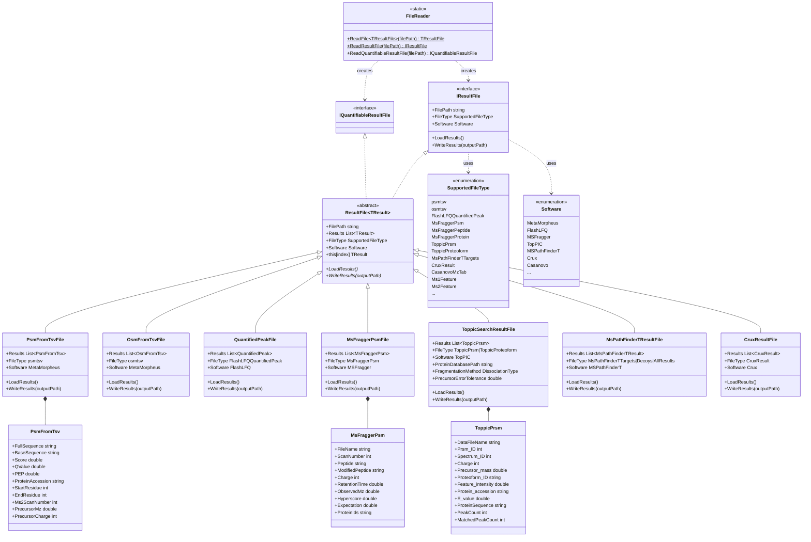

# Search Result File Reading

## Overview

The Search Result File Reading infrastructure provides a unified interface for reading peptide/protein identification and quantification results from various search engines and tools. The system automatically detects file types and provides consistent access to search results regardless of the source software.

### Key Features

- **Multi-Software Support**: Read results from MetaMorpheus, MSFragger, TopPIC, Crux, MSPathFinder-T, and more
- **Automatic Format Detection**: File type automatically determined from extension and content
- **Unified Interface**: Consistent API (`IResultFile`) across all formats
- **Type-Safe Reading**: Generic and non-generic factory methods
- **Write Support**: Export results in their native formats
- **Quantification Support**: Special interface for quantifiable results

### Quick Start

```csharp
// Read any result file automatically
IResultFile resultFile = FileReader.ReadResultFile(filePath);
resultFile.LoadResults();

// Access results generically
Console.WriteLine($"File type: {resultFile.FileType}");
Console.WriteLine($"Software: {resultFile.Software}");

// Type-specific reading
var psmFile = FileReader.ReadFile<PsmFromTsvFile>(psmPath);
foreach (var psm in psmFile.Results)
{
    Console.WriteLine($"{psm.FullSequence}: Score={psm.Score}, q-value={psm.QValue}");
}

// Write results
psmFile.WriteResults(outputPath);
```

## Supported Result Formats

### Internal Results (MetaMorpheus)

| Format | Extension | Description | Contains |
|--------|-----------|-------------|----------|
| **PSM TSV** | .psmtsv | Peptide Spectrum Matches | Individual PSM identifications |
| **OSM TSV** | .osmtsv | Oligosaccharide Spectrum Matches | Glycan identifications |
| **Quantified Peaks** | QuantifiedPeaks.tsv | FlashLFQ Results | Quantification data |

### External Results

| Software | Format | Extension | Description |
|----------|--------|-----------|-------------|
| **MSFragger** | PSM | psm.tsv | Peptide spectrum matches |
| | Peptide | peptide.tsv | Aggregated peptide-level results |
| | Protein | protein.tsv | Protein-level identifications |
| **TopPIC** | PRSM | _prsm.tsv | Proteoform spectrum matches |
| | Proteoform | _proteoform.tsv | Proteoform-level results |
| | PRSM Single | _prsm_single.tsv | Single proteoform matches |
| | Proteoform Single | _proteoform_single.tsv | Single proteoform results |
| **MSPathFinder-T** | Targets | _IcTarget.tsv | Target identifications |
| | Decoys | _IcDecoy.tsv | Decoy identifications |
| | TDA | _IcTDA.tsv | Combined target-decoy results |
| **Crux** | Results | .txt | Percolator output |
| **Casanovo** | MzTab | .mztab | De novo sequencing results |
| **FlashDeconv** | MS1 TSV | _ms1.tsv | MS1 deconvolution |
| | TSV | .tsv | Deconvolution results |
| **Dinosaur** | Features | .feature.tsv | LC-MS features |
| **TopFD** | MS1 Feature | _ms1.feature | MS1 features |
| | MS2 Feature | _ms2.feature | MS2 features |
| | MZRT | .mzrt.csv | Mass and retention time pairs |

## System Design

### Architecture Overview

The system uses a factory pattern with a common interface:

1. **FileReader** - Factory class for creating result file readers
2. **IResultFile** - Interface defining common result file operations
3. **ResultFile<TResult>** - Abstract base class with generic result type
4. **Format-Specific Readers** - Implementations for each format



### Core Components

#### FileReader (Factory)
Static factory class for reading result files with automatic type detection.

```csharp
public static class FileReader
{
    // Generic method - when you know the type
    public static TResultFile ReadFile<TResultFile>(string filePath) 
        where TResultFile : IResultFile, new();
    
    // Non-generic - automatic type detection
    public static IResultFile ReadResultFile(string filePath);
    
    // For quantifiable results in FlashLFQ only
    public static IQuantifiableResultFile ReadQuantifiableResultFile(string filePath);
}
```

#### IResultFile (Interface)
Common interface for all result files.

```csharp
public interface IResultFile
{
    string FilePath { get; internal set; }
    SupportedFileType FileType { get; }
    Software Software { get; set; }
    
    void LoadResults();
    void WriteResults(string outputPath);
}
```

#### ResultFile<TResult> (Abstract Base)
Generic base class providing common functionality.

```csharp
public abstract class ResultFile<TResult> : IResultFile, IEnumerable<TResult>
{
    public string FilePath { get; set; }
    public List<TResult> Results { get; set; }
    public abstract SupportedFileType FileType { get; }
    public abstract Software Software { get; set; }
    
    public abstract void LoadResults();
    public abstract void WriteResults(string outputPath);
    
    // Indexer support
    public TResult this[int index] { get; set; }
    
    // Operators for combining results
    public static ResultFile<TResult> operator +(
        ResultFile<TResult> thisFile, 
        TResult resultToAdd);
}
```

## Reading Result Files

### Automatic Detection

The system automatically detects file type from extension and content:

```csharp
// Automatically detect and read
IResultFile resultFile = FileReader.ReadResultFile(filePath);
resultFile.LoadResults();

// Check what was loaded
Console.WriteLine($"Detected: {resultFile.Software} {resultFile.FileType}");

// Cast to specific type if needed
if (resultFile is PsmFromTsvFile psmFile)
{
    foreach (var psm in psmFile.Results)
    {
        Console.WriteLine($"PSM: {psm.FullSequence} (q={psm.QValue})");
    }
}
```

### Type-Specific Reading

When you know the file type, use the generic method:

```csharp
// Read specific type directly
var psmFile = FileReader.ReadFile<PsmFromTsvFile>("results.psmtsv");

// Results are already loaded
foreach (var psm in psmFile.Results)
{
    ProcessPsm(psm);
}

// Can iterate directly (implements IEnumerable)
foreach (var psm in psmFile)
{
    ProcessPsm(psm);
}
```

### Lazy Loading

Results are loaded on first access:

```csharp
// Create file object (doesn't load yet)
var psmFile = new PsmFromTsvFile(filePath);

// Access Results property triggers loading
int count = psmFile.Results.Count; // Now loaded

// Or explicitly load
psmFile.LoadResults();
```

## Format-Specific Details

### MetaMorpheus PSM Files

**Format**: Tab-separated values with extensive metadata

**Key Properties**:
- Full sequence with modifications
- Spectral scores (PEP, q-value)
- Protein information
- Localization probabilities
- Cross-link information (if applicable)

**Example**:
```csharp
var psmFile = FileReader.ReadFile<PsmFromTsvFile>("AllPSMs.psmtsv");

foreach (var psm in psmFile.Results)
{
    Console.WriteLine($"Scan {psm.Ms2ScanNumber}: {psm.FullSequence}");
    Console.WriteLine($"  Protein: {psm.ProteinAccession}");
    Console.WriteLine($"  Score: {psm.Score:F2}");
    Console.WriteLine($"  Q-Value: {psm.QValue:E2}");
    Console.WriteLine($"  PEP: {psm.PEP:E2}");
    
    // Access modifications
    if (psm.AllModsInfo != null)
    {
        foreach (var mod in psm.AllModsInfo)
        {
            Console.WriteLine($"  Mod: {mod.Value.IdWithMotif} at position {mod.Key}");
        }
    }
}

// Filter by q-value
var highConfidence = psmFile.Results
    .Where(p => p.QValue < 0.01)
    .OrderByDescending(p => p.Score);
```

**Special Features**:
- Cross-link support (intralink, interlink)
- Glycopeptide information
- Ambiguous modifications
- Spectral angle

### MetaMorpheus Quantified Peaks (FlashLFQ)

**Format**: Label-free quantification results

**Key Properties**:
- Intensity per file
- Retention time per file
- Detection type
- Peak splitting information

**Example**:
```csharp
var quantFile = FileReader.ReadFile<QuantifiedPeakFile>("QuantifiedPeaks.tsv");

foreach (var peak in quantFile.Results)
{
    Console.WriteLine($"Sequence: {peak.Sequence}");
    Console.WriteLine($"Protein: {peak.ProteinAccession}");
    
    // Intensity across files
    foreach (var (file, intensity) in peak.FileNameToIntensityMap)
    {
        Console.WriteLine($"  {file}: {intensity:E2}");
    }
    
    // Retention times
    foreach (var (file, rt) in peak.FileNameToRetentionTimeMap)
    {
        Console.WriteLine($"  {file} RT: {rt:F2} min");
    }
}

// Calculate fold changes
var condition1Files = new[] { "Sample1_Rep1.raw", "Sample1_Rep2.raw" };
var condition2Files = new[] { "Sample2_Rep1.raw", "Sample2_Rep2.raw" };

foreach (var peak in quantFile.Results)
{
    var avgCondition1 = condition1Files
        .Average(f => peak.FileNameToIntensityMap.GetValueOrDefault(f, 0));
    var avgCondition2 = condition2Files
        .Average(f => peak.FileNameToIntensityMap.GetValueOrDefault(f, 0));
    
    if (avgCondition1 > 0 && avgCondition2 > 0)
    {
        double foldChange = avgCondition2 / avgCondition1;
        Console.WriteLine($"{peak.Sequence}: FC = {foldChange:F2}");
    }
}
```

### MSFragger Results

**Supported Files**:
- **PSM** (`psm.tsv`): Individual spectrum matches
- **Peptide** (`peptide.tsv`): Peptide-level aggregation
- **Protein** (`protein.tsv`): Protein-level results

**Example - PSM**:
```csharp
var fraggerPsm = FileReader.ReadFile<MsFraggerPsmFile>("psm.tsv");

foreach (var psm in fraggerPsm.Results)
{
    Console.WriteLine($"File: {psm.FileName}");
    Console.WriteLine($"Scan: {psm.ScanNumber}");
    Console.WriteLine($"Peptide: {psm.ModifiedPeptide}");
    Console.WriteLine($"Charge: {psm.Charge}");
    Console.WriteLine($"RT: {psm.RetentionTime:F2} min");
    Console.WriteLine($"Hyperscore: {psm.Hyperscore:F2}");
    Console.WriteLine($"Expectation: {psm.Expectation:E2}");
    Console.WriteLine($"Proteins: {psm.ProteinIds}");
}
```

**Example - Peptide**:
```csharp
var fraggerPeptide = FileReader.ReadFile<MsFraggerPeptideFile>("peptide.tsv");

foreach (var peptide in fraggerPeptide.Results)
{
    Console.WriteLine($"Peptide: {peptide.Peptide}");
    Console.WriteLine($"Protein: {peptide.Protein}");
    Console.WriteLine($"Max Probability: {peptide.MaxProbability:F4}");
    Console.WriteLine($"Total Spectral Count: {peptide.TotalSpectralCount}");
    
    // Intensity information
    Console.WriteLine($"Max Intensity: {peptide.MaxIntensity:E2}");
}
```

**Example - Combined Results**:
```csharp
// MSFragger can produce multiple PSM files
var combinedResults = new MsFraggerCombinedResults(directoryPath);
combinedResults.LoadResults();

Console.WriteLine($"Loaded {combinedResults.AllPsmFiles.Count} PSM files");
Console.WriteLine($"Total PSMs: {combinedResults.Results.Count}");

// Access by file
foreach (var psmFile in combinedResults.AllPsmFiles)
{
    var psmsFromFile = combinedResults.Results
        .Where(p => p.FileName == psmFile);
    Console.WriteLine($"{psmFile}: {psmsFromFile.Count()} PSMs");
}
```

### TopPIC Results

**Supported Files**:
- **PRSM** (`_prsm.tsv`): Proteoform-spectrum matches
- **Proteoform** (`_proteoform.tsv`): Proteoform-level results
- **Single** variants: Single proteoform per spectrum

**Key Features**:
- Search parameters embedded in file
- Proteoform mass shifts
- Unexpected modifications
- E-values for scoring

**Example**:
```csharp
var toppicFile = FileReader.ReadFile<ToppicSearchResultFile>("sample_prsm.tsv");

// Access search parameters
Console.WriteLine($"Database: {toppicFile.ProteinDatabasePath}");
Console.WriteLine($"Fragmentation: {toppicFile.FragmentationMethod}");
Console.WriteLine($"Precursor Tolerance: {toppicFile.PrecursorErrorTolerance} ppm");
Console.WriteLine($"Max Unexpected Mods: {toppicFile.NumberOfMaxUnexpectedModifications}");

// Process results
foreach (var prsm in toppicFile.Results)
{
    Console.WriteLine($"PRSM {prsm.Prsm_ID}:");
    Console.WriteLine($"  File: {prsm.DataFileName}");
    Console.WriteLine($"  Scan: {prsm.Spectrum_ID}");
    Console.WriteLine($"  Charge: {prsm.Charge}");
    Console.WriteLine($"  Protein: {prsm.Protein_accession}");
    Console.WriteLine($"  E-value: {prsm.E_value:E2}");
    Console.WriteLine($"  Matched Peaks: {prsm.MatchedPeakCount}/{prsm.PeakCount}");
    
    // Mass shift information
    if (prsm.MassShift > 0)
    {
        Console.WriteLine($"  Mass Shift: {prsm.MassShift:F4} Da");
    }
}

// Filter high-confidence
var goodPrsms = toppicFile.Results
    .Where(p => p.E_value < 0.01)
    .OrderBy(p => p.E_value);
```

### MSPathFinder-T Results

**Supported Files**:
- **Targets** (`_IcTarget.tsv`): Target identifications
- **Decoys** (`_IcDecoy.tsv`): Decoy identifications
- **TDA** (`_IcTDA.tsv`): Combined target-decoy analysis

**Key Features**:
- Top-down proteomics focus
- Modification information
- Q-values and PEP values
- Decoy detection

**Example**:
```csharp
var mspfFile = FileReader.ReadFile<MsPathFinderTResultFile>("sample_IcTda.tsv");

foreach (var result in mspfFile.Results)
{
    Console.WriteLine($"Scan: {result.Scan}");
    Console.WriteLine($"Sequence: {result.Sequence}");
    Console.WriteLine($"Accession: {result.Accession}");
    Console.WriteLine($"Score: {result.SpecEValue:E2}");
    Console.WriteLine($"Q-Value: {result.QValue:E4}");
    Console.WriteLine($"Decoy: {result.IsDecoy}");
    
    // Modifications
    if (result.AllModsOneIsNterminus.Any())
    {
        foreach (var (position, mod) in result.AllModsOneIsNterminus)
        {
            Console.WriteLine($"  Mod at {position}: {mod.IdWithMotif} " +
                            $"({mod.MonoisotopicMass:F4} Da)");
        }
    }
}

// Separate targets and decoys
var targets = mspfFile.Results.Where(r => !r.IsDecoy);
var decoys = mspfFile.Results.Where(r => r.IsDecoy);
Console.WriteLine($"Targets: {targets.Count()}, Decoys: {decoys.Count()}");
```

### Crux Results

**Format**: Percolator output format

**Example**:
```csharp
var cruxFile = FileReader.ReadFile<CruxResultFile>("crux.txt");

foreach (var result in cruxFile.Results)
{
    Console.WriteLine($"PSM {result.PSMId}:");
    Console.WriteLine($"  Peptide: {result.Peptide}");
    Console.WriteLine($"  Proteins: {result.ProteinIds}");
    Console.WriteLine($"  Score: {result.Score:F4}");
    Console.WriteLine($"  q-value: {result.QValue:E2}");
    Console.WriteLine($"  PEP: {result.PosteriorErrorProbability:E2}");
}
```

### Feature Files

**MS1/MS2 Features**: Deconvoluted isotopic features

**Example**:
```csharp
// MS1 features
var ms1Features = FileReader.ReadFile<Ms1FeatureFile>("sample_ms1.feature");

foreach (var feature in ms1Features.Results)
{
    Console.WriteLine($"ID: {feature.Id}");
    Console.WriteLine($"Mass: {feature.MonoisotopicMass:F4} Da");
    Console.WriteLine($"Charge: {feature.MinCharge}-{feature.MaxCharge}");
    Console.WriteLine($"RT: {feature.MinElutionTime:F2}-{feature.MaxElutionTime:F2} min");
    Console.WriteLine($"Intensity: {feature.Intensity:E2}");
}

// MS2 features
var ms2Features = FileReader.ReadFile<Ms2FeatureFile>("sample_ms2.feature");

foreach (var feature in ms2Features.Results)
{
    Console.WriteLine($"Precursor Mass: {feature.PrecursorMass:F4} Da");
    Console.WriteLine($"Activation: {feature.ActivationMethod}");
    Console.WriteLine($"Scan: {feature.ScanNum}");
}
```

## Writing Result Files

All result file classes support writing in their native format:

```csharp
// Read and filter
var psmFile = FileReader.ReadFile<PsmFromTsvFile>("input.psmtsv");
var filtered = psmFile.Results.Where(p => p.QValue < 0.01).ToList();

// Create new file with filtered results
var outputFile = new PsmFromTsvFile("output.psmtsv")
{
    Results = filtered
};

// Write to disk
outputFile.WriteResults("filtered.psmtsv");

// Extension added automatically if missing
outputFile.WriteResults("filtered"); // Creates "filtered.psmtsv"
```

## Combining Results

Result files support operators for easy combination:

```csharp
// Read multiple files
var file1 = FileReader.ReadFile<PsmFromTsvFile>("file1.psmtsv");
var file2 = FileReader.ReadFile<PsmFromTsvFile>("file2.psmtsv");

// Combine files
var combined = file1 + file2;
Console.WriteLine($"Combined: {combined.Results.Count} PSMs");

// Add individual results
var newFile = new PsmFromTsvFile("combined.psmtsv");
newFile += psm1;
newFile += psm2;

// Add collection
newFile += morePs ms.ToList();

// Write combined results
combined.WriteResults("all_results.psmtsv");
```

## Quantifiable Results

Some result types support quantification through `IQuantifiableResultFile`:

```csharp
// Read quantifiable file
IQuantifiableResultFile quantFile = 
    FileReader.ReadQuantifiableResultFile("psm.tsv");

// Currently supported:
// - MSFragger PSM files
// - FlashLFQ Quantified Peaks

if (quantFile is MsFraggerPsmFile fraggerFile)
{
    foreach (var psm in fraggerFile.Results)
    {
        if (psm.Intensity > 1e6)
        {
            Console.WriteLine($"{psm.Peptide}: {psm.Intensity:E2}");
        }
    }
}
```

## Common Operations

### Filtering and Analysis

```csharp
var psmFile = FileReader.ReadFile<PsmFromTsvFile>("results.psmtsv");

// Filter by q-value
var highConfidence = psmFile.Results.Where(p => p.QValue < 0.01);

// Group by protein
var byProtein = psmFile.Results
    .GroupBy(p => p.ProteinAccession)
    .OrderByDescending(g => g.Count());

foreach (var proteinGroup in byProtein.Take(10))
{
    Console.WriteLine($"{proteinGroup.Key}: {proteinGroup.Count()} PSMs");
}

// Find unique peptides
var uniquePeptides = psmFile.Results
    .Select(p => p.BaseSequence)
    .Distinct()
    .Count();

Console.WriteLine($"Unique peptides: {uniquePeptides}");

// Calculate spectrum coverage
var ms2Scans = psmFile.Results.Select(p => p.Ms2ScanNumber).Distinct().Count();
Console.WriteLine($"Identified scans: {ms2Scans}");
```

### Cross-Software Comparison

```csharp
// Compare results from different search engines
var metamorpheus = FileReader.ReadFile<PsmFromTsvFile>("mm_results.psmtsv");
var msfragger = FileReader.ReadFile<MsFraggerPsmFile>("fragger_psm.tsv");

var mmPeptides = metamorpheus.Results
    .Where(p => p.QValue < 0.01)
    .Select(p => p.BaseSequence)
    .ToHashSet();

var fragPeptides = msfragger.Results
    .Where(p => p.Expectation < 0.01)
    .Select(p => p.Peptide)
    .ToHashSet();

var overlap = mmPeptides.Intersect(fragPeptides).Count();
var mmOnly = mmPeptides.Except(fragPeptides).Count();
var fragOnly = fragPeptides.Except(mmPeptides).Count();

Console.WriteLine($"MetaMorpheus only: {mmOnly}");
Console.WriteLine($"MSFragger only: {fragOnly}");
Console.WriteLine($"Overlap: {overlap}");
```

### Extracting Modification Information

```csharp
var psmFile = FileReader.ReadFile<PsmFromTsvFile>("results.psmtsv");

// Count modifications
var modCounts = new Dictionary<string, int>();

foreach (var psm in psmFile.Results.Where(p => p.QValue < 0.01))
{
    if (psm.AllModsInfo != null)
    {
        foreach (var mod in psm.AllModsInfo.Values)
        {
            string modName = mod.IdWithMotif;
            modCounts[modName] = modCounts.GetValueOrDefault(modName, 0) + 1;
        }
    }
}

// Print most common modifications
foreach (var (mod, count) in modCounts.OrderByDescending(kv => kv.Value).Take(10))
{
    Console.WriteLine($"{mod}: {count} occurrences");
}
```

### Retention Time Analysis

```csharp
var psmFile = FileReader.ReadFile<PsmFromTsvFile>("results.psmtsv");

// Analyze RT distribution
var rtStats = psmFile.Results
    .Where(p => p.QValue < 0.01)
    .Select(p => p.RetentionTime)
    .ToList();

Console.WriteLine($"Mean RT: {rtStats.Average():F2} min");
Console.WriteLine($"Min RT: {rtStats.Min():F2} min");
Console.WriteLine($"Max RT: {rtStats.Max():F2} min");

// Find peptides eluting in specific window
var earlyElutersample = psmFile.Results
    .Where(p => p.RetentionTime >= 10 && p.RetentionTime <= 20)
    .OrderBy(p => p.RetentionTime);
```

## Metadata and Search Parameters

Some formats include search parameters (e.g., TopPIC):

```csharp
var toppicFile = FileReader.ReadFile<ToppicSearchResultFile>("sample_prsm.tsv");

// Access embedded search parameters
Console.WriteLine("Search Parameters:");
Console.WriteLine($"  Database: {toppicFile.ProteinDatabasePath}");
Console.WriteLine($"  Spectra: {toppicFile.SpectrumFilePath}");
Console.WriteLine($"  Combined Spectra: {toppicFile.NumberOfCombinedSpectra}");
Console.WriteLine($"  Fragmentation: {toppicFile.FragmentationMethod}");
Console.WriteLine($"  Search Type: {toppicFile.SearchType}");
Console.WriteLine($"  Precursor Tolerance: {toppicFile.PrecursorErrorTolerance} Da");
Console.WriteLine($"  Max Unexpected Mods: {toppicFile.NumberOfMaxUnexpectedModifications}");
Console.WriteLine($"  Mass Shift Range: {toppicFile.MinimumMassShift} to {toppicFile.MaximumMassShift} Da");

// Fixed modifications
Console.WriteLine("Fixed Modifications:");
foreach (var mod in toppicFile.FixedModifications)
{
    Console.WriteLine($"  {mod}");
}

// Cutoff values
Console.WriteLine($"Spectrum Cutoff: {toppicFile.SpectrumLevelCutOffType} = {toppicFile.SpectrumLevelCutOffValue}");
Console.WriteLine($"Proteoform Cutoff: {toppicFile.ProteoformLevelCutOffType} = {toppicFile.ProteoformLevelCutOffValue}");
```

## Error Handling

### File Not Found

```csharp
try
{
    var file = FileReader.ReadResultFile("nonexistent.psmtsv");
}
catch (FileNotFoundException ex)
{
    Console.WriteLine($"File not found: {ex.Message}");
}
```

### Unsupported Format

```csharp
try
{
    var file = FileReader.ReadResultFile("unknown.xyz");
}
catch (MzLibException ex) when (ex.Message.Contains("not supported"))
{
    Console.WriteLine($"Unsupported file type: {ex.Message}");
}
```

### Type Mismatch

```csharp
try
{
    // Trying to read MS data file as result file
    var file = FileReader.ReadQuantifiableResultFile("sample.raw");
}
catch (MzLibException ex)
{
    Console.WriteLine($"Cannot convert to IQuantifiableResultFile: {ex.Message}");
}
```

## Integration

### Dependencies

```
Readers (this project)
  ↓
  MassSpectrometry (scan data types)
  ↓
  MzLibUtil (utilities)
  ↓
  Proteomics (peptide objects)
  ↓
  UsefulProteomicsDatabases (modifications)
```

### NuGet Packages

- **CsvHelper**: TSV/CSV parsing

### Usage in mzLib Applications

Result file reading is used throughout mzLib:

- **MetaMorpheus**: Writing and reading search results
- **FlashLFQ**: Reading PSMs for quantification
- **Comparison Tools**: Cross-software result validation
- **Quality Control**: FDR calculations and filtering
- **Result Aggregation**: Combining multiple search results

## Best Practices

### File Type Detection

```csharp
// Let the system detect the type
IResultFile file = FileReader.ReadResultFile(filePath);

// Or use explicit typing when known
var psmFile = FileReader.ReadFile<PsmFromTsvFile>(filePath);

// Check type if needed
if (file.FileType == SupportedFileType.psmtsv)
{
    var psmFile = (PsmFromTsvFile)file;
    ProcessPsms(psmFile.Results);
}
```

### Memory Management

```csharp
// For very large files, process in chunks
var psmFile = new PsmFromTsvFile(largeFilePath);
psmFile.LoadResults();

// Process and clear
var batch1 = psmFile.Results.Take(10000).ToList();
ProcessBatch(batch1);

var batch2 = psmFile.Results.Skip(10000).Take(10000).ToList();
ProcessBatch(batch2);

// Or use LINQ to avoid loading all at once
foreach (var psm in psmFile.Results.Where(p => p.QValue < 0.01))
{
    ProcessPsm(psm);
}
```

### Writing Results

```csharp
// Always specify output path
psmFile.WriteResults("output.psmtsv");

// Extension added automatically
psmFile.WriteResults("output"); // Creates output.psmtsv

// Preserve directory structure
var outputPath = Path.Combine(outputDir, Path.GetFileName(psmFile.FilePath));
psmFile.WriteResults(outputPath);
```

## Supported Versions

The system supports result files from multiple software versions. See `Readers/ExternalResults/SupportedVersions.txt` for details:

- **MSFragger**: FragPipe 17.0+
- **TopPIC**: 1.5.0+
- **MSPathFinder-T**: Various versions
- **Crux**: Percolator output
- **MetaMorpheus**: All versions
- **FlashLFQ**: All versions

## References

- **MetaMorpheus**: [GitHub](https://github.com/smith-chem-wisc/MetaMorpheus)
- **MSFragger**: [FragPipe](https://fragpipe.nesvilab.org/)
- **TopPIC**: [TopPIC Suite](https://proteomics.informatics.iupui.edu/software/toppic/)
- **Crux**: [Crux Toolkit](https://crux.ms/)
- **FlashLFQ**: [GitHub](https://github.com/smith-chem-wisc/FlashLFQ)

## See Also

- [MS Data File Reading Wiki](MsDataFileReading_Wiki.md) - Reading raw spectral data
- [Deconvolution Wiki](../MassSpectrometry/Deconvolution/Deconvolution_Wiki.md) - Spectrum deconvolution
- API Documentation - Full class documentation
