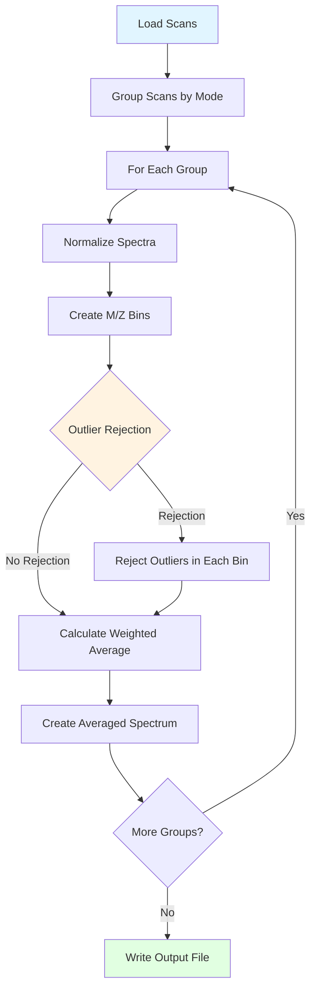

# Spectral Averaging

## Overview

The Spectral Averaging infrastructure provides robust algorithms for combining multiple mass spectra to improve signal-to-noise ratios while intelligently rejecting outliers. Originally developed for top-down proteomics, these methods adapt outlier rejection techniques from astronomical image processing to address mass spectrometry-specific artifacts.

### Key Features

- **Multiple Averaging Modes**: Average all scans, DDA scans, or every N scans with optional overlap
- **Robust Outlier Rejection**: Six different algorithms adapted from PixInsight astronomical software
- **Flexible Normalization**: Multiple strategies for normalizing scan intensities
- **Weighted Averaging**: Support for different weighting schemes
- **High Performance**: Multi-threaded processing for large files
- **Standard Output**: mzML 1.1.0 format with parameter files

### Quick Start

```csharp
// Set up parameters
var parameters = new SpectralAveragingParameters
{
    SpectraFileAveragingType = SpectraFileAveragingType.AverageDdaScans,
    NumberOfScansToAverage = 5,
    OutlierRejectionType = OutlierRejectionType.SigmaClipping,
    NormalizationType = NormalizationType.RelativeToTics,
    BinSize = 0.01
};

// Load scans from file
var msDataFile = MsDataFileReader.GetDataFile(filePath);
var scans = msDataFile.GetAllScansList();

// Average the spectra
var averagedScans = SpectraFileAveraging.AverageSpectraFile(scans, parameters);

// Write output
AveragedSpectraWriter.WriteAveragedScans(averagedScans, parameters, filePath);
```

## Problem Statement

### Challenges in Top-Down Proteomics

Top-down proteomics identification requires:
1. **High-quality fragmentation spectra** for peptide/protein matching
2. **Accurate neutral mass** of the intact proteoform

### Complications with Intact Proteins

Intact proteoform spectra are highly complex:
- Multiple overlapping proteoforms
- Many isotopic peaks across charge states
- Lower signal-to-noise ratios compared to peptides
- Artifacts specific to mass spectrometry data

### Solution: Spectral Averaging with Outlier Rejection

- **Signal Averaging**: Combining multiple scans improves signal-to-noise
- **Outlier Rejection**: Removes artifacts before averaging
- **Benefits**:
  - Improved isotopic envelope refinement
  - Increased feature detection
  - Higher-quality features
  - More proteoform identifications

## System Design

### Architecture Overview

```mermaid
classDiagram
    %% Main Classes
    class SpectraFileAveraging {
        <<static>>
        +AverageSpectraFile(scans, parameters)$ MsDataScan[]
        -AverageAll(scans, parameters)$ MsDataScan[]
        -AverageEverynScans(scans, parameters)$ MsDataScan[]
        -AverageDdaScans(scans, parameters)$ MsDataScan[]
    }

    class SpectraAveraging {
        <<static>>
        +AverageSpectra(scans, parameters)$ MzSpectrum
        +AverageSpectraMzBinning(scans, parameters)$ MzSpectrum
    }

    class OutlierRejection {
        <<static>>
        +RejectOutliers(binnedPeaks, parameters)
        -SigmaClipping(binnedPeaks, parameters)
        -WinsorizedSigmaClipping(binnedPeaks, parameters)
        -AveragedSigmaClipping(binnedPeaks, parameters)
        -MinMaxClipping(binnedPeaks)
        -PercentileClipping(binnedPeaks, percentile)
        -BelowThresholdRejection(binnedPeaks, threshold)
    }

    class SpectraNormalization {
        <<static>>
        +NormalizeSpectra(scans, normalizationType)$ List~MzSpectrum~
        +NormalizeToTics(scans)$ List~MzSpectrum~
        -GetTicNormalizationFactor(spectrum, avgTic)$
    }

    class SpectralWeighting {
        <<static>>
        +GetWeights(intensities, weightingType)$ double[]
        +GetEvenWeights(count)$ double[]
        +GetBasePeakWeights(intensities)$ double[]
        +GetTicWeights(intensities)$ double[]
    }

    class AveragedSpectraWriter {
        <<static>>
        +WriteAveragedScans(scans, parameters, originalPath)
    }

    class SpectralAveragingParameters {
        +SpectraFileAveragingType SpectraFileAveragingType
        +OutlierRejectionType OutlierRejectionType
        +NormalizationType NormalizationType
        +SpectraWeightingType SpectralWeightingType
        +SpectralAveragingType SpectralAveragingType
        +NumberOfScansToAverage int
        +ScanOverlap int
        +BinSize double
        +MinSigmaValue double
        +MaxSigmaValue double
        +Percentile double
        +MaxThreadsToUsePerFile int
        +SetDefaultValues()
        +SetValues(...)
    }

    class BinnedPeak {
        +MzBin double
        +Intensities double[]
        +Accepted bool[]
        +TrimIntensities(acceptedOnly)
    }

    %% Enums
    class SpectraFileAveragingType {
        <<enumeration>>
        AverageAll
        AverageEverynScans
        AverageEverynScansWithOverlap
        AverageDdaScans
    }

    class OutlierRejectionType {
        <<enumeration>>
        NoRejection
        MinMaxClipping
        PercentileClipping
        SigmaClipping
        WinsorizedSigmaClipping
        AveragedSigmaClipping
        BelowThresholdRejection
    }

    class NormalizationType {
        <<enumeration>>
        NoNormalization
        RelativeToTics
        RelativeToMedianTic
    }

    class SpectraWeightingType {
        <<enumeration>>
        WeightEvenly
        WeightByBasePeakIntensity
        WeightByTotalIonCurrent
    }

    class SpectralAveragingType {
        <<enumeration>>
        MzBinning
    }

    %% Relationships
    SpectraFileAveraging ..> SpectraAveraging : uses
    SpectraFileAveraging ..> SpectralAveragingParameters : uses
    SpectraAveraging ..> OutlierRejection : uses
    SpectraAveraging ..> SpectraNormalization : uses
    SpectraAveraging ..> SpectralWeighting : uses
    SpectraAveraging ..> BinnedPeak : creates
    SpectralAveragingParameters ..> SpectraFileAveragingType : uses
    SpectralAveragingParameters ..> OutlierRejectionType : uses
    SpectralAveragingParameters ..> NormalizationType : uses
    SpectralAveragingParameters ..> SpectraWeightingType : uses
    SpectralAveragingParameters ..> SpectralAveragingType : uses
```



### Core Components

#### SpectraFileAveraging (Static Class)
Manages file-level averaging, grouping scans based on the selected mode.

```csharp
public static class SpectraFileAveraging
{
    public static MsDataScan[] AverageSpectraFile(
        List<MsDataScan> scans, 
        SpectralAveragingParameters parameters);
}
```

#### SpectraAveraging (Static Class)
Handles the core averaging logic with m/z binning and outlier rejection.

```csharp
public static class SpectraAveraging
{
    public static MzSpectrum AverageSpectra(
        this IEnumerable<MsDataScan> scans, 
        SpectralAveragingParameters parameters);
}
```

#### SpectralAveragingParameters
Configures all aspects of the averaging process.

```csharp
public class SpectralAveragingParameters
{
    // Averaging mode
    public SpectraFileAveragingType SpectraFileAveragingType { get; set; }
    
    // Outlier rejection
    public OutlierRejectionType OutlierRejectionType { get; set; }
    
    // Normalization
    public NormalizationType NormalizationType { get; set; }
    
    // Weighting
    public SpectraWeightingType SpectralWeightingType { get; set; }
    
    // Parameters
    public int NumberOfScansToAverage { get; set; } = 5;
    public int ScanOverlap { get; set; } = 4;
    public double BinSize { get; set; } = 0.01;
    public double MinSigmaValue { get; set; } = 1.5;
    public double MaxSigmaValue { get; set; } = 1.5;
    public double Percentile { get; set; } = 0.1;
}
```

## Averaging Workflow

### Step-by-Step Process



### Detailed Steps

1. **Group Scans**
   - Based on `SpectraFileAveragingType`
   - All, every N, or DDA-based grouping

2. **Normalize Each Spectrum**
   - To average TIC
   - To median TIC
   - Or no normalization

3. **Create M/Z Bins**
   - User-defined bin size (default: 0.01 Th)
   - Assign peaks to bins

4. **Reject Outliers**
   - Apply selected rejection algorithm
   - Per-bin outlier detection

5. **Calculate Weighted Average**
   - Apply weighting scheme
   - Compute final m/z and intensity

6. **Create Output Scan**
   - Metadata from representative scan
   - Averaged retention time and TIC

## Averaging Modes

### Average All Scans

Combines all scans in the file into a single averaged spectrum.

```csharp
var parameters = new SpectralAveragingParameters
{
    SpectraFileAveragingType = SpectraFileAveragingType.AverageAll
};

var scans = msDataFile.GetAllScansList();
var averagedScans = SpectraFileAveraging.AverageSpectraFile(scans, parameters);
// Returns: 1 averaged scan
```

**Use Cases**:
- Creating reference spectra
- Low signal-to-noise throughout acquisition
- Small datasets

### Average Every N Scans (No Overlap)

Creates non-overlapping groups of N consecutive scans.

```csharp
var parameters = new SpectralAveragingParameters
{
    SpectraFileAveragingType = SpectraFileAveragingType.AverageEverynScans,
    NumberOfScansToAverage = 5
};

var averagedScans = SpectraFileAveraging.AverageSpectraFile(scans, parameters);
// Scans: 1-5, 6-10, 11-15, etc.
```

**Use Cases**:
- Uniform scan-to-scan variation
- Time-course experiments
- When temporal resolution is less critical

### Average Every N Scans (With Overlap)

Creates overlapping groups for smoother transitions.

```csharp
var parameters = new SpectralAveragingParameters
{
    SpectraFileAveragingType = SpectraFileAveragingType.AverageEverynScansWithOverlap,
    NumberOfScansToAverage = 5,
    ScanOverlap = 4  // Each group shares 4 scans with next
};

var averagedScans = SpectraFileAveraging.AverageSpectraFile(scans, parameters);
// Scans: 1-5, 2-6, 3-7, 4-8, 5-9, etc.
```

**Use Cases**:
- Maximum smoothing
- Chromatographic peak tracking
- When retaining more temporal information

### Average DDA Scans (Recommended for DDA)

Intelligently groups MS1 scans while preserving MS2 structure.

```csharp
var parameters = new SpectralAveragingParameters
{
    SpectraFileAveragingType = SpectraFileAveragingType.AverageDdaScans,
    NumberOfScansToAverage = 5,
    ScanOverlap = 4
};

var averagedScans = SpectraFileAveraging.AverageSpectraFile(scans, parameters);
// Preserves MS2 scans, averages MS1 with overlap
```

**How It Works**:
- MS1 scans: Averaged with overlap (moving average)
- MS2 scans: Passed through unchanged
- MS1-MS2 relationships: Maintained

**Use Cases**:
- **Data-Dependent Acquisition (DDA)** datasets
- Top-down proteomics
- When MS2 scans must remain intact

## Outlier Rejection Algorithms

### No Rejection

All intensity values are retained. Fastest option but most susceptible to artifacts.

```csharp
parameters.OutlierRejectionType = OutlierRejectionType.NoRejection;
```

**Use When**:
- Data is very clean
- Speed is critical
- For comparison purposes

---

### Iterative Rejection Algorithms

These algorithms iteratively remove outliers based on statistical thresholds.

#### Sigma Clipping

**Algorithm**: Remove values outside `median ± n*σ` iteratively until no more outliers.

```csharp
parameters.OutlierRejectionType = OutlierRejectionType.SigmaClipping;
parameters.MinSigmaValue = 1.5;  // Lower bound multiplier
parameters.MaxSigmaValue = 1.5;  // Upper bound multiplier
```

**How It Works**:
1. Calculate median and standard deviation
2. Reject values outside `median - (MinSigma * σ)` to `median + (MaxSigma * σ)`
3. Recalculate median and σ with remaining values
4. Repeat until no more rejections or ≤ 2 values remain

**Best For**:
- Gaussian-distributed noise
- General-purpose outlier rejection
- When outliers are symmetric

**Example**:
```csharp
// Asymmetric rejection - more aggressive on high side
parameters.OutlierRejectionType = OutlierRejectionType.SigmaClipping;
parameters.MinSigmaValue = 2.0;  // Keep more low values
parameters.MaxSigmaValue = 1.0;  // Reject high values aggressively
```

---

#### Winsorized Sigma Clipping

**Algorithm**: Replace outliers with boundary values before calculating statistics.

```csharp
parameters.OutlierRejectionType = OutlierRejectionType.WinsorizedSigmaClipping;
parameters.MinSigmaValue = 1.5;
parameters.MaxSigmaValue = 1.5;
```

**How It Works**:
1. Identify outliers outside `median ± 1.5σ`
2. Replace outliers with nearest acceptable value (winsorization)
3. Calculate median and σ using winsorized values
4. Apply sigma clipping with winsorized statistics
5. Iterate until convergence

**Advantages**:
- More robust to extreme outliers
- Better median and σ estimates
- Less influenced by outlier magnitude

**Best For**:
- Data with extreme outliers
- Skewed distributions
- When occasional very high/low values occur

---

#### Averaged Sigma Clipping

**Algorithm**: Uses noise model based on Poisson statistics.

```csharp
parameters.OutlierRejectionType = OutlierRejectionType.AveragedSigmaClipping;
parameters.MinSigmaValue = 1.5;
parameters.MaxSigmaValue = 1.5;
```

**How It Works**:
1. Assumes Poisson-based shot noise
2. Calculates σ based on intensity-dependent noise model
3. Applies sigma clipping with intensity-scaled thresholds

**Advantages**:
- Accounts for intensity-dependent noise
- Better for mass spectrometry data
- More accurate at different intensity regimes

**Best For**:
- Mass spectrometry data (shot noise dominant)
- Wide dynamic range
- When low and high intensity peaks need different treatment

---

### Single-Step Rejection Algorithms

These algorithms apply rejection criteria in a single pass.

#### Min-Max Clipping

**Algorithm**: Remove the highest and lowest intensity values.

```csharp
parameters.OutlierRejectionType = OutlierRejectionType.MinMaxClipping;
```

**How It Works**:
- Removes exactly 2 values per bin (min and max)
- Simple and fast
- No parameters needed

**Best For**:
- Quick outlier removal
- When you know outliers are at extremes
- Small scan groups (5-10 scans)

**Example**:
```csharp
// For 5 scans: Keep middle 3 values per m/z bin
parameters.OutlierRejectionType = OutlierRejectionType.MinMaxClipping;
```

---

#### Percentile Clipping

**Algorithm**: Remove values below/above specified percentiles.

```csharp
parameters.OutlierRejectionType = OutlierRejectionType.PercentileClipping;
parameters.Percentile = 0.1;  // Remove bottom and top 10%
```

**How It Works**:
- Calculate percentile thresholds
- Remove values < lower percentile or > upper percentile
- Symmetric rejection by default

**Best For**:
- Known contamination rate
- Uniform outlier distribution
- Large scan groups (>10 scans)

**Examples**:
```csharp
// Conservative: Remove only 5% on each end
parameters.Percentile = 0.05;

// Aggressive: Remove 20% on each end
parameters.Percentile = 0.20;
```

---

#### Below Threshold Rejection

**Algorithm**: Remove entire bin if insufficient values present.

```csharp
parameters.OutlierRejectionType = OutlierRejectionType.BelowThresholdRejection;
// Threshold automatically set to 70% of NumberOfScansToAverage
```

**How It Works**:
- Count valid intensities in bin
- If count < threshold (default: 70% of scans), reject entire bin
- Removes sporadic peaks

**Best For**:
- Removing transient artifacts
- Ensuring peak consistency across scans
- Quality control

**Use With**:
```csharp
parameters.NumberOfScansToAverage = 10;
// Bins need ≥7 values (70%) to be kept
parameters.OutlierRejectionType = OutlierRejectionType.BelowThresholdRejection;
```

---

## Normalization Methods

### Relative to TIC (Recommended)

Normalizes each spectrum to the average TIC of all scans being averaged.

```csharp
parameters.NormalizationType = NormalizationType.RelativeToTics;
```

**How It Works**:
1. Calculate average TIC across all scans
2. Scale each scan's intensities: `intensity * (avgTIC / scanTIC)`
3. Ensures equal contribution from each scan

**Best For**:
- General-purpose averaging
- When TIC varies between scans
- Default choice

### Relative to Median TIC

Similar to TIC normalization but uses median instead of mean.

```csharp
parameters.NormalizationType = NormalizationType.RelativeToMedianTic;
```

**Advantages**:
- More robust to outlier scans
- Better when TIC distribution is skewed

### No Normalization

Scans are averaged without intensity normalization.

```csharp
parameters.NormalizationType = NormalizationType.NoNormalization;
```

**Use When**:
- TIC is already normalized
- Comparing normalization effects
- Scans have similar TIC values

## Weighting Methods

### Weight Evenly (Default)

All scans contribute equally to the average.

```csharp
parameters.SpectralWeightingType = SpectraWeightingType.WeightEvenly;
```

**Best For**:
- Most cases
- After normalization
- When scans are similar quality

### Weight by Base Peak Intensity

Scans with higher base peak intensity contribute more.

```csharp
parameters.SpectralWeightingType = SpectraWeightingType.WeightByBasePeakIntensity;
```

### Weight by Total Ion Current

Scans with higher TIC contribute more.

```csharp
parameters.SpectralWeightingType = SpectraWeightingType.WeightByTotalIonCurrent;
```


## Configuration Examples

### Top-Down Proteomics (DDA)

```csharp
var parameters = new SpectralAveragingParameters
{
    // Preserve MS2, average MS1 scans
    SpectraFileAveragingType = SpectraFileAveragingType.AverageDdaScans,
    NumberOfScansToAverage = 5,
    ScanOverlap = 4,
    
    // Robust outlier rejection
    OutlierRejectionType = OutlierRejectionType.WinsorizedSigmaClipping,
    MinSigmaValue = 1.5,
    MaxSigmaValue = 1.5,
    
    // Normalize and weight evenly
    NormalizationType = NormalizationType.RelativeToTics,
    SpectralWeightingType = SpectraWeightingType.WeightEvenly,
    
    // Standard binning
    BinSize = 0.01,
    
    // Use multiple threads
    MaxThreadsToUsePerFile = 4
};
```

### High-Resolution MS1 Profiling

```csharp
var parameters = new SpectralAveragingParameters
{
    // Moving average with high overlap
    SpectraFileAveragingType = SpectraFileAveragingType.AverageEverynScansWithOverlap,
    NumberOfScansToAverage = 10,
    ScanOverlap = 9,  // 90% overlap for smooth chromatogram
    
    // Conservative outlier rejection
    OutlierRejectionType = OutlierRejectionType.SigmaClipping,
    MinSigmaValue = 2.0,
    MaxSigmaValue = 2.0,
    
    // Normalization
    NormalizationType = NormalizationType.RelativeToMedianTic,
    SpectralWeightingType = SpectraWeightingType.WeightEvenly,
    
    // Fine binning for high resolution
    BinSize = 0.005
};
```

### Quick Averaging (Speed Priority)

```csharp
var parameters = new SpectralAveragingParameters
{
    // Average all for single output
    SpectraFileAveragingType = SpectraFileAveragingType.AverageAll,
    
    // Minimal outlier rejection
    OutlierRejectionType = OutlierRejectionType.MinMaxClipping,
    
    // No normalization for speed
    NormalizationType = NormalizationType.NoNormalization,
    SpectralWeightingType = SpectraWeightingType.WeightEvenly,
    
    // Standard binning
    BinSize = 0.01,
    
    // Single thread for small files
    MaxThreadsToUsePerFile = 1
};
```

## Output

### File Format

Averaged spectra are written in **mzML 1.1.0** format.

**Filename Convention**:
```
original_filename-averaged.mzML
```

**Example**:
```
Input:  sample_topdown.raw
Output: sample_topdown-averaged.mzML
```

### Metadata

Each averaged scan retains metadata from the first scan in the group:
- **Scan number**: Sequential (1, 2, 3...)
- **Retention time**: Average of grouped scans
- **Total ion current**: Average of grouped scans
- **Polarity**: From representative scan
- **MS level**: From representative scan
- **Centroid/Profile**: From representative scan

## Complete Workflow Example

```csharp
using Readers;
using SpectralAveraging;
using MassSpectrometry;

// 1. Load data file
string inputPath = "data/sample_topdown.raw";
var msDataFile = MsDataFileReader.GetDataFile(inputPath);
var allScans = msDataFile.GetAllScansList();

Console.WriteLine($"Loaded {allScans.Count} scans");

// 2. Configure averaging parameters
var parameters = new SpectralAveragingParameters
{
    // DDA-specific averaging
    SpectraFileAveragingType = SpectraFileAveragingType.AverageDdaScans,
    NumberOfScansToAverage = 5,
    ScanOverlap = 4,
    
    // Robust outlier rejection
    OutlierRejectionType = OutlierRejectionType.WinsorizedSigmaClipping,
    MinSigmaValue = 1.5,
    MaxSigmaValue = 1.5,
    
    // Standard normalization
    NormalizationType = NormalizationType.RelativeToTics,
    SpectralWeightingType = SpectraWeightingType.WeightEvenly,
    
    // Standard binning
    BinSize = 0.01,
    
    // Multi-threading
    MaxThreadsToUsePerFile = 4,
    
    // Output format
    OutputType = OutputType.MzML
};

// 3. Perform averaging
Console.WriteLine("Averaging spectra...");
var averagedScans = SpectraFileAveraging.AverageSpectraFile(allScans, parameters);

Console.WriteLine($"Created {averagedScans.Length} averaged scans");

// 4. Write output
string outputDir = "data/averaged/";
Directory.CreateDirectory(outputDir);

AveragedSpectraWriter.WriteAveragedScans(averagedScans, parameters, inputPath);

Console.WriteLine($"Output written to: {Path.GetFileNameWithoutExtension(inputPath)}-averaged.mzML");
```

### Memory Errors

**Problem**: Out of memory errors with large files

**Solutions**:
```csharp
// Reduce averaging window
parameters.NumberOfScansToAverage = 3;

// Reduce threading
parameters.MaxThreadsToUsePerFile = 1;

// Increase bin size
parameters.BinSize = 0.05;

// Process in batches
var batchSize = 1000;
for (int i = 0; i < allScans.Count; i += batchSize)
{
    var batch = allScans.Skip(i).Take(batchSize).ToList();
    var averagedBatch = SpectraFileAveraging.AverageSpectraFile(batch, parameters);
    // Process or write batch
}
```

## Integration

### Dependencies

```
SpectralAveraging (this project)
  ↓
  MassSpectrometry (scans and spectra)
  ↓
  Readers (file I/O)
  ↓
  MzLibUtil (utilities)
```

### NuGet Packages

- **MathNet.Numerics**: Statistical calculations
- **CsvHelper**: Parameter file I/O

### Usage in mzLib Applications

- **MetaMorpheus**: Built-in averaging task for top-down searches
- **Custom Workflows**: Preprocessing before quantification or identification
- **Data QC**: Assessing data quality through averaged spectra

## References

- **PixInsight**: [Astronomical Image Processing Software](https://pixinsight.com/) - Source of outlier rejection algorithms
- **MetaMorpheus**: [GitHub](https://github.com/smith-chem-wisc/MetaMorpheus) - Top-down proteomics implementation
- **mzML 1.1.0**: [PSI Standard](http://www.psidev.info/mzml) - Output file format

## See Also

- [MS Data File Reading Wiki](../Readers/MsDataFileReading_Wiki.md) - Reading input files
- [Deconvolution Wiki](../MassSpectrometry/Deconvolution/Deconvolution_Wiki.md) - Processing averaged spectra
- API Documentation - Full method documentation
