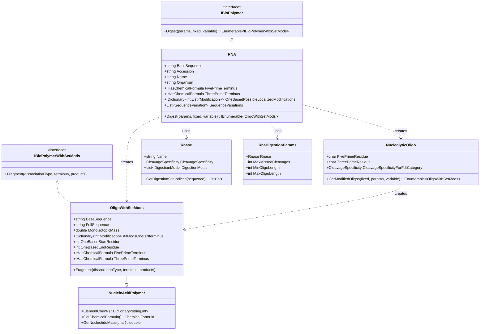

# Transcriptomics

## Overview

The Transcriptomics library provides RNA-specific implementations of the Omics framework, enabling comprehensive RNA analysis for mass spectrometry applications. It extends the base Omics interfaces with RNA-specific features including RNase digestion, RNA modifications (epitranscriptomics), and oligonucleotide fragmentation for top-down and bottom-up RNA sequencing.

### Key Features

- **RNA Class**: Complete RNA representation with sequence and termini information
- **Oligonucleotide Generation**: RNase digestion with custom enzymes
- **RNA Modifications**: Comprehensive epitranscriptomic modification support (m6A, pseudouridine, etc.)
- **5' and 3' Termini**: Explicit modeling of RNA termini (phosphate, hydroxyl, cap structures)
- **RNA Fragmentation**: Specialized fragmentation for nucleic acids (a/b/c/d and w/x/y/z ions)
- **Base Loss Ions**: Support for characteristic base loss fragmentation
- **Sequence Variants**: RNA editing and SNP support

### Quick Start

```csharp
using Transcriptomics;
using Transcriptomics.Digestion;
using Omics.Modifications;

// Create an RNA
var rna = new RNA(
    sequence: "AUGCCGUACGAU",
    accession: "RNA001",
    name: "tRNA-Ala",
    organism: "Homo sapiens"
);

// Configure RNase digestion
var digestionParams = new RnaDigestionParams(
    rnase: "RNase T1",
    maxMissedCleavages: 1,
    minOligoLength: 3,
    maxOligoLength: 20
);

// Define RNA modifications
var m6A = /* N6-methyladenosine modification */;
var pseudoU = /* pseudouridine modification */;

// Digest with modifications
var oligos = rna.Digest(
    digestionParams,
    new List<Modification> { },        // Fixed mods
    new List<Modification> { m6A, pseudoU }  // Variable mods
).ToList();

// Process oligonucleotides
foreach (var oligo in oligos)
{
    Console.WriteLine($"{oligo.FullSequence}");
    Console.WriteLine($"  Mass: {oligo.MonoisotopicMass:F4} Da");
    Console.WriteLine($"  5' terminus: {oligo.FivePrimeTerminus}");
    Console.WriteLine($"  3' terminus: {oligo.ThreePrimeTerminus}");
    
    // Fragment the oligo
    var products = new List<Product>();
    oligo.Fragment(DissociationType.HCD, FragmentationTerminus.Both, products);
    Console.WriteLine($"  Fragment ions: {products.Count}");
}
```

## System Design

### Architecture Overview



## Core Classes

### RNA Class

The `RNA` class represents a complete RNA molecule with all associated metadata:

```csharp
public class RNA : IBioPolymer
{
    // Core Properties
    public string BaseSequence { get; }
    public string Accession { get; }
    public string Name { get; }
    public string FullName { get; }
    public string Organism { get; }
    public int Length => BaseSequence.Length;
    public bool IsDecoy { get; }
    public bool IsContaminant { get; }
    
    // RNA-Specific Properties
    public IHasChemicalFormula FivePrimeTerminus { get; set; }
    public IHasChemicalFormula ThreePrimeTerminus { get; set; }
    public IDictionary<int, List<Modification>> OneBasedPossibleLocalizedModifications { get; }
    public List<SequenceVariation> SequenceVariations { get; }
    
    // Digestion
    public IEnumerable<OligoWithSetMods> Digest(
        RnaDigestionParams digestionParams,
        List<Modification> allKnownFixedModifications,
        List<Modification> variableModifications);
}
```

**Constructor Options**:

```csharp
// Basic RNA
var rna = new RNA(
    sequence: "AUGCCGUACGAU",
    accession: "RNA001"
);

// RNA with full metadata and termini
var rnaWithMetadata = new RNA(
    sequence: "AUGCCGUACGAU",
    accession: "RNA001",
    name: "tRNA-Ala-AGC",
    fullName: "transfer RNA alanine (AGC)",
    organism: "Homo sapiens",
    fivePrimeTerminus: fivePrimePhosphate,
    threePrimeTerminus: threePrimeHydroxyl,
    oneBasedModifications: new Dictionary<int, List<Modification>>
    {
        { 5, new List<Modification> { m6A } }  // m6A at position 5
    },
    isDecoy: false
);
```

**RNA Termini**:

RNA termini are explicitly modeled to account for their chemical differences:

```csharp
// Common 5' termini
var fivePrimePhosphate = ChemicalFormula.ParseFormula("O3H2P");      // Monophosphate
var fivePrimeTriphosphate = ChemicalFormula.ParseFormula("O10H4P3"); // Triphosphate (capped)
var fivePrimeHydroxyl = ChemicalFormula.ParseFormula("OH");          // Hydroxyl

// Common 3' termini
var threePrimePhosphate = ChemicalFormula.ParseFormula("O3H2P");     // Monophosphate
var threePrimeHydroxyl = ChemicalFormula.ParseFormula("OH");         // Hydroxyl (most common)
var threePrimeCyclicPhosphate = ChemicalFormula.ParseFormula("O3HP"); // Cyclic phosphate

// Set termini
rna.FivePrimeTerminus = fivePrimeTriphosphate;
rna.ThreePrimeTerminus = threePrimeHydroxyl;
```

### OligoWithSetMods Class

Represents an oligonucleotide with specific modifications applied:

```csharp
public class OligoWithSetMods : NucleicAcidPolymer, IBioPolymerWithSetMods
{
    // Sequence Information
    public string BaseSequence { get; }
    public string FullSequence { get; }
    public int Length => BaseSequence.Length;
    
    // Position in Parent RNA
    public int OneBasedStartResidue { get; }
    public int OneBasedEndResidue { get; }
    public char FivePrimeResidue { get; }   // Adjacent 5' base
    public char ThreePrimeResidue { get; }  // Adjacent 3' base
    
    // Digestion Information
    public int MissedCleavages { get; }
    public CleavageSpecificity CleavageSpecificityForFdrCategory { get; }
    public IBioPolymer Parent { get; }  // Parent RNA
    
    // Termini
    public IHasChemicalFormula FivePrimeTerminus { get; }
    public IHasChemicalFormula ThreePrimeTerminus { get; }
    
    // Modifications
    public Dictionary<int, Modification> AllModsOneIsNterminus { get; }
    public int NumMods { get; }
    
    // Mass Properties
    public double MonoisotopicMass { get; }
    public double MostAbundantMonoisotopicMass { get; }
    
    // Fragmentation
    public void Fragment(
        DissociationType dissociationType,
        FragmentationTerminus fragmentationTerminus,
        List<Product> products);
}
```

**Key Features**:

```csharp
var oligo = oligos.First();

// Access sequence information
Console.WriteLine($"Sequence: {oligo.BaseSequence}");
Console.WriteLine($"Full: {oligo.FullSequence}");
Console.WriteLine($"5' context: {oligo.FivePrimeResidue}-{oligo.BaseSequence}");
Console.WriteLine($"3' context: {oligo.BaseSequence}-{oligo.ThreePrimeResidue}");

// Position in RNA
Console.WriteLine($"Position: {oligo.OneBasedStartResidue}-{oligo.OneBasedEndResidue}");

// Termini
Console.WriteLine($"5' terminus: {oligo.FivePrimeTerminus}");
Console.WriteLine($"3' terminus: {oligo.ThreePrimeTerminus}");

// Modifications
foreach (var mod in oligo.AllModsOneIsNterminus)
{
    Console.WriteLine($"Mod at {mod.Key}: {mod.Value.IdWithMotif}");
}

// Mass
Console.WriteLine($"Monoisotopic mass: {oligo.MonoisotopicMass:F4} Da");
```

## Digestion

### Basic RNA Digestion

```csharp
// Create RNA
var rna = new RNA("AUGCCGUACGAU", "RNA001");

// Configure RNase digestion
var digestionParams = new RnaDigestionParams(
    rnase: "RNase T1",
    maxMissedCleavages: 1,
    minOligoLength: 3,
    maxOligoLength: 20
);

// Perform digestion
var oligos = rna.Digest(
    digestionParams,
    fixedModifications,
    variableModifications
).ToList();

Console.WriteLine($"Generated {oligos.Count} oligonucleotides");
```

### RNase Enzymes

Common RNases for RNA digestion:

```csharp
using Transcriptomics.Digestion;

// RNase T1: cuts after G
var rnaseT1 = RnaseDictionary.Dictionary["RNase T1"];

// RNase A: cuts after pyrimidines (C, U)
var rnaseA = RnaseDictionary.Dictionary["RNase A"];

// RNase U2: cuts after A
var rnaseU2 = RnaseDictionary.Dictionary["RNase U2"];

// Non-specific RNase
var colicinE5 = RnaseDictionary.Dictionary["Colicin E5"];

// List all available RNases
foreach (var rnase in RnaseDictionary.Dictionary.Values)
{
    Console.WriteLine($"{rnase.Name}: {string.Join(", ", rnase.DigestionMotifs.Select(m => m.InducingCleavage))}");
}
```

### Digestion with RNA Modifications

```csharp
// Define RNA modifications
var fixedMods = new List<Modification>();

var variableMods = new List<Modification>
{
    // m6A (N6-methyladenosine)
    new Modification(
        _originalId: "m6A",
        _target: ModificationMotif.GetMotif("A"),
        _chemicalFormula: ChemicalFormula.ParseFormula("CH2")
    ),
    
    // Pseudouridine (?)
    new Modification(
        _originalId: "Pseudouridine",
        _target: ModificationMotif.GetMotif("U"),
        _chemicalFormula: ChemicalFormula.ParseFormula("")  // Isomer, same mass
    ),
    
    // 2'-O-methylation
    new Modification(
        _originalId: "2'-O-Me",
        _target: ModificationMotif.GetMotif("X"),  // Any nucleotide
        _chemicalFormula: ChemicalFormula.ParseFormula("CH2")
    )
};

// Digest with modifications
var oligos = rna.Digest(digestionParams, fixedMods, variableMods);

// Each oligo may have different modification states
foreach (var oligo in oligos.Take(10))
{
    Console.WriteLine(oligo.FullSequence);
    // Example: AUG[Common:m6A on A]CCG
    // Example: [Variable:2'-O-Me on A]AUGC
}
```

## RNA Modifications (Epitranscriptomics)

### Common RNA Modifications

RNA contains over 170 known chemical modifications. Here are some of the most important:

```csharp
// m6A (N6-methyladenosine) - most abundant internal modification
var m6A = new Modification(
    _originalId: "m6A",
    _target: ModificationMotif.GetMotif("A"),
    _locationRestriction: "Anywhere.",
    _chemicalFormula: ChemicalFormula.ParseFormula("CH2")
);

// m5C (5-methylcytosine)
var m5C = new Modification(
    _originalId: "m5C",
    _target: ModificationMotif.GetMotif("C"),
    _chemicalFormula: ChemicalFormula.ParseFormula("CH2")
);

// Pseudouridine (?) - most abundant modification
var pseudoU = new Modification(
    _originalId: "Pseudouridine",
    _target: ModificationMotif.GetMotif("U"),
    _chemicalFormula: ChemicalFormula.ParseFormula("")  // Isomeric
);

// 2'-O-methylation - common in rRNA and snoRNA
var twoOMe = new Modification(
    _originalId: "2'-O-Me",
    _target: ModificationMotif.GetMotif("X"),
    _chemicalFormula: ChemicalFormula.ParseFormula("CH2")
);

// Inosine (I) - from adenosine deamination
var inosine = new Modification(
    _originalId: "Inosine",
    _target: ModificationMotif.GetMotif("A"),
    _chemicalFormula: ChemicalFormula.ParseFormula("H-1N-1O1")
);

// Dihydrouridine (D)
var dihydroU = new Modification(
    _originalId: "Dihydrouridine",
    _target: ModificationMotif.GetMotif("U"),
    _chemicalFormula: ChemicalFormula.ParseFormula("H2")
);
```

### Modification Categories

| Category | Examples | Typical Locations |
|----------|----------|-------------------|
| **Base methylation** | m6A, m5C, m1A, m7G | mRNA, tRNA, rRNA |
| **Ribose methylation** | 2'-O-Me, 2'-O-methylguanosine | rRNA, snRNA, snoRNA |
| **Pseudouridylation** | ? | tRNA, rRNA, mRNA |
| **Deamination** | Inosine (I) | tRNA, mRNA (A-to-I editing) |
| **Reduction** | Dihydrouridine (D) | tRNA |
| **Thiolation** | s2U, s4U | tRNA |
| **Hypermodifications** | wybutosine (yW), queuosine (Q) | tRNA |

## RNA Fragmentation

### RNA-Specific Ion Types

RNA fragmentation produces characteristic ion series:

```csharp
// Fragment an oligonucleotide
var products = new List<Product>();
oligo.Fragment(
    dissociationType: DissociationType.HCD,
    fragmentationTerminus: FragmentationTerminus.Both,
    products: products
);

// RNA generates a/b/c/d (5') and w/x/y/z (3') ions
var fivePrimeIons = products.Where(p => 
    p.ProductType == ProductType.a ||
    p.ProductType == ProductType.b ||
    p.ProductType == ProductType.c ||
    p.ProductType == ProductType.d
).ToList();

var threePrimeIons = products.Where(p =>
    p.ProductType == ProductType.w ||
    p.ProductType == ProductType.x ||
    p.ProductType == ProductType.y ||
    p.ProductType == ProductType.z
).ToList();

Console.WriteLine($"5' ions: {fivePrimeIons.Count}");
Console.WriteLine($"3' ions: {threePrimeIons.Count}");
```

### RNA Ion Nomenclature

**Standard RNA Fragment Ion Nomenclature** (McLuckey nomenclature):

```
5'-P-O-Base-Sugar-O-P-O-Base-Sugar-O-P-O-Base-Sugar-OH-3'
   |         |               |               |
   a         b               c               d     (5' fragments)
   
   w         x               y               z     (3' fragments)
```

**Ion Type Mass Shifts** (from glycosidic cleavage point):

| Ion | Description | Mass Shift |
|-----|-------------|------------|
| **a** | 5' fragment, base + sugar | +H (+1.008 Da) |
| **b** | 5' fragment, base + sugar + OH | +OH (+17.003 Da) |
| **c** | 5' fragment, includes 3' phosphate | +H?PO? (+79.966 Da) |
| **d** | 5' fragment, includes 3' phosphate + H | +H?PO? (+97.977 Da) |
| **w** | 3' fragment, base + sugar | +H (+1.008 Da) |
| **x** | 3' fragment, base + sugar - O | -OH (-15.995 Da) |
| **y** | 3' fragment, minus 5' phosphate | -H?PO? (-79.966 Da) |
| **z** | 3' fragment, minus 5' phosphate - H | -H?PO? (-97.977 Da) |

### Base Loss Fragmentation

RNA fragments can lose their nucleobase:

```csharp
// Fragment with base loss consideration
oligo.Fragment(DissociationType.HCD, FragmentationTerminus.Both, products);

// Filter for base loss ions
var baseLossIons = products.Where(p =>
    p.ProductType == ProductType.aBaseLoss ||
    p.ProductType == ProductType.bBaseLoss ||
    p.ProductType == ProductType.cBaseLoss ||
    p.ProductType == ProductType.dBaseLoss ||
    p.ProductType == ProductType.wBaseLoss ||
    p.ProductType == ProductType.xBaseLoss ||
    p.ProductType == ProductType.yBaseLoss ||
    p.ProductType == ProductType.zBaseLoss
).ToList();

Console.WriteLine($"Base loss ions: {baseLossIons.Count}");

foreach (var ion in baseLossIons.Take(5))
{
    Console.WriteLine($"{ion.Annotation}: {ion.NeutralMass:F4} Da");
}
// Example output:
// a2-Base: 459.0567 Da
// c3-Base: 862.1234 Da
```

**Base Masses** (for base loss calculation):

| Base | Formula | Mass (Da) |
|------|---------|-----------|
| **Adenine (A)** | C?H?N? | 135.0545 |
| **Guanine (G)** | C?H?N?O | 151.0494 |
| **Cytosine (C)** | C?H?N?O | 111.0433 |
| **Uracil (U)** | C?H?N?O? | 112.0273 |

### Dissociation Methods for RNA

Different fragmentation methods for RNA analysis:

```csharp
// HCD - most common for RNA
var hcdParams = DissociationType.HCD;
// Generates: a, b, c, d, w, x, y, z ions

// CID - lower energy
var cidParams = DissociationType.CID;
// Generates: a, c, d, w, y ions (fewer ion types)

// UVPD - ultraviolet photodissociation
var uvpdParams = DissociationType.UVPD;
// Generates: a, c, d, w ions (specific backbone cleavages)

// Low-energy CID - for modified nucleotides
var lowCidParams = DissociationType.LowCID;
// Emphasizes base loss ions
```

## Advanced Features

### Sequence Variants (RNA Editing)

Handle RNA editing events (A-to-I, C-to-U):

```csharp
// Add RNA editing variant
var aToIEdit = new SequenceVariation(
    oneBasedBeginPosition: 15,
    oneBasedEndPosition: 15,
    originalSequence: "A",
    variantSequence: "I",  // Inosine (reads as G)
    description: "A-to-I editing at position 15"
);

rna.SequenceVariations.Add(aToIEdit);

// Generate variant RNAs
var variantRnas = rna.GetVariantBioPolymers(
    maxAllowedVariants: 4,
    minAlleleDepth: 1
);

foreach (var variantRna in variantRnas)
{
    Console.WriteLine($"Accession: {variantRna.Accession}");
    Console.WriteLine($"Edits applied: {variantRna.AppliedSequenceVariations.Count}");
    
    // Digest variant RNA
    var variantOligos = variantRna.Digest(digestionParams, fixedMods, variableMods);
}
```

### Top-Down RNA Analysis

Work with intact or minimally digested RNA:

```csharp
// Configure for top-down
var topDownParams = new RnaDigestionParams(
    rnase: "top-down",
    minOligoLength: 20,
    maxOligoLength: int.MaxValue
);

// Digest (returns intact or large fragments)
var topDownOligos = rna.Digest(
    topDownParams,
    fixedMods,
    variableMods
).ToList();

Console.WriteLine($"Generated {topDownOligos.Count} large RNA fragments");
```

## Common Use Cases

### tRNA Analysis

```csharp
// tRNA typically contains many modifications
var tRNA = new RNA(
    sequence: "GCCGAGGUAGCUCAGDDGGGAGAGCGCCAGACUGAAGAUCUGGAGGUCCUGUGUUCGAUCCACAGCCUCGGCA",
    accession: "tRNA-Ala-AGC",
    name: "tRNA-Ala"
);

// Common tRNA modifications
var tRnaModifications = new List<Modification>
{
    m6A,              // N6-methyladenosine
    pseudoU,          // Pseudouridine
    dihydroU,         // Dihydrouridine
    twoOMe,           // 2'-O-methylation
    m5C,              // 5-methylcytosine
    m7G,              // 7-methylguanosine
    inosine           // Inosine
};

// Digest with RNase T1
var tRnaOligos = tRNA.Digest(
    new RnaDigestionParams("RNase T1", 1, 3, 20),
    new List<Modification>(),
    tRnaModifications
);

// Analyze modification distribution
var modifiedOligos = tRnaOligos.Where(o => o.NumMods > 0).ToList();
Console.WriteLine($"Modified oligos: {modifiedOligos.Count}/{tRnaOligos.Count()}");
```

### mRNA m6A Mapping

```csharp
// mRNA with potential m6A sites
var mRNA = new RNA(
    sequence: "AUGCAGACUGAACUGUGCCAAGACU",
    accession: "mRNA_001"
);

// m6A typically occurs in DRACH motif (D=A/G/U, R=A/G, H=A/C/U)
var m6AVariable = new Modification(
    _originalId: "m6A",
    _target: ModificationMotif.GetMotif("A"),
    _chemicalFormula: ChemicalFormula.ParseFormula("CH2")
);

// Digest to identify m6A sites
var mRnaOligos = mRNA.Digest(
    new RnaDigestionParams("RNase T1", 1, 4, 15),
    new List<Modification>(),
    new List<Modification> { m6AVariable }
);

// Filter for oligos with m6A
var m6AOligos = mRnaOligos.Where(o => 
    o.AllModsOneIsNterminus.Values.Any(m => m.OriginalId == "m6A")
).ToList();

Console.WriteLine($"Potential m6A-containing oligos: {m6AOligos.Count}");
```

### Mass Spectrometry-Based RNA Sequencing

```csharp
// Load experimental RNA-MS data
var spectrum = /* load from file */;

// Generate theoretical oligonucleotides
var theoreticalOligos = rna.Digest(
    new RnaDigestionParams("RNase T1", 1, 3, 20),
    fixedMods,
    variableMods
).ToList();

// Match precursor masses
var tolerance = new PpmTolerance(20);
var candidates = theoreticalOligos
    .Where(o => tolerance.Within(o.MonoisotopicMass, spectrum.PrecursorMass))
    .ToList();

Console.WriteLine($"Candidate oligos: {candidates.Count}");

// Fragment and match MS/MS
foreach (var candidate in candidates)
{
    var products = new List<Product>();
    candidate.Fragment(DissociationType.HCD, FragmentationTerminus.Both, products);
    
    // Match to experimental spectrum
    int matchedIons = 0;
    foreach (var product in products)
    {
        int closestPeakIndex = spectrum.GetClosestPeakIndex(product.NeutralMass);
        if (closestPeakIndex >= 0 && 
            tolerance.Within(product.NeutralMass, spectrum.XArray[closestPeakIndex]))
        {
            matchedIons++;
        }
    }
    
    double score = (double)matchedIons / products.Count * 100;
    Console.WriteLine($"{candidate.FullSequence}: {score:F1}% coverage");
}
```

### RNA Coverage Analysis

```csharp
// Calculate sequence coverage
var identifiedOligos = /* oligos identified from MS */;

var coveredBases = new HashSet<int>();
foreach (var oligo in identifiedOligos.Where(o => o.Parent.Accession == rna.Accession))
{
    for (int i = oligo.OneBasedStartResidue; i <= oligo.OneBasedEndResidue; i++)
    {
        coveredBases.Add(i);
    }
}

double coverage = (double)coveredBases.Count / rna.Length * 100;
Console.WriteLine($"RNA coverage: {coverage:F1}%");

// Visualize coverage
var coverageArray = new bool[rna.Length];
foreach (int pos in coveredBases)
{
    coverageArray[pos - 1] = true;
}

for (int i = 0; i < rna.Length; i++)
{
    Console.Write(coverageArray[i] ? rna[i] : rna[i].ToString().ToLower());
}
```

## Integration

### Dependencies

```
Transcriptomics
  ?
  Omics (IBioPolymer, IBioPolymerWithSetMods, Modifications, Digestion, Fragmentation)
  ?
  Chemistry (ChemicalFormula, PeriodicTable)
  ?
  MassSpectrometry (DissociationType)
  ?
  MzLibUtil (Utilities)
```

### Used By

- **RNA-seq analysis tools**: Oligonucleotide identification
- **Epitranscriptomics studies**: Modification mapping
- **RNA structure analysis**: Secondary/tertiary structure validation

## Best Practices

### Terminus Specification

```csharp
// Good: Explicitly set termini based on RNA source
var nativeRNA = new RNA("AUGC", "RNA001")
{
    FivePrimeTerminus = ChemicalFormula.ParseFormula("O10H4P3"),  // Triphosphate (native)
    ThreePrimeTerminus = ChemicalFormula.ParseFormula("OH")       // Hydroxyl
};

var syntheticRNA = new RNA("AUGC", "RNA002")
{
    FivePrimeTerminus = ChemicalFormula.ParseFormula("OH"),       // Hydroxyl (synthetic)
    ThreePrimeTerminus = ChemicalFormula.ParseFormula("OH")
};
```

### Modification Selection

```csharp
// Good: Focus on biologically relevant modifications
var biologicalMods = new List<Modification>
{
    m6A,          // Known m6A sites
    pseudoU,      // Pseudouridine
    twoOMe        // 2'-O-methylation
};

// Avoid: Too many variable modifications
// This creates combinatorial explosion
var tooManyMods = allRnaMods.Where(m => m.ModificationType == "Variable").ToList();  // Bad
```

### RNase Selection

```csharp
// Good: Choose RNase based on analysis goals
var specificDigestion = new RnaDigestionParams(
    rnase: "RNase T1",  // Specific cleavage after G
    maxMissedCleavages: 1,
    minOligoLength: 3,
    maxOligoLength: 15
);

// Good: Non-specific for comprehensive coverage
var comprehensiveDigestion = new RnaDigestionParams(
    rnase: "Colicin E5",  // Non-specific
    maxMissedCleavages: 0,
    minOligoLength: 3,
    maxOligoLength: 10
);
```

### Performance Optimization

```csharp
// Good: Parallel digestion for multiple RNAs
var allOligos = rnas
    .AsParallel()
    .WithDegreeOfParallelism(Environment.ProcessorCount)
    .SelectMany(r => r.Digest(params, fixed, variable))
    .ToList();

// Good: Filter early
var filteredOligos = rnas
    .AsParallel()
    .SelectMany(r => r.Digest(params, fixed, variable))
    .Where(o => o.MonoisotopicMass >= 500 && o.MonoisotopicMass <= 3000)
    .ToList();
```

## RNA Databases

### Loading RNA Sequences

```csharp
// Load from FASTA
var rnas = RnaDbLoader.LoadRnaFasta(
    "human_rna.fasta",
    generateTargets: true,
    decoyType: DecoyType.Reverse,
    isContaminant: false,
    out var errors
);

Console.WriteLine($"Loaded {rnas.Count} RNA sequences");

// Filter by RNA type
var tRNAs = rnas.Where(r => r.Name.Contains("tRNA")).ToList();
var mRNAs = rnas.Where(r => r.Name.Contains("mRNA")).ToList();
var rRNAs = rnas.Where(r => r.Name.Contains("rRNA")).ToList();
```

## See Also

- [Omics: Base Foundation](https://github.com/smith-chem-wisc/mzLib/wiki/Omics:-Base-Foundation) - Core omics interfaces
- [Omics: Modifications](https://github.com/smith-chem-wisc/mzLib/wiki/Omics:-Modifications) - Modification system (including RNA mods)
- [Omics: Digestion](https://github.com/smith-chem-wisc/mzLib/wiki/Omics:-Digestion) - Enzymatic digestion framework
- [Omics: Fragmentation](https://github.com/smith-chem-wisc/mzLib/wiki/Omics:-Fragmentation) - MS/MS fragmentation (including RNA)
- [File Reading: Sequence Databases](https://github.com/smith-chem-wisc/mzLib/wiki/File-Reading:-Sequence-Databases) - Loading RNA databases
- [Decoy Generation](https://github.com/smith-chem-wisc/mzLib/wiki/Omics:-Decoy-Generation) - Generating decoy RNAs
