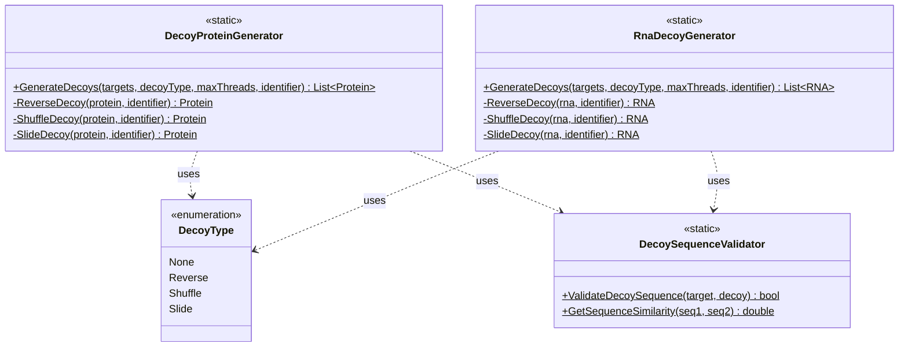

# Decoy Database Generation

## Overview

The Decoy Generation infrastructure provides multiple strategies for creating decoy sequences for false discovery rate (FDR) calculation in proteomics and transcriptomics searches. The system supports both protein and RNA sequence decoys with parallel processing capabilities and customizable identifiers.

### Key Features

- **Multiple Decoy Strategies**: Reverse, shuffle, and slide algorithms
- **Protein and RNA Support**: Unified interface for both sequence types
- **Parallel Processing**: Multi-threaded decoy generation for large databases
- **Custom Identifiers**: Configurable decoy prefixes
- **Integrated with Loaders**: Automatic decoy generation during database loading

### Quick Start

```csharp
// Generate protein decoys
var targets = ProteinDbLoader.LoadProteinFasta(
    "database.fasta",
    generateTargets: true,
    decoyType: DecoyType.None,
    isContaminant: false,
    out var errors
);

var decoys = DecoyProteinGenerator.GenerateDecoys(
    targets: targets,
    decoyType: DecoyType.Reverse,
    maxThreads: -1,  // Use all available cores
    decoyIdentifier: "DECOY_"
);

// Generate RNA decoys
var rnaTargets = RnaDbLoader.LoadRnaFasta(
    "rna_database.fasta",
    generateTargets: true,
    decoyType: DecoyType.None,
    isContaminant: false,
    out var rnaErrors
);

var rnaDecoys = RnaDecoyGenerator.GenerateDecoys(
    targets: rnaTargets,
    decoyType: DecoyType.Reverse,
    maxThreads: -1,
    decoyIdentifier: "DECOY_"
);
```

## System Design

### Architecture Overview



## Decoy Strategies

### DecoyType Enumeration

```csharp
public enum DecoyType
{
    None,      // No decoys generated
    Reverse,   // Reverse sequence (most common)
    Shuffle,   // Randomly shuffle sequence
    Slide      // Slide sequence by peptide length
}
```

### Reverse Decoy

Reverses the entire sequence while preserving terminal modifications.

**Protein Example**:
```
Original: MAQTQVLQVAKEATPTPLPTAVPR
Reverse:  RPVATPLPTPATAKVQLVQTQAM
```

**Implementation**:
```csharp
var decoys = DecoyProteinGenerator.GenerateDecoys(
    targets: proteins,
    decoyType: DecoyType.Reverse,
    maxThreads: -1,
    decoyIdentifier: "REV_"
);

// Each decoy protein has:
// - Accession: "REV_" + original accession
// - Sequence: Reversed
// - IsDecoy: true
```

**Best For**:
- Standard proteomics searches
- Most commonly used in literature
- Compatible with all search engines

### Shuffle Decoy

Randomly shuffles the sequence while maintaining amino acid composition.

**Protein Example**:
```
Original: MAQTQVLQVAKEATPTPLPTAVPR
Shuffle:  MATPVQQLVAPTKAQTPVLTAER (random order)
```

**Implementation**:
```csharp
var decoys = DecoyProteinGenerator.GenerateDecoys(
    targets: proteins,
    decoyType: DecoyType.Shuffle,
    maxThreads: -1,
    decoyIdentifier: "SHUFFLE_"
);
```

**Best For**:
- Alternative to reverse when testing method robustness
- Maintains amino acid composition exactly
- More randomized peptide distribution

### Slide Decoy

Slides the sequence by a fixed offset (typically peptide length).

**Protein Example**:
```
Original: MAQTQVLQVAKEATPTPLPTAVPR
Slide:    TPLPTAVPRMAQTQVLQVAKEATP (shifted)
```

**Implementation**:
```csharp
var decoys = DecoyProteinGenerator.GenerateDecoys(
    targets: proteins,
    decoyType: DecoyType.Slide,
    maxThreads: -1,
    decoyIdentifier: "SLIDE_"
);
```

**Best For**:
- Preserving local sequence properties
- Maintaining some peptide characteristics
- Specialized analyses

## Protein Decoy Generation

### Basic Usage

```csharp
// Load target proteins without decoys
var targets = ProteinDbLoader.LoadProteinFasta(
    "uniprot_human.fasta",
    generateTargets: true,
    decoyType: DecoyType.None,
    isContaminant: false,
    out var errors
);

// Generate decoys manually
var decoys = DecoyProteinGenerator.GenerateDecoys(
    targets: targets,
    decoyType: DecoyType.Reverse,
    maxThreads: Environment.ProcessorCount,
    decoyIdentifier: "DECOY_"
);

// Combine targets and decoys
var combinedDatabase = targets.Concat(decoys).ToList();

Console.WriteLine($"Targets: {targets.Count}");
Console.WriteLine($"Decoys: {decoys.Count}");
Console.WriteLine($"Total: {combinedDatabase.Count}");
```

### Integrated with Database Loading

```csharp
// Automatically generate decoys during loading
var proteins = ProteinDbLoader.LoadProteinFasta(
    "database.fasta",
    generateTargets: true,
    decoyType: DecoyType.Reverse,  // Decoys generated automatically
    isContaminant: false,
    out var errors,
    decoyIdentifier: "REV_"
);

// Result contains both targets and decoys
var targets = proteins.Where(p => !p.IsDecoy).ToList();
var decoys = proteins.Where(p => p.IsDecoy).ToList();
```

### Custom Decoy Identifiers

```csharp
// Use custom prefix
var decoys1 = DecoyProteinGenerator.GenerateDecoys(
    targets, 
    DecoyType.Reverse, 
    -1, 
    "REVERSED_"
);

var decoys2 = DecoyProteinGenerator.GenerateDecoys(
    targets, 
    DecoyType.Shuffle, 
    -1, 
    "SHUFFLED_"
);

// Check decoy status
foreach (var protein in decoys1)
{
    Console.WriteLine($"Accession: {protein.Accession}");
    Console.WriteLine($"Is Decoy: {protein.IsDecoy}");  // true
    Console.WriteLine($"Starts with REVERSED_: {protein.Accession.StartsWith("REVERSED_")}");
}
```

### Parallel Processing

```csharp
// Single-threaded (slower)
var decoysSingleThread = DecoyProteinGenerator.GenerateDecoys(
    targets,
    DecoyType.Reverse,
    maxThreads: 1,
    decoyIdentifier: "DECOY_"
);

// Multi-threaded (faster)
var decoysMultiThread = DecoyProteinGenerator.GenerateDecoys(
    targets,
    DecoyType.Reverse,
    maxThreads: -1,  // Use all available cores
    decoyIdentifier: "DECOY_"
);

// Explicit thread count
var decoysFixedThreads = DecoyProteinGenerator.GenerateDecoys(
    targets,
    DecoyType.Reverse,
    maxThreads: 8,  // Use 8 threads
    decoyIdentifier: "DECOY_"
);
```

## RNA Decoy Generation

### Basic Usage

```csharp
// Load RNA targets
var rnaTargets = RnaDbLoader.LoadRnaFasta(
    "rna_database.fasta",
    generateTargets: true,
    decoyType: DecoyType.None,
    isContaminant: false,
    out var errors
);

// Generate RNA decoys
var rnaDecoys = RnaDecoyGenerator.GenerateDecoys(
    targets: rnaTargets,
    decoyType: DecoyType.Reverse,
    maxThreads: -1,
    decoyIdentifier: "DECOY_"
);

// Combine
var combinedRnaDb = rnaTargets.Concat(rnaDecoys).ToList();
```

### Integrated Loading

```csharp
// Automatically generate RNA decoys
var rnaSequences = RnaDbLoader.LoadRnaFasta(
    "rna_database.fasta",
    generateTargets: true,
    decoyType: DecoyType.Reverse,  // Automatic decoy generation
    isContaminant: false,
    out var errors,
    decoyIdentifier: "REV_"
);

// Filter by decoy status
var rnaTargets = rnaSequences.Where(r => !r.IsDecoy).ToList();
var rnaDecoys = rnaSequences.Where(r => r.IsDecoy).ToList();
```

## Working with Decoy Databases

### Identifying Decoys

```csharp
// Check if protein/RNA is a decoy
if (protein.IsDecoy)
{
    Console.WriteLine($"{protein.Accession} is a decoy");
}

// Filter targets and decoys
var allProteins = ProteinDbLoader.LoadProteinFasta(
    "database.fasta",
    generateTargets: true,
    decoyType: DecoyType.Reverse,
    isContaminant: false,
    out var errors
);

var targetProteins = allProteins.Where(p => !p.IsDecoy).ToList();
var decoyProteins = allProteins.Where(p => p.IsDecoy).ToList();

Console.WriteLine($"Targets: {targetProteins.Count}");
Console.WriteLine($"Decoys: {decoyProteins.Count}");
Console.WriteLine($"Decoy ratio: {(double)decoyProteins.Count / targetProteins.Count:F2}");
```

### Comparing Target and Decoy

```csharp
// Find original target for a decoy
var decoy = decoys.First();
var targetAccession = decoy.Accession.Replace("DECOY_", "");
var target = targets.FirstOrDefault(t => t.Accession == targetAccession);

if (target != null)
{
    Console.WriteLine($"Target sequence:  {target.BaseSequence}");
    Console.WriteLine($"Decoy sequence:   {decoy.BaseSequence}");
    Console.WriteLine($"Target length:    {target.Length}");
    Console.WriteLine($"Decoy length:     {decoy.Length}");
    Console.WriteLine($"Sequences equal:  {target.BaseSequence == decoy.BaseSequence}");
}
```

### Validating Decoys

```csharp
// Validate that decoys are properly generated
var target = targets[0];
var decoy = decoys[0];

bool isValid = DecoySequenceValidator.ValidateDecoySequence(target, decoy);

if (isValid)
{
    Console.WriteLine("Decoy is properly generated");
}
else
{
    Console.WriteLine("Warning: Decoy validation failed");
}

// Check sequence similarity
double similarity = DecoySequenceValidator.GetSequenceSimilarity(
    target.BaseSequence, 
    decoy.BaseSequence
);
Console.WriteLine($"Sequence similarity: {similarity:P2}");
```

## Common Use Cases

### Generate Multiple Decoy Sets

```csharp
// Generate different types of decoys
var reverseDecoys = DecoyProteinGenerator.GenerateDecoys(
    targets, 
    DecoyType.Reverse, 
    -1, 
    "REV_"
);

var shuffleDecoys = DecoyProteinGenerator.GenerateDecoys(
    targets, 
    DecoyType.Shuffle, 
    -1, 
    "SHUF_"
);

var slideDecoys = DecoyProteinGenerator.GenerateDecoys(
    targets, 
    DecoyType.Slide, 
    -1, 
    "SLIDE_"
);

// Compare decoy strategies
Console.WriteLine($"Reverse decoys: {reverseDecoys.Count}");
Console.WriteLine($"Shuffle decoys: {shuffleDecoys.Count}");
Console.WriteLine($"Slide decoys: {slideDecoys.Count}");
```

### Create Target-Decoy Database

```csharp
// Load targets
var targets = ProteinDbLoader.LoadProteinFasta(
    "targets.fasta",
    generateTargets: true,
    decoyType: DecoyType.None,
    isContaminant: false,
    out var errors
);

// Generate decoys
var decoys = DecoyProteinGenerator.GenerateDecoys(
    targets,
    DecoyType.Reverse,
    maxThreads: -1,
    decoyIdentifier: "DECOY_"
);

// Combine and write
var targetDecoyDb = targets.Concat(decoys).ToList();
ProteinDbWriter.WriteFastaDatabase(
    targetDecoyDb,
    "target_decoy_database.fasta",
    "|"
);

Console.WriteLine($"Created target-decoy database with {targetDecoyDb.Count} entries");
```

### Contaminants with Decoys

```csharp
// Load main database with decoys
var mainDb = ProteinDbLoader.LoadProteinFasta(
    "main_database.fasta",
    generateTargets: true,
    decoyType: DecoyType.Reverse,
    isContaminant: false,
    out var errors1,
    decoyIdentifier: "REV_"
);

// Load contaminants with decoys
var contaminants = ProteinDbLoader.LoadProteinFasta(
    "contaminants.fasta",
    generateTargets: true,
    decoyType: DecoyType.Reverse,
    isContaminant: true,
    out var errors2,
    decoyIdentifier: "REV_"
);

// Combine all
var completeDb = mainDb.Concat(contaminants).ToList();

// Count entries
var targetProteins = completeDb.Where(p => !p.IsDecoy && !p.IsContaminant).Count();
var targetContaminants = completeDb.Where(p => !p.IsDecoy && p.IsContaminant).Count();
var decoyProteins = completeDb.Where(p => p.IsDecoy && !p.IsContaminant).Count();
var decoyContaminants = completeDb.Where(p => p.IsDecoy && p.IsContaminant).Count();

Console.WriteLine($"Target proteins: {targetProteins}");
Console.WriteLine($"Target contaminants: {targetContaminants}");
Console.WriteLine($"Decoy proteins: {decoyProteins}");
Console.WriteLine($"Decoy contaminants: {decoyContaminants}");
```

### Decoys for Specific Proteins

```csharp
// Select specific proteins
var selectedProteins = targets
    .Where(p => p.GeneNames.Any(g => g.Item2 == "BRCA1" || g.Item2 == "TP53"))
    .ToList();

// Generate decoys only for selected proteins
var selectedDecoys = DecoyProteinGenerator.GenerateDecoys(
    selectedProteins,
    DecoyType.Reverse,
    maxThreads: -1,
    decoyIdentifier: "DECOY_"
);

Console.WriteLine($"Generated {selectedDecoys.Count} decoys for {selectedProteins.Count} selected proteins");
```

## Properties Preserved in Decoys

### Protein Decoys

**Preserved**:
- Length (same number of amino acids)
- Amino acid composition (exact same amino acids)
- Organism information
- Gene names
- Database references
- Modifications (at corresponding positions)

**Modified**:
- Accession (prefix added)
- Base sequence (transformed by decoy algorithm)
- IsDecoy flag (set to `true`)

### RNA Decoys

**Preserved**:
- Length (same number of nucleotides)
- Nucleotide composition
- Terminus modifications
- Organism information
- Gene names

**Modified**:
- Accession (prefix added)
- Base sequence (transformed by decoy algorithm)
- IsDecoy flag (set to `true`)

## FDR Calculation Context

Decoy databases are essential for false discovery rate (FDR) calculation:

```csharp
// After database search
var targetHits = searchResults.Where(r => !r.IsDecoy).Count();
var decoyHits = searchResults.Where(r => r.IsDecoy).Count();

double fdr = (double)decoyHits / targetHits;
Console.WriteLine($"FDR: {fdr:P2}");

// Q-value calculation (cumulative FDR)
var sortedResults = searchResults.OrderByDescending(r => r.Score).ToList();
for (int i = 0; i < sortedResults.Count; i++)
{
    var targets = sortedResults.Take(i + 1).Count(r => !r.IsDecoy);
    var decoys = sortedResults.Take(i + 1).Count(r => r.IsDecoy);
    
    if (targets > 0)
    {
        double qValue = (double)decoys / targets;
        sortedResults[i].QValue = qValue;
    }
}
```

## Integration

### Dependencies

```
UsefulProteomicsDatabases
  ↓
  DecoyProteinGenerator, RnaDecoyGenerator
  ↓
  Proteomics (Protein class)
  ↓
  Transcriptomics (RNA class)
```

### Used By

- **MetaMorpheus**: FDR calculation in database searches
- **ProteinDbLoader**: Automatic decoy generation during loading
- **RnaDbLoader**: Automatic RNA decoy generation
- **FlashLFQ**: Protein-level FDR filtering

## References

- **Target-Decoy Strategy**: Elias, J. E., & Gygi, S. P. (2007). *Nature Methods*, 4(3), 207-214.
- **FDR Control**: Käll, L., et al. (2008). *Journal of Proteome Research*, 7(1), 29-34.

## See Also

- [Sequence Database File Reading](https://github.com/smith-chem-wisc/mzLib/wiki/File-Reading-%E2%80%90-Sequence-Databases) - Reading Sequence Database Files
- [Omics](https://github.com/smith-chem-wisc/mzLib/wiki/Omics) - Working with omics data - generic base for all supported omics types
- [Proteomics](https://github.com/smith-chem-wisc/mzLib/wiki/Proteomics) - Working with proteins and peptides
- [Transcriptomics](https://github.com/smith-chem-wisc/mzLib/wiki/Transcriptomics) - Working with transcripts and oligos
- [Chemistry](https://github.com/smith-chem-wisc/mzLib/wiki/Chemistry) - Chemical formula operations
