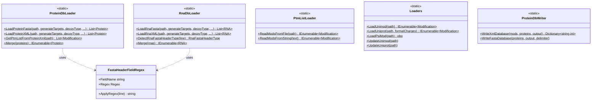

# Protein and Nucleic Acid Database Reading

## Overview

The UsefulProteomicsDatabases library provides comprehensive infrastructure for reading, parsing, and writing protein and RNA databases in various formats. The system automatically detects database formats, handles modifications, generates decoys, and provides a unified interface for working with biological sequence databases across multiple vendor formats and standards.

### Key Features

- **Multi-Format Support**: FASTA (UniProt, Ensembl, Gencode, NCBI, Modomics), XML (mzLibProteinDb, UniProt XML)
- **Automatic Format Detection**: Database format automatically determined from headers
- **Modification Management**: Built-in support for PTMs from UniMod, PSI-MOD, and UniProt
- **Decoy Generation**: Multiple decoy generation strategies (see [Decoy Generation Wiki](https://github.com/smith-chem-wisc/mzLib/wiki/Omics:-Decoy-Generation))
- **Sequence Variant Support**: Handle SNPs, indels, and sequence variations
- **RNA Database Support**: Native support for RNA/nucleic acid databases
- **Database Writing**: Export proteins and modifications to XML or FASTA formats

### Quick Start

```csharp
// Load protein FASTA database
var proteins = ProteinDbLoader.LoadProteinFasta(
    "database.fasta",
    generateTargets: true,
    decoyType: DecoyType.Reverse,
    isContaminant: false,
    out var errors
);

// Load protein XML database (mzLibProteinDb format)
var proteinsWithMods = ProteinDbLoader.LoadProteinXML(
    "database.xml",
    generateTargets: true,
    decoyType: DecoyType.Reverse,
    allKnownModifications: PtmListLoader.ReadModsFromFile("modifications.txt", out var modWarnings),
    isContaminant: false,
    modTypesToExclude: null,
    out var unknownMods
);

// Load RNA FASTA database
var rnaSequences = RnaDbLoader.LoadRnaFasta(
    "rna_database.fasta",
    generateTargets: true,
    decoyType: DecoyType.Reverse,
    isContaminant: false,
    out var rnaErrors
);

// Access loaded data
foreach (var protein in proteins)
{
    Console.WriteLine($"Accession: {protein.Accession}");
    Console.WriteLine($"Sequence: {protein.BaseSequence}");
    Console.WriteLine($"Length: {protein.Length}");
}
```

## System Design

### Architecture Overview

The database reading system uses a loader pattern with format-specific parsers:



### Core Components

#### ProteinDbLoader (Static)
Main class for loading protein databases from FASTA or XML formats.

```csharp
public static class ProteinDbLoader
{
    // Load FASTA database
    public static List<Protein> LoadProteinFasta(
        string proteinDbLocation,
        bool generateTargets,
        DecoyType decoyType,
        bool isContaminant,
        out List<string> errors,
        FastaHeaderFieldRegex accessionRegex = null,
        FastaHeaderFieldRegex fullNameRegex = null,
        FastaHeaderFieldRegex nameRegex = null,
        FastaHeaderFieldRegex geneNameRegex = null,
        FastaHeaderFieldRegex organismRegex = null,
        int maxThreads = -1,
        bool addTruncations = false,
        string decoyIdentifier = "DECOY"
    );
    
    // Load XML database (mzLibProteinDb format)
    public static List<Protein> LoadProteinXML(
        string proteinDbLocation,
        bool generateTargets,
        DecoyType decoyType,
        IEnumerable<Modification> allKnownModifications,
        bool isContaminant,
        IEnumerable<string> modTypesToExclude,
        out Dictionary<string, Modification> unknownModifications,
        int maxThreads = -1,
        int maxHeterozygousVariants = 4,
        int minAlleleDepth = 1,
        bool addTruncations = false,
        string decoyIdentifier = "DECOY"
    );
    
    // Get modifications from XML header
    public static List<Modification> GetPtmListFromProteinXml(string proteinDbLocation);
    
    // Merge duplicate proteins
    public static IEnumerable<Protein> Merge(IEnumerable<Protein> mergeThese);
}
```

#### RnaDbLoader (Static)
Main class for loading RNA/nucleic acid databases.

```csharp
public static class RnaDbLoader
{
    // Load RNA FASTA database
    public static List<RNA> LoadRnaFasta(
        string rnaDbLocation,
        bool generateTargets,
        DecoyType decoyType,
        bool isContaminant,
        out List<string> errors,
        IHasChemicalFormula? fivePrimeTerm = null,
        IHasChemicalFormula? threePrimeTerm = null,
        int maxThreads = 1,
        string decoyIdentifier = "DECOY"
    );
    
    // Load RNA XML database
    public static List<RNA> LoadRnaXML(
        string rnaDbLocation,
        bool generateTargets,
        DecoyType decoyType,
        bool isContaminant,
        IEnumerable<Modification> allKnownModifications,
        IEnumerable<string> modTypesToExclude,
        out Dictionary<string, Modification> unknownModifications,
        int maxHeterozygousVariants = 4,
        int minAlleleDepth = 1,
        int maxThreads = 1,
        IHasChemicalFormula? fivePrimeTerm = null,
        IHasChemicalFormula? threePrimeTerm = null,
        string decoyIdentifier = "DECOY"
    );
    
    // Detect RNA FASTA header format
    public static RnaFastaHeaderType DetectRnaFastaHeaderType(string line);
    
    // Merge duplicate RNA sequences
    public static IEnumerable<RNA> Merge(IEnumerable<RNA> mergeThese);
}
```

## Supported Database Formats

### Protein Databases

| Format | Extension | Source | Example Header |
|--------|-----------|--------|----------------|
| **UniProt FASTA** | .fasta | UniProt | `>sp\|P12345\|NAME_HUMAN Description OS=Homo sapiens GN=GENE` |
| **Ensembl FASTA** | .fasta | Ensembl | `>ENSP00000123456.1 pep:protein gene:ENSG00000123456` |
| **GENCODE FASTA** | .fasta | GENCODE | `>ENST00000123456.1\|ENSG00000123456.1\|...` |
| **mzLibProteinDb XML** | .xml, .xml.gz | mzLib | Custom format with embedded modifications |
| **UniProt XML** | .xml, .xml.gz | UniProt | Official UniProt XML format |

### RNA/Nucleic Acid Databases

| Format | Extension | Source | Example Header |
|--------|-----------|--------|----------------|
| **Modomics** | .fasta | Modomics | `>id:12345\|Name:tRNA\|Species:Homo sapiens` |
| **Ensembl RNA** | .fasta | Ensembl | `>ENST00000123456.1 scaffold:...` |
| **NCBI RefSeq** | .fasta | NCBI | `>NC_000001.11:12345-67890 [organism=...]` |
| **NCBI Assembly** | .fasta | NCBI | `>NM_001234.5 Homo sapiens gene,...` |
| **mzLib RNA** | .fasta | mzLib | `>mz\|ACC\|NAME fullName OS=organism GN=gene` |

## Loading Databases

### Basic FASTA Loading

```csharp
// Load protein database
var proteins = ProteinDbLoader.LoadProteinFasta(
    "database.fasta",
    generateTargets: true,
    decoyType: DecoyType.Reverse,
    isContaminant: false,
    out var errors
);

// Load RNA database
var rnaSequences = RnaDbLoader.LoadRnaFasta(
    "rna_database.fasta",
    generateTargets: true,
    decoyType: DecoyType.Reverse,
    isContaminant: false,
    out var errors
);

// Check for errors
if (errors.Any())
{
    foreach (var error in errors)
        Console.WriteLine($"Warning: {error}");
}
```

### Loading with Custom Header Parsing

For non-standard FASTA formats:

```csharp
// Define custom regex for accession
var customAccessionRegex = new FastaHeaderFieldRegex(
    fieldName: "accession",
    regex: @"^>([A-Z0-9_]+)","$1"
);

// Load with custom parsing
var proteins = ProteinDbLoader.LoadProteinFasta(
    "custom_database.fasta",
    generateTargets: true,
    decoyType: DecoyType.Reverse,
    isContaminant: false,
    out var errors,
    accessionRegex: customAccessionRegex
);
```

### Loading Compressed Databases

The loader automatically handles gzip-compressed files:

```csharp
// .gz extension automatically detected and decompressed
var proteins = ProteinDbLoader.LoadProteinFasta(
    "database.fasta.gz",
    generateTargets: true,
    decoyType: DecoyType.Reverse,
    isContaminant: false,
    out var errors
);
```

### Loading XML Databases

```csharp
// Load modifications first
var unimodMods = Loaders.LoadUnimod("unimod.xml");
var ptmlistMods = PtmListLoader.ReadModsFromFile("ptmlist.txt", out var modWarnings);
var allMods = unimodMods.Concat(ptmlistMods);

// Load XML database with modifications
var proteins = ProteinDbLoader.LoadProteinXML(
    "database.xml",
    generateTargets: true,
    decoyType: DecoyType.Reverse,
    allKnownModifications: allMods,
    isContaminant: false,
    modTypesToExclude: new[] { "Artefact", "Chemical derivative" },
    out var unknownMods
);

// Access modifications
foreach (var protein in proteins.Where(p => p.OneBasedPossibleLocalizedModifications.Any()))
{
    Console.WriteLine($"{protein.Accession} has modifications at:");
    foreach (var posMod in protein.OneBasedPossibleLocalizedModifications)
    {
        Console.WriteLine($"  Position {posMod.Key}: {string.Join(", ", posMod.Value.Select(m => m.IdWithMotif))}");
    }
}
```

### Extract Modifications from XML

```csharp
// Get only the modification list from XML header
var modifications = ProteinDbLoader.GetPtmListFromProteinXml("database.xml");

Console.WriteLine($"Database contains {modifications.Count} modification definitions");
```

## Loading RNA Databases

### Basic RNA Loading

```csharp
// Load RNA FASTA
var rnaSequences = RnaDbLoader.LoadRnaFasta(
    "rna_database.fasta",
    generateTargets: true,
    decoyType: DecoyType.Reverse,
    isContaminant: false,
    out var errors
);
```

### With Terminus Modifications

```csharp
// Define 5' terminus modification (e.g., triphosphate)
var fivePrime = ChemicalFormula.ParseFormula("H4O10P3");  // PPP

// Define 3' terminus modification
var threePrime = ChemicalFormula.ParseFormula("HPO3");

// Load with terminus modifications
var rnaSequences = RnaDbLoader.LoadRnaFasta(
    "rna_database.fasta",
    generateTargets: true,
    decoyType: DecoyType.Reverse,
    isContaminant: false,
    out var errors,
    fivePrimeTerm: fivePrime,
    threePrimeTerm: threePrime
);
```

### Automatic Sequence Transformation

Some RNA databases use T instead of U. The loader automatically detects and converts:

```csharp
// NCBI databases use T, automatically converted to U
var ncbiRna = RnaDbLoader.LoadRnaFasta(
    "ncbi_rna.fasta",  // Contains ACGT
    generateTargets: true,
    decoyType: DecoyType.None,
    isContaminant: false,
    out var errors
);

// All sequences now contain U instead of T
```

## Loading Modifications

### UniMod Database

```csharp
// Download/update UniMod
Loaders.UpdateUnimod("unimod.xml");

// Load modifications
var unimodMods = Loaders.LoadUnimod("unimod.xml");

// Filter modifications
var phosphorylations = unimodMods
    .Where(m => m.OriginalId.Contains("Phospho"));
```

### UniProt PTM List

```csharp
// Download/update UniProt PTM list
Loaders.UpdateUniprot("ptmlist.txt");

// Load PSI-MOD for formal charges
var psiMod = Loaders.LoadPsiMod("psimod.obo.xml");
var formalCharges = Loaders.GetFormalChargesDictionary(psiMod);

// Load UniProt modifications
var uniprotMods = Loaders.LoadUniprot("ptmlist.txt", formalCharges);
```

### Custom PTM List

PTM lists use a structured text format:

```
ID   Phosphorylation
TG   Serine or Threonine or Tyrosine.
PP   Anywhere.
CF   H O3 P
MM   79.966331
DR   PSI-MOD; MOD:00046.
//
```

**Field Definitions**:
- `ID`: Modification identifier (required)
- `TG`: Target amino acid(s) or motif (required)
- `PP`: Position restriction (optional)
- `CF`: Chemical formula correction (optional)
- `MM`: Monoisotopic mass (optional)
- `DR`: Database reference (optional)
- `NL`: Neutral losses (optional)
- `DI`: Diagnostic ions (optional)
- `//`: End of entry (required)

```csharp
// Read from file
var mods = PtmListLoader.ReadModsFromFile("custom_mods.txt", out var warnings);

// Read from string
string modText = @"
ID   Custom Modification
TG   Lysine.
PP   Anywhere.
CF   C2 H2 O
MM   42.010565
//
";
var modsFromString = PtmListLoader.ReadModsFromString(modText, out var warnings2);
```

## Header Format Detection

The system automatically detects various header formats:

### Protein Headers

**UniProt Format**:
```
>sp|P12345|PROTEIN_HUMAN Description OS=Homo sapiens GN=GENE
```
- Detection: Two-letter code followed by `|` at position 1-3
- Parsed: Accession, Name, Full Name, Organism, Gene Name

**Ensembl Format**:
```
>ENSP00000123456.1 pep:protein gene:ENSG00000123456.1
```
- Detection: Contains `gene:`, `Acc:`, or similar identifiers
- Parsed: Accession, Full Name, Gene Name

**GENCODE Format**:
```
>ENST00000123456.1|ENSG00000123456.1|OTTHUMG00000012345.1|...
```
- Detection: Exactly 7 pipe-separated fields
- Parsed: Accession, Full Name, Gene Name

### RNA Headers

**Modomics**: Starts with `>id:`
**Ensembl**: Starts with `>ENST`
**NCBI**: Regex patterns for RefSeq identifiers

## Writing Databases

### Writing XML Database

```csharp
// Optional: Add custom modifications
var additionalMods = new Dictionary<string, HashSet<Tuple<int, Modification>>>();
var phospho = new Modification(
    _originalId: "Phosphorylation",
    _target: ModificationMotif.GetMotif("S"),
    _locationRestriction: "Anywhere.",
    _chemicalFormula: ChemicalFormula.ParseFormula("HO3P")
);

additionalMods["P12345"] = new HashSet<Tuple<int, Modification>>
{
    new Tuple<int, Modification>(10, phospho)
};

// Write XML database
var newModEntries = ProteinDbWriter.WriteXmlDatabase(
    additionalModsToAddToProteins: additionalMods,
    proteinList: proteins,
    outputFileName: "output_database.xml"
);
```

### Writing FASTA Database

```csharp
// Write protein FASTA (UniProt-style)
ProteinDbWriter.WriteFastaDatabase(
    proteinList: proteins,
    outputFileName: "output.fasta",
    delimeter: "|"
);

// Write RNA FASTA
ProteinDbWriter.WriteFastaDatabase(
    rnaList: rnaSequences,
    outputFileName: "output_rna.fasta"
);
```

## Advanced Features

### Sequence Variants

```csharp
// Load database with variants
var proteins = ProteinDbLoader.LoadProteinXML(
    "database_with_variants.xml",
    generateTargets: true,
    decoyType: DecoyType.Reverse,
    allKnownModifications: null,
    isContaminant: false,
    modTypesToExclude: null,
    out var unknownMods,
    maxHeterozygousVariants: 4,
    minAlleleDepth: 1
);

// Access variant information
foreach (var protein in proteins.Where(p => p.SequenceVariations.Any()))
{
    Console.WriteLine($"{protein.Accession} has {protein.SequenceVariations.Count} variants");
}

// Get all variant forms
var variantProteins = protein.GetVariantBioPolymers(
    maxAllowedVariants: 4,
    minAlleleDepth: 1
);
```

### Database Merging

Merge duplicate entries with same accession and sequence:

```csharp
// Load multiple databases
var db1 = ProteinDbLoader.LoadProteinFasta("database1.fasta", true, DecoyType.None, false, out var e1);
var db2 = ProteinDbLoader.LoadProteinFasta("database2.fasta", true, DecoyType.None, false, out var e2);

// Combine and merge duplicates
var merged = ProteinDbLoader.Merge(db1.Concat(db2));
```

Merging combines:
- Modifications at same positions
- Gene names
- Database references
- Sequence variations
- Proteolysis products

## Common Use Cases

### Load with All Modifications

```csharp
// Combine modification sources
var unimodMods = Loaders.LoadUnimod("unimod.xml");
var psiMod = Loaders.LoadPsiMod("psimod.obo.xml");
var formalCharges = Loaders.GetFormalChargesDictionary(psiMod);
var uniprotMods = Loaders.LoadUniprot("ptmlist.txt", formalCharges);
var allMods = unimodMods.Concat(uniprotMods);

// Load with all modifications
var proteins = ProteinDbLoader.LoadProteinXML(
    "database.xml",
    generateTargets: true,
    decoyType: DecoyType.Reverse,
    allKnownModifications: allMods,
    isContaminant: false,
    modTypesToExclude: null,
    out var unknownMods
);
```

### Create Contaminant Database

```csharp
// Load contaminants
var contaminants = ProteinDbLoader.LoadProteinFasta(
    "contaminants.fasta",
    generateTargets: true,
    decoyType: DecoyType.Reverse,
    isContaminant: true,  // Mark as contaminants
    out var errors
);

// Load main database
var mainDb = ProteinDbLoader.LoadProteinFasta(
    "main_database.fasta",
    generateTargets: true,
    decoyType: DecoyType.Reverse,
    isContaminant: false,
    out var errors2
);

// Combine
var combinedDb = mainDb.Concat(contaminants).ToList();
```

### Extract Specific Sequences

```csharp
// Extract by accession
var accessions = new HashSet<string> { "P12345", "P67890" };
var selected = proteins.Where(p => accessions.Contains(p.Accession)).ToList();

// Extract by gene name
var selectedGenes = proteins
    .Where(p => p.GeneNames.Any(g => g.Item2 == "BRCA1"))
    .ToList();

// Extract by organism
var humanProteins = proteins
    .Where(p => p.Organism?.Contains("sapiens") == true)
    .ToList();
```

## Integration

### Dependencies

```
UsefulProteomicsDatabases
  ↓
  Proteomics (Protein, Modification classes)
  ↓
  Transcriptomics (RNA, NucleicAcid classes)
  ↓
  Chemistry (ChemicalFormula)
  ↓
  MzLibUtil (Utilities)
```

### NuGet Packages

- **TopDownProteomics.IO.Obo**: PSI-MOD OBO file parsing
- **CsvHelper**: CSV operations

### Used By

- **MetaMorpheus**: Database loading for searches
- **Proteomics Library**: Protein management
- **Transcriptomics Library**: RNA analysis
- **FlashLFQ**: Quantification

## References

- **UniProt**: https://www.uniprot.org/
- **UniMod**: http://www.unimod.org/
- **PSI-MOD**: https://github.com/HUPO-PSI/psi-mod-CV
- **Ensembl**: https://www.ensembl.org/
- **GENCODE**: https://www.gencodegenes.org/
- **Modomics**: http://modomics.genesilico.pl/
- **NCBI RefSeq**: https://www.ncbi.nlm.nih.gov/refseq/

## See Also

- [Decoy Generation](https://github.com/smith-chem-wisc/mzLib/wiki/Omics:-Decoy-Generation) - Generating decoy proteins/transcripts
- [Chemistry](https://github.com/smith-chem-wisc/mzLib/wiki/Chemistry) - Chemical formula and mass calculations
- [Mass Spectrometry](https://github.com/smith-chem-wisc/mzLib/wiki/Mass-Spectrometry) - MS data processing
- [Deconvolution](https://github.com/smith-chem-wisc/mzLib/wiki/Spectral-Deconvolution-(Decharging-and-Deisotoping)) - Spectral deconvolution
- [MS Data File Reading](https://github.com/smith-chem-wisc/mzLib/wiki/File-Reading:-Mass-Spec) - Reading MS data files